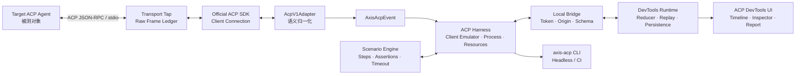

# Axis ACP Coding Agent Developer Toolkit 总方案

> 文档版本：3.0
>
> 更新日期：2026-08-03
>
> 项目定位：保留 Axis-UI 原有 Vue 3 Styled Component 组件库，新增一套面向 ACP Coding Agent 开发者的测试、调试、回放和兼容性验证工具链。

---

# 一、方向决策

项目不再以“做一个 ACP Agent 客户端”为核心，也不以聊天、会话管理或多 Agent 使用体验作为主要卖点。

新的核心定位是：

> **Axis ACP DevKit：面向 Coding Agent 开发者的 ACP Harness、场景测试框架、协议 Inspector、确定性 Replay 和兼容性报告工具链。**

Workbench 仍然存在，但职责发生变化：

```text
旧定位
Workbench = 供用户日常使用 Coding Agent 的客户端

新定位
DevTools UI = Toolkit 的可视化调试、测试和报告界面
```

目标用户也随之改变：

```text
正在实现 ACP Agent 的开发者
正在把现有 Coding Agent 适配到 ACP 的团队
需要验证 Agent 生命周期与异常行为的工程师
希望在 CI 中回归 ACP 兼容性的 Agent 团队
需要为 Vue 产品接入 ACP 能力的前端基础设施团队
```

一句话产品介绍：

> **给任意 ACP Agent 一条启动命令和一组场景，Axis ACP DevKit 可以驱动其运行，记录双向协议，验证生命周期约束，注入故障，离线回放，并输出可审计的兼容性报告。**

---

# 二、为什么不继续做“Agent 客户端”

ACP 官方生态目前已经包含：

- 稳定的 TypeScript、Rust、Python、Kotlin 等 SDK；
- ACP Agent Registry；
- Codex、Claude 等 Agent Adapter；
- 多种 IDE、桌面端和社区 Client。

只实现：

```text
Agent 选择
会话列表
聊天输入
Plan / Tool Call
Permission / Diff / Terminal
```

虽然有工程价值，但容易被理解为现有 Agent Client 的缩小版，核心竞争力仍集中在 UI 和产品拼装。

Developer Toolkit 的差异在于它回答的是另一组问题：

```text
这个 Agent 是否遵守 ACP 生命周期？
它声明的 Capability 与实际行为是否一致？
Permission 等待期间 Cancel 会发生什么？
Agent Crash 后是否残留请求、终端或进程？
一次线上异常能否通过 Transcript 确定性复现？
协议升级后哪些场景发生回归？
不同 Agent 在同一场景下有哪些行为差异？
```

这类问题更接近：

```text
Protocol Engineering
Agent Infrastructure
Developer Experience
Compatibility Testing
Runtime Observability
```

而不是通用 AI 客户端。

---

# 三、对初步设计的采纳与修正

初步设计中以下判断应保留：

```text
不能做 Cherry Studio 的缩小版
必须聚焦 Plan / Tool / Permission / Diff / Terminal
要同时理解 ACP Client 侧和 Agent 侧
需要 Inspector、Transcript 和 Replay
可以实现一个轻量 Agent 证明 Agent Loop 能力
```

但“Client Runtime + Agent UI Kit + 自研 Agent”仍然不完全等于 Developer Toolkit。

原因是：

- Client Runtime 仍服务于构建客户端；
- Agent UI Kit 仍服务于展示 Agent；
- 自研 Agent 是另一个应用实现；
- 三者相加，主体验仍可能是 Workbench。

因此总方案增加四个真正决定产品类别的核心：

```text
ACP Harness
Scenario DSL
Lifecycle Assertion Engine
Headless CLI / CI Reporter
```

自研轻量 Agent 保留，但调整为：

> **Toolkit 的参考实现和 Dogfooding 对象，而不是 Toolkit 成立的前提。**

---

# 四、最终产品形态

```text
Axis/
├── Axis-UI
│   └── 原有 Vue 3 Styled Component 组件库
│
└── Axis ACP DevKit
    ├── ACP Harness
    │   ├── 启动目标 Agent
    │   ├── 模拟 ACP Client
    │   ├── Client Capability Profile
    │   └── 安全进程与资源管理
    │
    ├── Scenario Runner
    │   ├── Typed Scenario DSL
    │   ├── 用户与 Permission 行为脚本
    │   ├── Lifecycle Assertions
    │   └── CI Exit Code / Report
    │
    ├── Trace Lab
    │   ├── Raw Protocol Trace
    │   ├── AxisAcpEvent
    │   ├── Transcript / Replay
    │   └── Fault Injection
    │
    ├── ACP DevTools UI
    │   ├── Timeline
    │   ├── Inspector
    │   ├── Scenario Runner
    │   ├── Diff / Terminal
    │   └── Compatibility Report
    │
    └── Reference Implementations
        ├── Deterministic Fixture Agents
        └── Axis Code Agent（可选增强）
```

## 4.1 核心开发者工作流

### 工作流 A：调试一个 Agent

```bash
axis-acp inspect --target codex-acp --cwd ./my-project
```

结果：

```text
启动 Agent
→ 完成 initialize
→ 展示 Capability Snapshot
→ 创建 Session
→ 记录 Prompt / Update / Permission
→ 显示 Raw Trace 与语义 Timeline
→ 导出 Transcript
```

### 工作流 B：运行兼容性场景

```bash
axis-acp run \
  --target codex-acp \
  --scenario scenarios/cancel-during-permission.ts
```

结果：

```text
PASS / FAIL
失败的生命周期约束
关联协议帧
Session 最终状态
待处理 RPC / Permission / Terminal
可复现 Transcript
```

### 工作流 C：离线复现

M2-Core 通过 Inspector 导入 Transcript；M2-Plus 再提供完整 CLI：

```bash
axis-acp replay artifacts/cancel-race.axis-acp-trace.json
```

结果：

```text
无需模型和真实 Agent
恢复同一事件序列
重建 AcpSessionState
单步查看异常发生位置
验证修复前后的状态差异
```

### 工作流 D：生成兼容性报告

M2-Core 的 `run` 自动输出 JSON 和简单 HTML；M2-Plus 再提供独立聚合命令：

```bash
axis-acp report artifacts/runs --format html
```

结果：

```text
Capability Matrix
Scenario Pass Rate
按类别、严重度和责任主体归档的 Diagnostics
行为差异
性能指标
报告环境与 Agent 版本
```

---

# 五、明确不做的事情

```text
不做多模型聚合聊天平台
不做知识库、翻译、办公助手
不把聊天页面作为首页中心
不做完整 IDE 或代码编辑器
不做 Agent 商店
不把 MCP 配置中心作为主要卖点
不重新推进完整 Headless UI 改造
不重新实现官方 ACP SDK
不声称自己是官方 ACP Conformance Suite
不默认支持所有 Registry Agent
不把 ACP v2 Draft 作为当前稳定主线
```

“Compatibility Report”只表示 Axis 场景集下的测试结果，不代表 ACP 官方认证。

---

# 六、原 Axis-UI 的保护边界

现有公开包名保持：

```text
axis-ui
@axis-ui/theme-chalk
@axis-ui/utils
```

不得将 `axis-ui` 重命名为 `@axis-ui/components`。

必须继续保留：

```text
ESM / UMD / 类型声明
全量与按需引入
Resolver 与样式自动导入
Theme-Chalk
动态高度 VirtualList
Tree / Form 现有能力
原单元测试、Coverage、Smoke、Publint、ATTW
```

ACP 包在 API 稳定前全部为 `private`。ACP 不进入 `axis-ui` 主包运行时依赖。

```text
build:all       可以构建公开包和 private ACP 包
check:publish   只检查公开包 Allowlist
release         只发布 axis-ui / theme-chalk / utils
```

---

# 七、ACP 协议策略

截至 2026-08-03：

```text
ACP v1                  稳定主线
ACP v2                  Draft / Experimental
TypeScript SDK          @agentclientprotocol/sdk
稳定 Transport          stdio
远程 HTTP/WebSocket     仍非当前稳定主线
```

项目策略：

```text
M1/M2-Core 只使用 ACP v1
协议类型优先来自官方 SDK
SDK 负责 JSON-RPC 与协议编解码
Axis Adapter 负责版本映射与语义归一化
Capability 决定场景是否运行或 Skip
v2 通过独立 Adapter 和 Feature Flag 接入
```

## 7.1 稳定性与实现范围不是一回事

| 分类         | 能力                                                                                                   | Toolkit 策略              |
| ------------ | ------------------------------------------------------------------------------------------------------ | ------------------------- |
| M1 基础      | initialize、session/new、prompt/update、cancel、Permission                                             | 必须覆盖                  |
| v1 稳定可选  | list、resume、close、delete、config、usage、workspace roots、elicitation、request cancellation、logout | 逐步增加 Scenario Pack    |
| 目标相关能力 | load、modes、slash commands、FS/Terminal、auth                                                         | 先覆盖目标 Agent 所需子集 |
| 实验能力     | ACP v2、远程 ACP Transport                                                                             | M2-Plus 后再做            |

`session/delete`、Elicitation 和 Request Cancellation 已进入稳定 v1，但不等于 M2-Core 必须全部实现。

---

# 八、总体架构



## 8.1 两条数据流

Toolkit 同时保存两种信息，不能混为一种。

### Raw Protocol Trace

```text
Agent 原始 stdout JSON-RPC
Client 发出的 JSON-RPC
direction / timestamp / request id
解析错误与 stdout 噪声
脱敏后的原始 Payload
```

用途：

```text
协议 Inspector
Schema / Method 检查
Request-Response 对应
定位非法 stdout
保留调试证据
```

### Normalized Semantic Events

```text
ACP v1 原始事件
→ acp-harness / AcpV1Adapter
→ AxisAcpEvent
→ Scenario Assertions / Bridge
→ DevTools Runtime
→ Reducer
→ AcpSessionState
```

用途：

```text
状态机
Timeline
Replay
生命周期断言
未来 v1/v2 统一投影
```

UI 的业务状态不读取 ACP 原始对象；Inspector 可以读取脱敏 Raw Trace。

## 8.2 Headless 优先

核心 Harness、Scenario Runner、Assertions 和 Reporter 必须不依赖 Vue、DOM 和浏览器。

```text
CLI / CI             是第一等使用方式
DevTools UI          是相同 Runtime 的可视化消费者
Vue Components       是 UI 实现和后续复用能力
```

如果关闭 DevTools UI，全部核心场景仍然可以在终端和 CI 中运行。

---

# 九、Monorepo 结构

## 9.1 M1/M2-Core 实际结构

```text
Axis-UI/
├── packages/
│   ├── components/              # 原 axis-ui
│   ├── theme-chalk/
│   ├── utils/
│   ├── acp-core/                # 类型、事件、Reducer、Trace、Bridge Schema
│   ├── acp-harness/             # Node Harness、SDK、进程与 Scenario Runner
│   └── acp-cli/                 # Headless CLI 与 Reporter
│
├── apps/
│   └── acp-devtools/            # Vue 可视化开发者工具
│
├── fixtures/
│   ├── acp-agents/              # 正常与故障 Fixture Agent
│   ├── repositories/            # 隔离测试仓库
│   ├── scenarios/               # 官方能力对应场景
│   └── transcripts/             # Golden Trace
│
├── examples/
│   └── axis-code-agent/         # 可选轻量 Coding Agent
│
├── docs/
│   ├── adr/
│   └── acp-devkit/
│
└── play/                        # 原组件 Play 环境
```

Workspace 精确加入包含 `package.json` 的目录，不使用整个 `fixtures/**`：

```yaml
packages:
  - 'packages/**'
  - 'apps/**'
  - 'fixtures/acp-agents'
  - 'examples/axis-code-agent'
  - 'play'
```

如果 `examples/axis-code-agent` 尚未实现，就不提前加入 workspace。

## 9.2 稳定后才抽取的包

首版 Vue Composables 和 Inspector Components 放在 `apps/acp-devtools` 内。

出现第二个真实消费者后，再抽取：

```text
@axis-ui/acp-vue
@axis-ui/acp-components
```

避免为了“看起来像 Monorepo”同时维护过多空包。

## 9.3 acp-core 内容

```text
packages/acp-core/src/
├── protocol/
│   ├── capabilities.ts
│   └── stop-reason.ts
├── events/
│   ├── axis-acp-event.ts
│   └── protocol-trace-frame.ts
├── state/
│   ├── connection-state.ts
│   ├── session-state.ts
│   └── reducer.ts
├── scenario/
│   ├── types.ts
│   └── assertions.ts
├── transcript/
│   ├── schema.ts
│   ├── redaction.ts
│   └── replay.ts
├── bridge/
│   └── schema.ts
└── index.ts
```

## 9.4 Type Check 与测试边界

```text
acp-core / acp-harness / acp-cli / fixtures    tsc --noEmit
acp-devtools                                    vue-tsc --noEmit
```

Vitest Projects：

```text
node        Core / Harness / CLI
happy-dom   Vue Store 与轻量组件
browser     DevTools 关键交互
contract    Harness ↔ Fixture Agent
scenario    Scenario DSL / Assertions
replay      Golden Trace
security    Host / Bridge / Path / Quota
```

---

# 十、核心模块设计

## 10.1 Target Registry

浏览器不能传入任意 `command` 和 `args`。

DevTools 只能发送：

```json
{
  "type": "target/start",
  "targetId": "codex-acp",
  "workspaceRoot": "/absolute/allowed/path"
}
```

本地 Harness 从 Registry 读取：

```ts
interface TargetDefinition {
  id: string
  command: string
  allowedArgs: readonly string[]
  environmentAllowlist: readonly string[]
  maxProcesses: number
  expectedProtocolVersion: 'v1'
}
```

CLI 可以由终端用户显式传入临时 Target Command，但该能力不能通过浏览器 Bridge 暴露。

## 10.2 ACP Harness

Harness 负责：

```text
安全启动和回收 Agent 子进程
隔离 ACP stdout 与 Agent stderr
建立官方 SDK Client Connection
模拟 Client Capability
处理 Permission / Elicitation
提供受控 FS / Terminal
记录 Raw Trace
输出 AxisAcpEvent
管理 Timeout、Cancel 和 Crash
向 Scenario Engine 暴露控制接口
```

建议接口：

```ts
export interface AcpHarness {
  startTarget(target: TargetRef): Promise<TargetHandle>
  initialize(profile: ClientCapabilityProfile): Promise<CapabilitySnapshot>
  createSession(input: CreateSessionInput): Promise<SessionIdentity>
  submitPrompt(input: PromptInput): Promise<PromptSubmission>
  cancelSession(sessionId: string): Promise<void>
  respondPermission(input: PermissionDecision): Promise<void>
  stopTarget(reason: StopReason): Promise<void>

  subscribeEvents(listener: (event: AxisAcpEvent) => void): () => void
  subscribeTrace(listener: (frame: ProtocolTraceFrame) => void): () => void
}
```

`submitPrompt()` 只表示 Harness 已完成本地校验并提交请求。UI 和 Scenario 不依赖 Promise 完成判断 Turn 结束；最终状态统一由 `SessionStateChangedEvent` 表达。

## 10.3 Client Capability Profile

为了测试 Agent 的 Capability 降级，Harness 需要多组客户端画像：

M2-Core 只实现 `minimal` 和 `permission-only`；其余画像属于 M2-Plus。

```text
minimal
permission-only
filesystem
terminal
elicitation-form
elicitation-url
full-v1
custom
```

场景可以验证：

```text
Agent 是否调用了未声明支持的 Client Method
Client 缺少 Terminal 时 Agent 是否降级
不支持 Elicitation 时 Agent 是否安全失败
Capability Snapshot 与后续行为是否一致
```

## 10.4 AxisAcpEvent

```ts
export type AxisAcpEvent =
  | ConnectionStateChangedEvent
  | CapabilitySnapshotEvent
  | SessionStateChangedEvent
  | MessageUpsertEvent
  | MessageChunkAppendedEvent
  | PlanUpdatedEvent
  | ToolCallUpsertEvent
  | PermissionRequestedEvent
  | PermissionResolvedEvent
  | ElicitationRequestedEvent
  | ElicitationResolvedEvent
  | UsageUpdatedEvent
  | TerminalOutputAppendedEvent
  | DiagnosticEmittedEvent
  | ProcessExitedEvent
```

所有事件包含：

```text
runId
connectionId
sessionId（适用时）
sequence
timestamp
protocolVersion
sourceTraceIds
```

`sequence` 决定归约顺序；时间戳只用于报告和性能分析。

## 10.5 Session Reducer

```ts
export function reduceSessionEvent(
  state: AcpSessionState,
  event: AxisAcpEvent
): AcpSessionState
```

Reducer 必须是纯函数，处理：

```text
Chunk 聚合
Message / Tool Upsert
多 Session 隔离
重复事件
非法状态转换
Cancel / Complete 竞态
Permission / Disconnect 竞态
Agent Crash
待处理请求清理
```

相同初始状态和 Trace 必须得到相同 State Hash。

## 10.6 Typed Scenario DSL

MVP 优先提供 TypeScript DSL，获得类型推断并避免先维护 YAML Schema。

M2-Core 只为三个固定 Scenario 提供所需 API；DSL 暂不追求任意组合、插件系统或 YAML 转换。

示例：

```ts
export default scenario('cancel-during-permission')
  .withClientProfile('permission-only')
  .withWorkspace(fixtureRepo('vue-bug'))
  .newSession()
  .prompt('修复异步加载失败后无法重试的问题')
  .waitFor(permissionRequested({ tool: 'run_command' }))
  .cancelSession()
  .expect(sessionStatus('cancelled'))
  .expect(noPendingPermissions())
  .expect(noRunningTerminals())
  .expect(noOrphanProcesses())
```

基础 Step：

```text
startTarget
initialize
newSession
prompt
waitForEvent
respondPermission
cancelSession
closeSession
killTarget
delay
injectFault
```

基础 Assertion：

```text
methodAllowedByCapability
eventsInOrder
eventually
never
sessionStatus
toolCallTransition
stopReason
noPendingRpc
noPendingPermissions
noRunningTerminals
noOrphanProcesses
traceMatches
```

## 10.7 Lifecycle Invariant Engine

Invariant Engine 必须区分“规范违规”“Axis 场景失败”和“工程可靠性问题”，不能把所有失败都描述成 Agent 违反 ACP。

### 10.7.1 统一诊断模型

```ts
type Diagnostic =
  | ProtocolViolationDiagnostic
  | CapabilityContractMismatchDiagnostic
  | ScenarioAssertionFailureDiagnostic
  | ResourceLeakDiagnostic
  | RuntimeWarningDiagnostic
  | PerformanceRegressionDiagnostic
  | HarnessFailureDiagnostic

interface DiagnosticBase {
  id: string
  runId: string
  severity: 'info' | 'warning' | 'error' | 'fatal'
  subject:
    | 'agent'
    | 'client-profile'
    | 'harness'
    | 'adapter'
    | 'environment'
    | 'unknown'
  message: string
  sequence?: number
  traceIds: string[]
  stateSnapshotIds: string[]
}
```

分类语义：

| 诊断类型                               | 含义                                                 | 示例                                            |
| -------------------------------------- | ---------------------------------------------------- | ----------------------------------------------- |
| `ProtocolViolationDiagnostic`          | 明确违反 ACP 或 JSON-RPC 的规范性要求                | stdout 非 ACP 消息、Notification 收到 Response  |
| `CapabilityContractMismatchDiagnostic` | 声明或省略的 Capability 与实际 Method/参数行为不一致 | 未声明 Terminal 却调用 `terminal/create`        |
| `ScenarioAssertionFailureDiagnostic`   | 没有满足当前 Axis Scenario 的预期，但不必然违反协议  | 场景期望 Permission，Agent 选择了无需权限的路径 |
| `ResourceLeakDiagnostic`               | 运行结束后残留资源                                   | 孤儿进程、未释放 Terminal、残留文件句柄         |
| `RuntimeWarningDiagnostic`             | 可疑但证据不足，或属于建议性工程规则                 | Tool 状态从终态回退、Close 后出现延迟 Update    |
| `PerformanceRegressionDiagnostic`      | 相对已提交基线发生性能退化                           | Replay P95 超过允许阈值                         |
| `HarnessFailureDiagnostic`             | 测试基础设施自身失败                                 | Transport Tap 异常、Fixture Repo 创建失败       |

`subject` 是必需字段。Toolkit 必须区分问题来自 Agent、Harness、Adapter、Client Profile 还是运行环境；无法确定时标记 `unknown`，不能默认归责 Agent。

### 10.7.2 规范引用

```ts
interface NormativeReference {
  standard: 'ACP' | 'JSON-RPC'
  protocolVersion?: 1
  section: string
  url: string
  requirement: 'MUST' | 'MUST NOT' | 'SHOULD' | 'SHOULD NOT' | 'MAY'
}

interface LifecycleInvariant {
  id: string
  category:
    | 'protocol'
    | 'capability-contract'
    | 'axis-scenario'
    | 'resource'
    | 'performance'
  description: string
  references: NormativeReference[]
  evaluate(context: RunContext): Diagnostic[]
}
```

规则：

- 只有存在明确规范依据时，才能输出 `ProtocolViolationDiagnostic`。
- JSON-RPC 规则引用 JSON-RPC 2.0，不伪装成 ACP 自有要求。
- `MUST` / `MUST_NOT` 可以形成错误级规范诊断。
- `SHOULD` / `SHOULD_NOT` 默认形成带依据的 Warning，并允许实现说明豁免。
- `MAY` 只能用于能力覆盖和说明，不能因为没有执行可选行为而判违规。
- 没有规范出处的规则必须归入 Axis Scenario、Resource 或 Runtime Warning。
- 规范链接、版本和章节随诊断写入 JSON/HTML Report。

### 10.7.3 首批规则候选池

下表是长期候选池；M2-Core 只实现并验证其后明确列出的七条，不要求一次覆盖全部规则。

| 规则                                                         | 分类                            | 依据或处理                                                  |
| ------------------------------------------------------------ | ------------------------------- | ----------------------------------------------------------- |
| Response 必须匹配 Request ID；Notification 不得收到 Response | Protocol                        | JSON-RPC 2.0 Request/Response 与 Notification               |
| ACP stdio stdout 不得包含非 ACP 消息                         | Protocol                        | ACP v1 Transports `MUST NOT`                                |
| 省略的 Capability 必须视为不支持                             | Capability Contract             | ACP v1 Initialization `MUST`                                |
| Cancel 后 Client 必须对 Pending Permission 回复 `cancelled`  | Protocol，主体通常为 Harness    | ACP v1 Prompt Turn / Tool Calls `MUST`                      |
| Agent 最终返回 `cancelled` StopReason                        | Protocol，主体为 Agent          | ACP v1 Prompt Turn `MUST`                                   |
| Tool Call 从 completed/failed 回到 in_progress               | Runtime Warning / Axis Contract | v1 描述了状态含义，但没有直接给出不可回退的规范性措辞       |
| Close Response 后仍出现业务 Update                           | Runtime Warning / Axis Contract | v1 要求取消工作并释放资源；具体迟到 Update 需要结合时序判断 |
| Process Exit 后仍有 Running Terminal                         | Resource Leak                   | 工程资源约束，不冒充 ACP 规范                               |
| 场景期望 Permission 但 Agent 未请求                          | Scenario Assertion Failure      | 可能是 Agent 选择了另一条合法执行路径                       |

M2-Core 固定实现七条：

```text
jsonrpc-response-correlation
notification-must-not-have-response
stdio-stdout-valid-acp-only
omitted-capability-is-unsupported
cancel-pending-permission-response
cancelled-stop-reason
no-orphan-process-after-run
```

每条输出必须指向：

```text
Diagnostic 类型与责任主体
Invariant 名称
规范链接（如有）
失败 Sequence
关联 Raw Frame
前后 Session State
Fault Injection 标记
可复现 Scenario / Transcript
```

## 10.8 Transcript 与 Deterministic Replay

```ts
interface AxisAcpTranscript {
  schemaVersion: number
  run: RunMetadata
  target: TargetSnapshot
  clientProfile: ClientCapabilityProfile
  rawFrames: ProtocolTraceFrame[]
  events: AxisAcpEvent[]
  assertions: AssertionResult[]
  diagnostics: Diagnostic[]
  redactionManifest: RedactionManifest
}
```

Replay 支持：

```text
原速 / 倍速
单步
暂停
跳转 Sequence
状态快照
只回放语义事件
Raw Trace 与语义事件联动
修复前后 Transcript Diff
```

## 10.9 Fault Injection

Fault Injection 作用在 Transport Tap、Client Capability 和资源层：

M2-Core 不先建设通用插件框架，只实现 Agent Crash、Permission Timeout 和 Update Delay 三个定向注入器；验证产品价值后，M2-Plus 再抽象统一接口。

```text
延迟 Update
重复 Notification
重排允许重排的消息
丢弃 Notification
注入非法 JSON
注入 stdout 日志污染
中断 stdin/stdout
杀死 Agent
Permission 超时或拒绝
FS 读取失败
Terminal 卡死
Bridge 断开
```

任何可能违反协议本身因果关系的故障，都要在报告中标记为“人为注入”，不能误报成 Agent 原生行为。

## 10.10 Compatibility Report

报告包含：

M2-Core 只输出单次 Run 的 JSON 和简单静态 HTML；多 Run 聚合、交互筛选和矩阵属于 M2-Plus。

```text
Toolkit 版本
ACP 协议版本
Agent 名称与版本
运行平台
Client Capability Profile
Scenario Pass / Fail / Skip
Diagnostics by Category / Severity / Subject
Normative References
Capability Snapshot
平均与 P95 时延
Crash / Cancel 资源清理结果
Transcript Artifact 链接
```

不同 Agent 可以生成矩阵，但不对模型回答质量打分。Toolkit 测的是协议、生命周期和工程行为，不是主观代码能力。

## 10.11 ACP DevTools UI

首页不是大聊天框，而是开发者运行面板：

```text
┌────────────────┬────────────────────────┬──────────────────┐
│ Targets / Runs │ Protocol Timeline      │ Detail Inspector │
│ Scenarios      │ Message / Plan         │ Raw JSON         │
│ Profiles       │ Tool / Permission      │ State Diff       │
│ Reports        │ Diagnostic Marker      │ Terminal / Diff  │
├────────────────┴────────────────────────┴──────────────────┤
│ Assertions / Process / stderr / Performance                │
└────────────────────────────────────────────────────────────┘
```

核心视图：

```text
M2-Core
Target Launcher
Capability Snapshot
Scenario Runner
Protocol Timeline
Raw JSON Inspector
Basic Plan / Tool / Permission Renderer
Assertion Results
Transcript Import / Playback
Simple Run Report

M2-Plus
State Transition Viewer
Complete Diff / Terminal Renderer
Advanced Replay Controls
Multi-run Compatibility Report
```

现有 Axis-UI 必须解决真实 DevTools 问题，而不是只在 README 中写“Built with Axis-UI”：

| Axis-UI 能力  | DevTools 中的真实用途                                     |
| ------------- | --------------------------------------------------------- |
| `VirtualList` | 万级 Trace、Event 和 Terminal Output；定位到指定 Sequence |
| `Tree`        | Capability 树、Session/Tool 层级和 State Diff             |
| `Form`        | Target、Scenario、Client Profile 配置与校验               |
| `Input`       | Trace 搜索、Method 过滤和 JSON 查询                       |
| `Checkbox`    | Direction、Method、Event、Diagnostic 类型过滤             |
| `Button`      | Run、Cancel、Replay 和单步控制                            |
| `Theme-Chalk` | DevTools 暗色主题、状态色和诊断等级变量                   |
| `Resolver`    | DevTools 组件与样式按需引入，验证真实消费链路             |

按实际需要补充：

```text
Dialog
Card
Collapse
Tag
Tabs
Tooltip
SplitPane
```

### 产品需求反哺 Axis-UI 的流程

DevTools 产生的新需求不能直接全部塞入组件库：

```text
1. 在 ACP DevTools 中发现真实交互问题
2. 判断需求是否与 ACP 领域无关
3. 通用能力进入 Axis-UI 设计
4. ACP 领域逻辑继续留在 DevKit
5. 为 Axis-UI 增加类型、测试、文档和性能验证
6. 发布新的 Axis-UI 版本
7. DevTools 升级依赖并完成真实消费验证
```

示例：

```text
DevTools 需要定位第 8,421 条 Trace
→ 抽象为通用 VirtualList scrollToIndex(index)
→ 在 Axis-UI 中实现并测试动态高度、筛选和边界场景
→ 发布 Axis-UI 新版本
→ DevTools 用 scrollToSequence(sequence) 包装领域映射
```

边界：

```text
scrollToIndex       属于 Axis-UI 通用能力
scrollToSequence    属于 ACP DevTools 领域能力
```

这种闭环同时为两个项目提供可信证据：Axis-UI 有真实复杂消费者，ACP DevKit 也不是复制一套私有 UI 基础设施。

## 10.12 Reference Agents

### Deterministic Fixture Agents（M1/M2-Core 必须）

Fixture Agent 不调用真实模型，用于稳定触发：

```text
正常流式消息
Plan 更新
Tool 生命周期
Permission 请求
Cancel
Crash
非法 stdout
重复和异常 Update
Terminal 未释放
```

### Axis Code Agent（M2-Core 后可选）

自研轻量 Agent 只解决一个场景：

> 根据 Issue 定位并修复一个中小型 Vue/TypeScript Bug，运行相关测试并输出 Diff。

工具限制为：

```text
list_files
search_code
read_file
edit_file
run_command
report_result
```

Agent Loop：

```text
planning
→ selecting_context
→ executing_tool
→ waiting_permission
→ observing_result
→ replanning
→ completed / failed
```

它的价值是证明：

```text
Toolkit 能被真实 Agent 开发者使用
内部 Agent Event 如何映射 ACP
自己理解 Context / Tool / Loop / Permission
Workbench 不只为第三方 Agent 做展示
```

但它不能拖延 Toolkit 的 M2-Core 交付。

---

# 十一、安全边界

## 11.1 本地 Bridge

从 M1 开始必须满足：

```text
只监听 127.0.0.1
启动时生成高熵随机 Token
校验 WebSocket Origin
限制消息大小和速率
拒绝未知 Target ID
限制单连接与全局进程数
浏览器断线时按策略清理进程
```

## 11.2 子进程

```text
浏览器不能提供任意 command / args
Target Command 来自本地 Allowlist
动态参数按 Target Schema 验证
Agent stdout 只允许 ACP
stderr 单独记录并脱敏
进程使用明确 cwd
超时后 TERM → KILL 分级回收
```

## 11.3 Workspace 与工具

```text
绝对路径
realpath Root 校验
阻止 .. 与 Symlink 逃逸
写入前二次校验父目录
限制文件大小
环境变量白名单
Terminal 进程树清理
```

## 11.4 Trace 与报告

默认脱敏：

```text
Authorization / Cookie
API Key / Token
用户目录绝对路径
环境变量
URL Query Secret
文件正文中的高置信凭据
```

Raw Trace 导出必须包含 Redaction Manifest，并明确是否仍可能含有代码或业务敏感信息。

---

# 十二、实施阶段与里程碑

## 12.0 面试驱动的人工 Review Gate

### 12.0.0 当前执行授权（2026-08-20）

用户已明确将本轮执行方式从“逐 Gate 人工阻断”调整为“连续开发、最终统一 Review”：

```text
Gate 01 → Gate 07 仍必须严格顺序执行
每个 Gate 仍必须保持独立实现范围、自动化证据和 Review Pack
每个 Gate 完成后必须创建一个可独立检出的 Git Commit
完成一个 Gate 后允许直接进入下一 Gate，不再等待逐 Gate 口头放行
最终统一 Review 时，可以回滚或检出任一 Gate Commit 独立学习与验收
任何 Gate 的自动化测试结果仍不等于用户最终 Review 通过
```

该授权只取消本轮 Gate 01～07 之间的人工等待，不允许合并 Gate、倒序开发、遗漏 Review Pack，或把后续能力写进较早 Gate 的 Commit。最终人工结论仍由用户给出。

本项目不采用“完成整个 P0/P1 后统一验收”的开发方式，而采用：

```text
实现一个可讲解的技术闭环
→ 自动化测试通过
→ 生成 Interview Review Pack
→ 暂停开发
→ 用户进行项目讲解和面试问答
→ 修正理解或实现缺口
→ 用户明确回复“Gate 通过”
→ 才能进入下一 Gate
```

测试通过只代表代码可以进入人工 Review，不代表 Gate 自动通过。任何 Agent 都不得替用户跳过、合并或自动批准人工节点。

### 每个 Gate 必须交付的 Review Pack

每个 Gate 在 `docs/interview/` 下生成一份文档：

```text
gate-00-positioning.md
gate-01-repository-boundary.md
gate-02-harness-security.md
gate-03-trace-event-model.md
gate-04-session-cancel.md
gate-05-scenario-diagnostics.md
gate-06-replay.md
gate-07-devtools-real-agent.md
```

每份文档必须包含：

```text
1. 本 Gate 实现了什么，以及明确没实现什么
2. 对应简历中的哪一句
3. 关键文件、测试、命令和运行证据
4. 30 秒项目讲解
5. 2 分钟技术讲解
6. 架构或时序图
7. 5～8 个高概率面试问题
8. 每个问题的参考回答
9. 面试官可能继续追问的两层问题
10. 常见错误回答和容易夸大的地方
11. 一个可以现场展示的 Demo 路径
12. 当前仍不能写进简历的能力
13. 用户人工 Review 结论
```

### 人工 Review 流程

进入 Review 后，实施 Agent 必须停止写代码，并按以下顺序与用户交互：

```text
1. 先让用户不看参考答案，用自己的话做 30 秒讲解
2. 从 Review Pack 中选择 3～5 个问题逐个提问
3. 根据用户回答指出遗漏、错误和表述问题
4. 再展示参考回答，不要求逐字背诵
5. 针对薄弱点继续追问一层
6. 用户能够解释设计选择、替代方案和局限后，等待人工确认
7. 只有用户明确回复“Gate XX 通过”，才能开始下一 Gate
```

如果用户讲不清楚，处理方式不是继续堆功能，而是：

```text
补文档
补图
补最小实验
补测试证据
或简化不必要的抽象
```

### Gate 00：产品定位

#### 对应内容

```text
为什么不是普通 Agent 客户端
为什么是 ACP Developer Toolkit
目标用户和核心问题
M2-Core 与非目标
```

#### 必会问题

```text
这个项目解决什么实际问题？
为什么现有 Agent Client 不能满足？
ACP DevKit 与 Cherry Studio、普通 Workbench 有什么区别？
为什么自研 Agent 不是当前核心？
为什么只做三个 Scenario？
```

#### 通过标准

用户可以在 30 秒内说明“驱动、记录、诊断、回放”四个核心价值，并明确项目不做通用聊天客户端。

### Gate 01：仓库与发布边界

#### 对应实现

```text
Monorepo Workspace
公开包 / Private DevKit 包
build / check:publish / release 过滤
Node / Vue Type Check 与 Test Projects
原 Axis-UI 回归验证
```

#### 必会问题

```text
为什么 ACP 不能直接写进 axis-ui 主包？
为什么 private 包仍参与 build，但不参与 publish？
为什么 Node 和 Vue 测试需要不同环境？
如何保证改造没有破坏原组件库？
为什么不重命名已经发布的 axis-ui？
```

#### 通过标准

用户能画出包依赖方向，解释构建与发布的差异，并用实际命令证明 Axis-UI 未被破坏。

### Gate 02：Harness、子进程与安全

#### 对应实现

```text
Target Registry
Process Manager
官方 ACP SDK
stdio
127.0.0.1 / Token / Origin
Crash 与进程清理
```

#### 必会问题

```text
为什么浏览器不能直接连接本地 ACP Agent？
为什么使用 stdio，而不是自己设计 HTTP？
为什么网页不能传任意 command/args？
Target Registry 解决了什么风险？
Agent Crash 后怎样避免孤儿进程？
官方 SDK 和自研 Harness 的职责如何划分？
```

#### 通过标准

用户能从浏览器安全、Node 子进程和 ACP Transport 三个角度讲清 Harness，并现场演示拒绝未知 Target。

### Gate 03：Raw Trace 与 AxisAcpEvent

#### 对应实现

```text
Transport Tap
Raw JSON-RPC Trace
AcpV1Adapter
AxisAcpEvent
Sequence
stdout / stderr 隔离
```

#### 必会问题

```text
为什么已经使用官方 SDK，还要记录 Raw Trace？
为什么 Raw JSON-RPC 不能直接作为 Vue 状态？
Raw Trace 和 AxisAcpEvent 分别解决什么问题？
事件顺序为什么使用 Sequence，而不是 Timestamp？
协议版本适配为什么必须发生在 Host？
如何关联一条语义事件和原始协议帧？
```

#### 通过标准

用户能画出 `Agent → Transport Tap → SDK → Adapter → AxisAcpEvent → Reducer`，并解释双层数据模型的必要性。

### Gate 04：Session Reducer 与 Cancel 竞态

#### 对应实现

```text
Session State
纯函数 Reducer
Prompt / Update
Permission Pending
Cancel
Crash 收敛
```

#### 必会问题

```text
为什么不用几个 loading 变量，而要使用状态机？
Reducer 为什么必须是纯函数？
Permission Pending 时 Cancel 会产生哪些并发动作？
ACP 对 Pending Permission 和 cancelled StopReason 有什么要求？
Cancel 与 Completed 同时到达时怎样处理？
如何判断问题来自 Agent 还是 Harness？
```

#### 通过标准

用户可以完整讲解 `cancel-during-permission` 时序，并指出 Client/Harness 与 Agent 各自必须完成的动作。

### Gate 05：Scenario 与 Diagnostics

#### 对应实现

```text
三个固定 Scenario
两个 Client Profile
七条 Lifecycle Invariant
Diagnostic 分类
Normative Reference
责任主体与证据链
```

#### 必会问题

```text
为什么选择 TypeScript Scenario API？
为什么 M2-Core 只做三个 Scenario？
协议违规和场景失败有什么区别？
资源泄漏为什么不一定是 ACP 违规？
如何证明一条规则确实来自规范？
Capability 省略为什么必须视为不支持？
为什么需要 HarnessFailureDiagnostic？
```

#### 通过标准

用户能将给定失败正确归类为 Protocol、Capability Contract、Scenario、Resource 或 Harness，并为规范规则指出来源。

### Gate 06：Transcript 与 Deterministic Replay

#### 对应实现

```text
Transcript Schema
Redaction
Replay
State Hash
副作用隔离
```

#### 必会问题

```text
确定性 Replay 的“确定性”具体指什么？
Replay 为什么不能重新执行 Tool 副作用？
Raw Frame 和 AxisAcpEvent 回放有什么区别？
State Hash 如何证明状态还原一致？
Transcript 中可能泄露哪些敏感数据？
协议升级后旧 Transcript 如何兼容？
```

#### 通过标准

用户能解释 Replay 重放的是已记录事实而不是重新运行 Agent，并现场证明相同 Transcript 得到相同 State Hash。

### Gate 07：DevTools、Axis-UI 与真实 Agent

#### 对应实现

```text
Timeline / Inspector
VirtualList / Tree / Form
三个 Scenario 的 UI 证据
一个真实 Registry Agent
Axis-UI 需求反哺闭环
简单 HTML Report
```

#### 必会问题

```text
为什么 DevTools 不是项目核心，而 Headless Harness 才是？
VirtualList 在万级 Trace 中解决了什么问题？
哪些需求应该进入 Axis-UI，哪些必须留在 ACP DevKit？
scrollToIndex 与 scrollToSequence 的边界是什么？
为什么 Fixture Agent 和真实 Agent 都需要？
真实 Agent 的非确定性如何避免阻塞测试？
Compatibility Report 为什么不等于官方认证？
```

#### 通过标准

用户可以完成 3～5 分钟完整 Demo，讲清一个 Axis-UI 反哺案例，并诚实说明真实 Agent 测试的边界。

### 最终 Mock Interview Gate

Gate 00～07 全部通过后，再进行一次完整模拟面试：

```text
2 分钟项目介绍
5 分钟架构深挖
5 分钟 Cancel / Permission 故障案例
5 分钟安全、测试与 Replay 追问
3 分钟 Axis-UI 反哺与项目复盘
```

最终通过条件：

```text
用户不依赖文档也能讲清主链路
能区分事实、设计选择和个人偏好
能说明至少两个替代方案及取舍
能承认未实现范围而不夸大
每条简历描述都有代码、测试和 Demo 证据
```

## P0：保护现有仓库并建立 DevKit 边界

### 工作

```text
保持 axis-ui 包名和发布流程
增加 apps/** 与精确 fixture workspace
公开包发布 Allowlist
Node / Vue Type Check 分离
Vitest Projects
ADR：产品定位、Trace 双模型、安全 Target Registry
```

### 验收

```text
原 build / test / coverage / smoke / publint / attw / docs 全通过
ACP private 包不参与发布
DevKit 空骨架可以独立 type-check 和 test
```

## P1 / M1：最小 ACP Harness

### 工作

```text
Deterministic Fixture Agent
安全 Target Registry
Node Process Manager
官方 TypeScript SDK Client
Transport Tap
initialize / session/new / prompt / update / cancel
Raw Trace Recorder
最小 AxisAcpEvent
CLI inspect
简陋 DevTools Timeline
```

### 验收

```text
浏览器和 CLI 均能启动 Fixture Agent
可以创建 Session、Prompt、看到流式 Update 并 Cancel
可以看到 Raw Trace 与语义事件
Agent Crash 后没有孤儿进程
浏览器不能执行任意命令
```

## P2 / M2-Core：秋招必须完成

### 工作

```text
最小 Typed Scenario API
7 个带规范来源或分类说明的 Lifecycle Invariants
2 个 Client Profiles：minimal / permission-only
Session Reducer
Raw Trace + AxisAcpEvent
Plan / Tool / Dynamic Permission / Cancel
Transcript / Deterministic Replay
3 个固定 Scenario
3 个定向 Fault：Agent Crash / Permission Timeout / Update Delay
CLI inspect / run
基础 Inspector：Timeline + Raw JSON + Diagnostic + Transcript 导入播放
一个真实 Registry Agent
JSON + 简单静态 HTML Report
README / Demo 视频 / 面试文档
```

### 唯一三个核心 Scenario

```text
normal-prompt-turn
cancel-during-permission
capability-method-mismatch
```

不在 M2-Core 建设通用 Scenario Marketplace、复杂组合语法或大而全的规则库。

三个场景必须在 Deterministic Fixture Agents 上可重复运行。真实 Registry Agent 的硬性验收只要求 `normal-prompt-turn`、Capability Snapshot 和基础 Trace；只有其行为可稳定配置时，才把 `cancel-during-permission` 纳入真实 Agent 自动测试，避免模型非确定性阻塞交付。

### M2-Core 主演示

```text
运行 cancel-during-permission Scenario
→ Harness 启动可确定触发 Permission 的 Fixture Agent
→ 创建 Session 并发送修复 Axis-UI Bug 的 Prompt
→ 捕获 Plan、Tool Call 和 Permission
→ 在 Permission Pending 时 Cancel
→ 断言 Session 收敛、无 Pending RPC、无 Terminal、无孤儿进程
→ 导出失败或成功报告
→ 离线 Replay 同一过程

随后单独运行真实 Registry Agent 的 normal-prompt-turn，证明 Harness 不是只适配 Fixture
```

### M2-Core 完成后先停下来

优先完成：

```text
真实指标
README
架构图
演示视频
简历描述
面试演练
```

不要因为总方案还有 P3～P5 就延迟投递。

## P3 / M2-Plus：交付后增强（可选）

```text
CLI replay / report 完整交互
通用 Fault Injection 框架
更多 Client Capability Profiles
State Transition Viewer
完整 Diff / Terminal Renderer
Benchmark Dashboard
多个真实 Agent
复杂 HTML Report
更多 v1 Scenario Pack 与 Diagnostics
Transcript Diff
```

## P4 / M3：Axis Code Agent（可选）

```text
模型 Adapter
Context Selector
Plan-Execute-Observe Loop
六个受控工具
ACP Agent Adapter
用 DevKit 测试自研 Agent
再用同一场景测试第三方 Agent
```

## P5 / M4：ACP v2 实验适配（可选）

```text
experimental/v2
Protocol Version Negotiation
state_update / Upsert
v1/v2 AxisAcpEvent 映射
同一 Scenario Pack 跨版本运行
Feature Flag 默认关闭
```

---

# 十三、Issue 清单

## 13.1 M2-Core

```text
01. docs: redefine Axis as ACP Coding Agent Developer Toolkit
02. chore: add precise DevKit workspaces and private package boundaries
03. chore: split publish, type-check and Vitest project scopes
04. feat(fixture-agent): add deterministic ACP v1 agent
05. feat(harness): add safe target registry and process manager
06. security(harness): add loopback, token, origin and quotas
07. feat(harness): integrate official ACP TypeScript SDK
08. feat(harness): add transport tap and raw trace ledger
09. feat(core): add normalized AxisAcpEvent model
10. feat(core): add session reducer and lifecycle state
11. feat(harness): complete initialize, session, prompt and cancel slice
12. feat(cli): add inspect command
13. feat(devtools): add basic timeline, raw JSON, diagnostics and transcript playback
14. feat(diagnostics): add diagnostic taxonomy and normative references
15. feat(invariants): add the seven M2-Core lifecycle invariants
16. feat(scenario): add minimal typed scenario API
17. feat(harness): add minimal and permission-only client profiles
18. feat(scenario): add exactly three M2-Core scenarios
19. feat(core): add transcript, redaction, replay and state hash
20. test(fault): add crash, permission timeout and update delay
21. feat(cli): add run command and JSON result
22. test(e2e): integrate one real ACP registry agent
23. feat(report): add simple static HTML report
24. docs: add README, one demo video and interview guide
25. refactor(axis-ui): promote only validated generic DevTools needs and consume the released version
```

## 13.2 M2-Plus

```text
26. feat(cli): complete replay and report command experience
27. feat(fault): generalize transport and resource fault injection
28. feat(profiles): add filesystem, terminal, elicitation and custom profiles
29. feat(devtools): add state transition viewer and transcript diff
30. feat(devtools): add complete diff and terminal renderers
31. perf: add reproducible benchmark dashboard
32. test(compat): add more real agents and compatibility matrix
33. feat(report): add interactive multi-run HTML report
```

每个 Issue 必须写明：

```text
目标
非目标
输入与输出
协议与 Capability 前提
Lifecycle Invariants
Diagnostic 类型与责任主体
规范依据（如有）
安全影响
验收测试
是否影响 axis-ui 发布
```

---

# 十四、测试与 Benchmark

## 14.1 测试层次

```text
Unit
  Reducer / Assertions / Redaction / State Hash

Contract
  Harness ↔ Fixture Agent ↔ Official SDK

Scenario
  Steps / Timeout / Skip / Invariants

Security
  Arbitrary Command / Origin / Token / Path / Quota

Replay
  Trace → Event → State 一致性

Browser
  Timeline / Inspector / Filters / Replay Controls

Real Agent E2E
  一个受控目标 Agent，不放认证密钥进公共 CI
```

## 14.2 必测异常

```text
stdout 混入日志
非法或半条 JSON
重复 Response
Agent Crash
Prompt Cancel
Permission Pending 时 Cancel
Tool 从终态回退
Terminal 未 Release
Client Capability 缺失
浏览器 Bridge 断线
未知 Target ID
超大消息
Workspace Symlink 逃逸
```

## 14.3 Benchmark

M2-Core 只在 Run Result 中记录 Trace 数量、总耗时、Cancel 收敛耗时和 Replay 耗时，不建设独立 Dashboard。以下完整性能基线属于 M2-Plus，只记录可复现结果，不提前编数字：

```text
10,000 Raw Frames 解析耗时
10,000 AxisAcpEvents Reducer 耗时
10,000 Timeline Items 渲染 P95
Transcript 导入与 State Hash 耗时
Cancel 到资源清理完成时延
Fault Injection 额外开销
内存峰值
```

报告必须包含：

```text
机器环境
Node / Browser 版本
Agent 与 Toolkit 版本
Scenario
样本数量
原始结果文件
重复运行方法
```

---

# 十五、最佳 Demo

Demo 不以“让 Agent 回答一个问题”为中心，而以“复现并定位一个 Agent 生命周期问题”为中心。

## Demo A：Cancel × Permission Race

```text
1. CLI 运行 cancel-during-permission
2. Harness 启动 Agent
3. Agent 生成 Plan 并请求运行测试
4. Scenario 在 Permission Pending 时发送 Cancel
5. Lifecycle Engine 检查 Session、RPC、Permission 和 Terminal
6. DevTools 在 Timeline 标出失败 Invariant
7. 点击查看关联 Raw JSON 与前后 State Diff
8. 导出 Transcript
9. 修复 Adapter 后离线 Replay
10. 报告由 FAIL 变为 PASS
```

## Demo B：Capability Contract

```text
1. 使用不支持 Terminal 的 minimal Client Profile
2. Agent 声明并接受 Capability Negotiation
3. Agent 后续错误调用 terminal/create
4. Toolkit 报告 capability-method-mismatch
5. 切换 full-v1 Profile 后场景正常运行
```

## Demo C：Axis Code Agent Dogfooding（可选）

```text
同一个 Scenario
├── 运行 Axis Code Agent
└── 运行第三方 ACP Agent

输出统一 Trace、State 和 Compatibility Report
```

---

# 十六、项目验收

## 16.1 M2-Core 简历版本验收

```text
原 Axis-UI 完整保留
CLI 可以 Headless 运行
Harness 可以安全启动目标 Agent
支持 Prompt、Update、Permission、Cancel、Crash
有 Raw Trace 和 AxisAcpEvent 双数据流
有最小 Typed Scenario API
有 7 个带来源和分类的 Lifecycle Invariants
有 2 个 Client Profiles
三个核心 Scenario 全部可运行
有 Transcript 与 Deterministic Replay
有基础 DevTools Inspector
Axis-UI 组件承担真实 Trace、过滤和配置交互
通用增强通过 Axis-UI 测试、文档、发布、回接闭环验证
接入一个真实 Agent
输出 JSON 和简单静态 HTML Report
有 README、Demo 和面试说明
```

## 16.2 长期总方案验收

```text
覆盖主要 ACP v1 Capability
完整 Fault Injection
两个以上真实 Agent
Compatibility Matrix
Benchmark Dashboard
自研 Axis Code Agent
ACP v2 实验 Adapter
```

长期验收不是秋招投递前置条件。

---

# 十七、简历与面试表达

## 17.1 推荐名称

> **Axis ACP DevKit：Coding Agent 协议测试与调试工具链**

副标题：

> **ACP Harness · Scenario Testing · Deterministic Replay · Developer Tools**

## 17.2 推荐简历描述方向

实现后按真实指标填写：

> 基于官方 TypeScript SDK 设计 ACP Coding Agent Harness，通过安全子进程管理和可配置 Client Capability Profile 驱动目标 Agent，支持 Headless CLI 与 CI 场景回归，并输出 Agent × Scenario 兼容性报告。

> 设计 Typed Scenario DSL 与 Lifecycle Invariant Engine，对 Prompt、Tool Call、Permission、Cancel 和 Crash 等双向协议流程进行时序断言，区分规范违规、Capability 契约不匹配、场景失败和资源泄漏，并关联规范依据与协议证据。

> 实现 Raw Protocol Trace 与 AxisAcpEvent 双层事件模型，将会话投影为可恢复状态；提供 Transcript、Deterministic Replay、Fault Injection 和 Vue DevTools Timeline，在万级事件下完成可复现性能测试。

如果完成自研 Agent，再增加：

> 实现轻量 Plan-Execute-Observe Coding Agent，通过 ACP Adapter 将 Plan、Tool、Permission 和执行结果映射为标准事件，并使用同一 Scenario Pack 对自研 Agent 与第三方 Agent 进行互操作验证。

## 17.3 技术辨识度关键词

```text
ACP Agent Test Harness
Typed Scenario DSL
Lifecycle Invariant Engine
Bidirectional RPC Simulation
Capability Contract Testing
Raw Trace / Semantic Event Dual Model
Deterministic Transcript Replay
Protocol Fault Injection
Agent Compatibility Matrix
Safe Subprocess Registry
Temporal Assertions
Long-session Virtualized DevTools
```

## 17.4 必须能回答的问题

```text
为什么 Toolkit 的核心必须 Headless，而不能只做 UI？
Harness 如何同时扮演 ACP Client 和测试控制器？
Raw Trace 与 AxisAcpEvent 为什么必须并存？
Scenario DSL 如何表达异步和时序断言？
如何判定 Tool Call 状态转换非法？
Permission Pending 时 Cancel 如何收敛？
Capability Negotiation 如何转化为可测试契约？
Replay 如何保证确定性？
Fault Injection 如何避免把人为故障归咎于 Agent？
为什么 Compatibility Report 不等于官方认证？
浏览器为什么不能传任意 Agent Command？
如何清理 Agent 进程树和 Terminal？
如何防止 Trace 泄露代码与密钥？
为什么自研 Agent 是参考实现而不是产品核心？
ACP v2 如何通过 Adapter 复用同一 Scenario Pack？
```

---

# 十八、参考资料

- [ACP 官方文档索引](https://agentclientprotocol.com/llms.txt)
- [ACP 官方组织](https://github.com/agentclientprotocol)
- [ACP TypeScript SDK](https://agentclientprotocol.com/libraries/typescript)
- [ACP TypeScript SDK Repository](https://github.com/agentclientprotocol/typescript-sdk)
- [ACP Registry](https://github.com/agentclientprotocol/registry)
- [ACP v1 Overview](https://agentclientprotocol.com/protocol/v1/overview)
- [ACP v1 Initialization](https://agentclientprotocol.com/protocol/v1/initialization)
- [ACP v1 Session Setup](https://agentclientprotocol.com/protocol/v1/session-setup)
- [ACP v1 Prompt Turn](https://agentclientprotocol.com/protocol/v1/prompt-turn)
- [ACP v1 Tool Calls](https://agentclientprotocol.com/protocol/v1/tool-calls)
- [ACP v1 Cancellation](https://agentclientprotocol.com/protocol/v1/cancellation)
- [ACP v1 Transports](https://agentclientprotocol.com/protocol/v1/transports)
- [JSON-RPC 2.0 Specification](https://www.jsonrpc.org/specification)
- [ACP v2 Draft](https://agentclientprotocol.com/announcements/acp-v2-draft)
- [ACP v2 Migration](https://agentclientprotocol.com/protocol/v2/migration)
- [Codex ACP Adapter](https://github.com/agentclientprotocol/codex-acp)

---

# 最终结论

```text
Axis-UI
    继续证明 Vue 组件库与工程化能力

Axis ACP DevKit
    证明 ACP、Agent Runtime、协议测试、可观测性与开发者工具能力

Axis Code Agent（可选）
    补充 Context、Tool、Loop 与 Agent Adapter 能力
```

项目首页、README、架构和 Demo 都应围绕：

```text
测试一个 Agent
复现一个问题
解释一条协议链路
验证一个生命周期约束
输出一份兼容性证据
```

而不是围绕：

```text
选择 Agent
打开聊天框
完成一次日常编码任务
```

第一项实际开发任务：

> **先执行 Gate 00 产品定位 Review。用户能够独立讲清项目目标并明确回复“Gate 00 通过”后，才进入 P0 的 Gate 01：建立仓库、构建、测试和发布边界。此后严格按照 Gate 02～07 分段实现和人工验收，不允许一次性推进完整 P1/M2-Core。**
