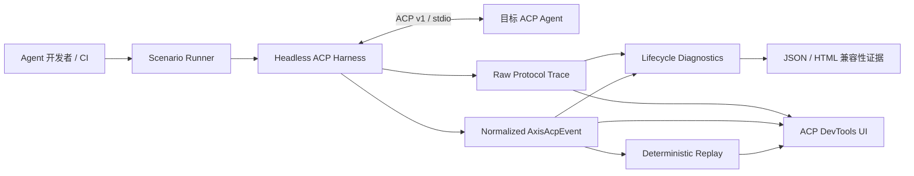

# Gate 00：产品定位 Review Pack

> Review 状态：**已通过**
>
> 生成日期：2026-08-04
>
> Review 范围：只审产品定位，不审仓库改造或 ACP 实现
>
> 面试使用说明：先完成“Part A：无答案面试区”，再阅读“Part B：参考答案区”。自动化测试通过不代表本 Gate 通过；只有用户明确回复“Gate 00 通过”后，才能进入 Gate 01。

## 0. 仓库与方案现状结论

本 Gate 的结论不是“ACP DevKit 已实现”，而是“产品定位已经被定义，并且当前实现边界已被诚实核对”。

- 当前分支：`feature/acp-devkit`。
- 相对 `origin/main`，当前分支只新增了 `Axis-UI-ACP方案.md`，没有 ACP 代码。
- 仓库当前仍是 Axis-UI：公开包为 `axis-ui`、`@axis-ui/theme-chalk`、`@axis-ui/utils`，已有 Button、Checkbox、Form、Icon、Input、Tree、VirtualList。
- 当前不存在 `acp-core`、`acp-harness`、`acp-cli`、`acp-devtools`、Fixture Agent、Scenario、Transcript 或 Replay 实现。
- Gate 00 之前不存在 `docs/interview/`；本文件是第一个 Review Pack。
- 现有 Axis-UI 基线的 type-check、单元测试和构建通过，但这些结果不能用来证明 ACP 能力。

因此，当前可以陈述的是“完成了产品方向与范围设计”；不能陈述“实现了 ACP 测试工具链”。

---

# Part A：无答案面试区

> 在人工面试开始前，不要继续阅读 Part B。

## 1. 本 Gate 做了什么，明确没做什么

### 已完成

- 将项目从“普通 Coding Agent 客户端”重新定位为 **Axis ACP DevKit：面向 Coding Agent 开发者的 ACP 协议测试与调试工具链**。
- 明确目标用户：ACP Agent 实现者、ACP 适配团队、生命周期与异常行为测试工程师、CI 兼容性回归团队，以及需要为 Vue 产品接入 ACP 的前端基础设施团队。
- 明确四个核心价值：**驱动、记录、诊断、回放**。
- 明确 Headless Harness / CLI 是产品核心，DevTools UI 是同一运行时的可视化消费者。
- 明确 M2-Core 的有限交付范围和长期非目标。
- 明确 Fixture Agent、自研 Axis Code Agent、真实 Registry Agent 在项目中的不同职责。

### 未完成

- 未修改 Workspace、构建、测试或发布边界；这些属于 Gate 01。
- 未集成官方 ACP SDK，未实现 Harness、子进程、安全 Bridge 或 Target Registry。
- 未实现 Raw Trace、AxisAcpEvent、Reducer、Scenario DSL、Diagnostics、Transcript、Replay、Fault Injection 或 Report。
- 未实现 DevTools UI，也未接入 Fixture Agent 或真实 Agent。
- 未验证方案中关于 ACP 生态、协议版本和 SDK 状态的外部时效性；本 Gate 只核对仓库内方案与定位。
- 未产生任何 ACP 运行指标、兼容性结论或 Demo 视频。

## 2. 对应简历内容

### 当前可以写

当前最多只能作为项目介绍或进行中描述：

> 设计 Axis ACP DevKit 的产品与技术方案，将项目定位为面向 Coding Agent 开发者的 ACP Harness、场景测试、协议诊断与确定性回放工具链，并划定 Headless 核心、可视化 DevTools 与原 Axis-UI 组件库之间的职责边界。

这句话只能证明“完成方案设计”，不能替代实现证据。

### Gate 00 通过后仍只能作为目标、不能作为完成事实

> 给任意受支持的 ACP Agent 一条启动命令和一组场景，DevKit 驱动其运行，记录双向协议，诊断生命周期约束，离线回放，并输出可审计的兼容性报告。

只有后续 Gate 提供对应代码、测试和 Demo 证据后，才能把其中的具体能力改写成完成式简历描述。

## 3. 关键文件、测试、命令和运行证据

### 关键文件

| 文件                               | 当前证据                                                                                      |
| ---------------------------------- | --------------------------------------------------------------------------------------------- |
| `Axis-UI-ACP方案.md`               | 1,949 行总方案；第 1～5 节定义产品定位、目标用户与非目标，第 12.0 节定义人工 Review Gate      |
| `README.md`                        | 当前首页仍只介绍 Vue 3 组件库，说明 ACP 产品尚未落地到仓库入口                                |
| `package.json`                     | 当前脚本只覆盖 Axis-UI；没有 ACP CLI、Harness 或 DevTools 脚本                                |
| `pnpm-workspace.yaml`              | 当前只包含 `packages/**` 与 `play`，尚未加入方案中的 `apps/**` 和精确 Fixture Workspace       |
| `packages/components/package.json` | 公开包名仍为 `axis-ui`，版本为 `0.0.3`                                                        |
| `vitest.config.ts`                 | 当前只有单一 `happy-dom` 测试配置，尚未拆分 Node、Contract、Scenario、Replay、Security 等项目 |

### 只读核对命令

```bash
git status --short --branch
git diff --name-status origin/main...HEAD
rg --files -g '!Axis-UI-ACP方案.md' | rg -i 'acp|agent|scenario|transcript|replay|harness'
rg -n -i '\bACP\b|AxisAcpEvent|Scenario DSL|Transcript|Replay' \
  -g '!Axis-UI-ACP方案.md' -g '!pnpm-lock.yaml' .
```

2026-08-04 的核对结果：

```text
branch: feature/acp-devkit
diff from origin/main: only Axis-UI-ACP方案.md
ACP-related paths outside the plan: none
ACP references outside the plan: none
```

### 现有仓库基线命令

```bash
pnpm type-check
pnpm test --run
pnpm build:all
```

2026-08-04 的运行结果：

```text
type-check: PASS（vue-tsc --noEmit）
unit tests: PASS（9 files, 119 tests）
build: PASS（axis-ui、@axis-ui/theme-chalk、@axis-ui/utils）
```

证据边界：这些结果只证明原 Axis-UI 基线当前健康，不证明 ACP DevKit 已经实现，也不代表 Gate 00 自动通过。

## 4. 30 秒项目讲解练习

请脱离文档，用自己的话覆盖以下信息，但不要背关键词：

- 服务谁；
- 解决什么实际问题；
- 驱动、记录、诊断、回放四个价值；
- 与普通 Agent 客户端的边界；
- 当前仍处于什么阶段。

## 5. 2 分钟技术讲解练习

请在 2 分钟内讲清：

1. 被测 ACP Agent、Harness、Scenario Engine、Trace/Event、Replay、CLI/UI 的关系；
2. 为什么核心必须 Headless；
3. 为什么 M2-Core 只做三个确定性场景；
4. Fixture Agent、真实 Agent、自研 Agent 分别解决什么证据问题；
5. 项目不做什么，以及为什么这些非目标能提高交付可信度。

## 6. 产品架构图



读图重点：Harness 和 Scenario 在无 UI 时仍可工作；UI 负责解释和展示证据，不是产品成立的前提。

## 7. 无答案面试题

人工 Review 时从以下问题中选择 3～5 个，逐个回答：

1. 这个项目解决什么实际问题？
2. 为什么现有 Agent Client 不能满足这些需求？
3. Axis ACP DevKit 与 Cherry Studio、普通 Workbench 有什么区别？
4. 为什么自研 Axis Code Agent 不是当前核心？
5. 为什么 M2-Core 只做三个 Scenario？
6. 为什么 Toolkit 的核心必须 Headless，而不能只做 DevTools UI？
7. “Compatibility Report”为什么不等于 ACP 官方认证，也不等于模型代码能力评分？

## 8. Demo 路径（Gate 00 文档级）

Gate 00 没有功能 Demo，只允许展示产品定位与诚实现状：

```text
1. 打开 README.md：证明当前产品仍是 Axis-UI 组件库
2. 打开 Axis-UI-ACP方案.md 的“一、方向决策”和“五、明确不做的事情”
3. 画出“目标 Agent → Harness → Trace/Event → Diagnose/Replay → Report/UI”
4. 执行 git diff --name-status origin/main...HEAD：证明当前只有方案文件
5. 执行 ACP 路径/关键字搜索：证明没有把未来能力冒充成已实现
6. 用 30 秒说明目标用户、四个核心价值和普通 Agent Client 非目标
```

这个 Demo 的目标是证明定位清楚、边界诚实，不是证明 ACP 功能可运行。

---

# Part B：参考答案区

> 只有完成第一轮无答案讲解和问答后再阅读本部分。参考回答用于校准逻辑，不要求逐字背诵。

## 9. 30 秒项目讲解参考

> Axis ACP DevKit 面向正在开发或适配 ACP Coding Agent 的团队。它不是给终端用户聊天的客户端，而是由 Headless Harness 驱动目标 Agent，记录双向协议，把生命周期和 Capability 行为转成可定位的诊断，再用 Transcript 离线回放问题。M2-Core 聚焦三个确定性场景，先证明驱动、记录、诊断、回放的闭环。目前仓库只完成产品与技术方案，ACP 能力尚未实现。

## 10. 2 分钟技术讲解参考

> 普通 Agent Client 主要优化的是用户如何发起对话、查看 Plan、Tool、Permission、Diff 和 Terminal；Axis ACP DevKit 主要服务 Agent 开发者，回答 Agent 是否遵守协议生命周期、Capability 声明与行为是否一致、Cancel 或 Crash 后资源是否收敛、线上异常能否复现等工程问题。
>
> 核心是一套不依赖 Vue 和浏览器的 Headless Harness。它通过 ACP v1 的 stdio 连接目标 Agent，同时扮演 ACP Client 和测试控制器。Scenario Runner 描述输入、等待条件和时序断言；Harness 保存原始 JSON-RPC Trace，并通过 Adapter 产生统一语义事件。Diagnostics 把协议违规、Capability 契约不匹配、场景失败、资源泄漏和 Harness 自身故障分开，避免把所有失败都归咎于 Agent。Transcript 记录已发生的事实，Replay 重放事件恢复状态，不重新执行模型或工具副作用。CLI/CI 是第一等入口，DevTools UI 只是同一证据链的可视化消费者。
>
> M2-Core 只做 normal-prompt-turn、cancel-during-permission、capability-method-mismatch 三个场景，因为它们分别覆盖基础互操作、关键竞态和 Capability 契约，能够以较小范围验证核心差异。Fixture Agent 提供确定性回归，真实 Agent 证明不是只适配 Fixture；自研 Axis Code Agent 属于后续 Dogfooding，不应拖慢测试工具链成立。当前这些仍是计划，必须经过后续 Gate 的代码、测试和 Demo 才能写成完成式简历能力。

## 11. 面试题参考回答、两层追问与常见错误

### Q1：这个项目解决什么实际问题？

**参考回答**

ACP Agent 开发者缺少一条可重复、可审计的协议工程闭环：用固定 Client Capability 和场景驱动 Agent，保存双向协议证据，检查生命周期、Capability 与资源收敛，出现异常后脱离真实模型和工具副作用离线回放。项目测试的是协议与工程行为，不是让用户更方便地聊天。

**第一层追问：为什么“能聊天”不能证明 Agent 接入正确？**

一次成功对话只覆盖 Happy Path，不能证明 Permission Pending 时 Cancel、Agent Crash、非法 stdout、Capability 缺失或残留进程等异常路径正确。

**第二层追问：如何让结论可审计？**

保存 Raw Frame、语义事件、断言结果、诊断分类、责任主体、规范引用、状态快照和可复现 Transcript，并在报告中关联同一 Sequence/Trace ID。

**常见错误回答**

- “它让 Agent 写代码更聪明。”——项目不评价模型主观代码质量。
- “它就是 ACP 聊天客户端。”——丢失测试、诊断和回放的定位。
- “它保证所有 Agent 都符合 ACP。”——当前只计划在 Axis 场景集内提供兼容性证据。

### Q2：为什么现有 Agent Client 不能满足？

**参考回答**

现有 Client 可以展示 Plan、Tool、Permission 等交互，但产品目标通常是完成用户任务。DevKit 需要额外提供可脚本化 Client 行为、Capability Profile、故障注入、时序断言、原始协议关联、确定性 Replay、CI Exit Code 和报告，这些是测试基础设施职责，而不是普通 Client 的主要职责。

**第一层追问：能否直接给现有 Client 加一个日志面板？**

日志面板能改善观察，但不能自动控制输入与 Permission、稳定复现竞态、执行断言、隔离副作用或在 CI 无界面运行，因此只解决了可见性的一部分。

**第二层追问：DevTools UI 为什么仍然保留？**

复杂 Trace、状态变化和诊断需要人类探索；UI 提高定位效率，但消费的是 Headless Runtime 的同一份证据，关闭 UI 后场景仍可运行。

**常见错误回答**

- “现有客户端做得不好看。”——差异不是视觉质量。
- “现有客户端完全没有日志。”——绝对化且不是核心论据。
- “我们功能更多。”——没有说明测试闭环和职责差异。

### Q3：与 Cherry Studio、普通 Workbench 有什么区别？

**参考回答**

Cherry Studio 或普通 Workbench 的中心对象通常是用户、会话和任务完成；Axis ACP DevKit 的中心对象是 Target、Run、Scenario、Trace、Diagnostic 和 Transcript。前者优化日常使用体验，后者优化 Agent 实现与适配的验证、复现和回归。Workbench 在本项目中被降级为 DevTools UI，而不是产品核心。

**第一层追问：为什么界面不能以聊天框为首页？**

首页信息架构会决定产品心智。DevKit 应优先展示 Target、Run、Scenario、Protocol Timeline、Inspector 和 Assertions，否则很容易退化为聊天客户端。

**第二层追问：两类产品有没有重叠？**

有，都会处理 Prompt、Plan、Tool、Permission、Diff 和 Terminal；区别在于这些能力是为了完成用户任务，还是为了生成可重复、可诊断、可审计的测试证据。

**常见错误回答**

- “完全没有重叠。”——忽略了共享的 ACP 交互面。
- “我们比 Cherry Studio 更专业。”——空泛且无法验证。
- “加了 Inspector 就是 DevKit。”——单一 UI 功能不足以构成测试工具链。

### Q4：为什么自研 Agent 不是当前核心？

**参考回答**

DevKit 的价值是测试和调试任意受支持的 ACP Agent。自研 Agent 可以证明团队理解 Context、Tool、Loop 和 ACP Adapter，也可以用于 Dogfooding，但它会引入模型、工具、上下文选择和任务质量等另一套复杂度。M2-Core 先用确定性 Fixture 建立测试闭环，再用一个真实 Agent 验证互操作；自研 Agent 延后，避免改变产品中心和拖慢交付。

**第一层追问：Fixture Agent 是否太假？**

Fixture 的目的不是代表真实模型质量，而是稳定触发 Permission、Cancel、Crash 和非法行为，保证回归可重复。它必须和真实 Agent E2E 搭配。

**第二层追问：何时值得实现 Axis Code Agent？**

当 Harness、Scenario、Diagnostics 和 Replay 的 M2-Core 闭环已成立，并且需要展示真实 Agent 开发与同一场景 Dogfooding时；它不能成为 DevKit 成立的前置条件。

**常见错误回答**

- “自研 Agent 没价值。”——它有参考实现和 Dogfooding 价值，只是不是当前核心。
- “先做自研 Agent 更能展示 AI 能力。”——会把产品重新拉回 Agent 应用实现。
- “Fixture 就能证明兼容所有真实 Agent。”——确定性测试不能替代真实互操作证据。

### Q5：为什么 M2-Core 只做三个 Scenario？

**参考回答**

三个场景形成最小但有辨识度的证据组合：`normal-prompt-turn` 验证基础互操作与事件链；`cancel-during-permission` 验证双向 RPC、竞态和资源收敛；`capability-method-mismatch` 验证协商结果能否变成可执行契约。先把每个场景的 Fixture、断言、诊断、Trace、Replay、CLI/UI 和报告闭环做深，比堆积大量浅场景更能验证架构并控制秋招交付风险。

**第一层追问：为什么不是一个场景？**

一个 Happy Path 无法覆盖项目最有区分度的竞态诊断和 Capability Contract；三个场景覆盖基础、时序和契约三个维度。

**第二层追问：为什么不是十个场景？**

每增加一个场景都需要稳定触发条件、规范或分类依据、责任主体、证据链、Fixture、报告和回归维护。M2-Core 的目标是证明完整方法，不是建立大而全的官方 Conformance Suite。

**常见错误回答**

- “时间不够，所以随便选三个。”——只讲资源约束，没有说明覆盖策略。
- “三个已经覆盖 ACP 全部能力。”——明显夸大。
- “以后场景越多越好。”——忽略维护成本与证据质量。

### Q6：为什么核心必须 Headless？

**参考回答**

协议回归需要在本地终端和 CI 中自动运行，需要确定的 Exit Code、机器可读结果和无浏览器依赖。Harness、Scenario、Assertions、Transcript 和 Reporter 如果依赖 Vue/DOM，就难以隔离测试、复用到 CLI，也会把核心可靠性绑在展示层。UI 应消费同一 Runtime，而不是复制一套行为逻辑。

**第一层追问：Headless 是否意味着 UI 不重要？**

不是。UI 对万级 Trace 浏览、Raw/语义关联和状态差异定位很重要，只是不承担协议真相和执行控制的唯一来源。

**第二层追问：如何防止 CLI 与 UI 结果不一致？**

两者复用相同 Harness、事件模型、Reducer、Assertions 与 Report Schema；UI 只通过受控 Bridge 触发 Target/Scenario 并展示同一 Run Artifact。

**常见错误回答**

- “CI 没有显示器，所以 Headless。”——方向正确但过浅，未提职责与复用。
- “有 CLI 就叫 Headless。”——核心模块仍可能错误依赖 DOM。
- “UI 只是装饰。”——低估人工诊断价值。

### Q7：Compatibility Report 为什么不等于官方认证或模型评分？

**参考回答**

报告只说明某个 Agent 版本、运行环境和 Client Profile 在 Axis 已定义场景与断言下的结果。只有带明确规范依据的规则才能标记协议违规；场景预期、资源规则和 Harness 故障必须分开。项目不代表 ACP 官方，也不对答案质量、代码正确性或模型智能做主观评分。

**第一层追问：报告怎样避免误导？**

携带 Toolkit/Agent/协议版本、环境、Scenario、Capability Snapshot、诊断类型、责任主体、规范引用、Fault Injection 标记和 Transcript 链接，并显式声明覆盖边界。

**第二层追问：Agent 没按预期请求 Permission，是否就是违规？**

不一定。它可能选择了不需要 Permission 的合法路径，应优先归为 Scenario Assertion Failure；只有存在明确 ACP/JSON-RPC 规范依据时才归为 Protocol Violation。

**常见错误回答**

- “PASS 说明 Agent 完全符合 ACP。”——超出场景覆盖范围。
- “FAIL 都是 Agent 的 Bug。”——可能来自 Profile、Harness、Adapter 或环境。
- “报告可以比较哪个模型写代码最好。”——偏离协议与工程行为定位。

## 12. 容易夸大的总清单

- 不说“已实现 ACP DevKit”；当前只完成方案设计和 Gate 00 Review Pack。
- 不说“支持任意 ACP Agent”；后续也只能说“受支持/登记的目标 Agent”。
- 不说“官方 Conformance Suite”或“ACP 官方认证”。
- 不说“确定性 Replay 会重新执行并复现所有外部副作用”；计划重放的是已记录事实和语义状态。
- 不说“Compatibility Report 能评价模型写代码能力”。
- 不说“Fixture Agent 证明了真实生态兼容性”。
- 不说“用了官方 SDK 就不需要 Raw Trace、Harness 或 Adapter”。
- 不把 Axis Code Agent 当成 M2-Core 已实现能力。

## 13. 当前仍不能写进简历的能力

以下能力全部缺少实现证据，目前不能以完成式写入简历：

- 基于官方 TypeScript SDK 实现 ACP Harness；
- 安全 Target Registry、Bridge、Token、Origin、Quota 和进程树清理；
- ACP v1 initialize/session/prompt/update/permission/cancel/crash 链路；
- Raw Protocol Trace 与 AxisAcpEvent 双层模型；
- 纯函数 Session Reducer、状态哈希与竞态收敛；
- Typed Scenario DSL、两个 Client Profile 和三个核心 Scenario；
- 七条 Lifecycle Invariant、规范引用与 Diagnostic 责任主体；
- Transcript、脱敏、Deterministic Replay 与 Fault Injection；
- Headless CLI、CI Exit Code、JSON/HTML Report；
- Vue DevTools Timeline、Inspector 或万级事件性能；
- Fixture Agent、真实 Registry Agent 互操作或自研 Axis Code Agent；
- Axis-UI 通用需求反哺、发布和真实消费闭环；
- 任何兼容性矩阵、性能数字、用户数据或官方认证结论。

## 14. 人工 Review 记录

### 本 Gate 的 Review 方式调整

- 2026-08-04，用户明确要求跳过口头项目讲解、逐题提问、回答评价和薄弱点追问。
- 本 Gate 改为文档自学：用户直接通过本 Review Pack 中的问题、参考答案、两层追问和常见错误回答进行学习。
- 其余 Review Pack 内容和 Gate 边界保持不变。
- 跳过互动面试不等于自动通过；在用户明确回复“Gate 00 通过”前，不进入 Gate 01。

### 第一轮：30 秒项目讲解

- 状态：已按用户要求跳过
- 用户原回答：不适用
- 评价：不进行
- 薄弱点：不进行互动追问，由用户通过文档自学

### 逐题问答与追问

- 状态：已按用户要求跳过
- 已提问题：不适用
- 用户原回答摘要：不适用
- 评价与追问：不进行；保留文档中的参考答案、两层追问和常见错误回答供自学

### Review 结论

- 当前结论：**Gate 00 已通过**
- 自动化检查：只证明 Axis-UI 基线健康，不构成 Gate 通过
- 放行条件：用户完成文档自学后，明确回复“Gate 00 通过”
- 用户明确确认：2026-08-04，用户在 Gate 00 上下文中回复“通过，继续”，明确放行 Gate 00 并要求继续

### 后续流程授权

- 2026-08-20，用户明确取消 Gate 01～07 的逐 Gate 人工阻断，授权按顺序连续开发。
- 每个 Gate 仍须独立测试、生成 Review Pack，并按合理开发单元创建一个或多个原子 Commit；Commit Message 只描述技术变更，Gate 映射由本机 Review Pack 记录，最终统一 Review。
- 此调整不改变 Gate 00 已通过的结论。
