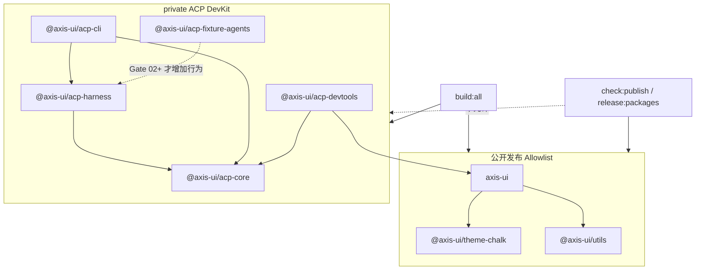

# Gate 01：仓库与发布边界 Review Pack

> Review 状态：**实现完成，等待最终统一 Review**
>
> 生成日期：2026-08-04
>
> Review 范围：Monorepo Workspace、公开/私有包、构建与发布过滤、Node/Vue 类型检查、Vitest Projects、原 Axis-UI 回归
>
> Review 方式：按用户 2026-08-20 的最新授权，Gate 01～07 连续开发、逐 Gate 独立提交，最终统一 Review；本文件保留问题、参考答案、两层追问和常见错误回答供独立学习。

## 0. Gate 结论

Gate 01 已经完成“保留原 Axis-UI 公开发布面，同时为 private ACP DevKit 建立可独立构建、类型检查和测试的 Monorepo 边界”。

当前仓库有 10 个 Workspace Project（含根项目）：

- 3 个公开包：`axis-ui`、`@axis-ui/theme-chalk`、`@axis-ui/utils`；名称和版本均未被 Gate 01 改写。
- 5 个 private ACP 项目：`@axis-ui/acp-core`、`@axis-ui/acp-harness`、`@axis-ui/acp-cli`、`@axis-ui/acp-devtools`、`@axis-ui/acp-fixture-agents`。
- 2 个原有 private Project：根项目与 `@axis-ui/play`。

`build:all` 会覆盖公开包与 private DevKit 骨架；`check:publish` 和 `release:packages` 只使用三个公开包的显式 Allowlist。Gate 01 没有实现任何 ACP 协议行为。

## 1. 本 Gate 实现了什么，以及明确没实现什么

### 已实现

- 将 Workspace 精确扩展为 `packages/**`、`apps/**`、`fixtures/acp-agents` 和 `play`，没有用宽泛的 `fixtures/**`。
- 新增 `acp-core`、`acp-harness`、`acp-cli`、`acp-devtools`、`acp-fixture-agents` 五个 `private: true` 的空骨架。
- 建立依赖方向：
  - `acp-core` 不依赖其他 ACP 包；
  - `acp-harness` 依赖 `acp-core`；
  - `acp-cli` 依赖 `acp-harness` 与 `acp-core`；
  - `acp-devtools` 可以消费 `acp-core` 和公开 `axis-ui`；
  - 公开包不能依赖 private ACP 包。
- `build:all` 构建所有公开包、private Node 包、Fixture 骨架，并单独校验 DevTools Vue 骨架。
- `check:publish`、`release:packages` 使用三个公开包名的显式 Allowlist。
- Changesets 配置为不版本化、不打 Tag 给 private 包。
- Node 包使用独立 `tsconfig.node.json` 和 `tsc --noEmit`；Axis-UI 与 DevTools 使用 `vue-tsc`，且 DevTools 单独执行。
- Vitest 拆分为八个 Project：`axis-ui`、`acp-node`、`acp-devtools`、`contract`、`scenario`、`replay`、`security`、`browser`。
- Browser Project 使用 Playwright + Headless Chromium，未把 `happy-dom` 冒充成真实浏览器。
- CI 在执行包含 Browser Project 的 `test:ci` 前安装 Chromium。
- 增加 6 条仓库边界断言和 6 条测试环境边界断言。
- 原 Axis-UI 的 type-check、119 个原单测、build、coverage、publint、ATTW、安装级 smoke 和 docs build 均继续通过。

### 明确未实现

- 未安装或集成 ACP SDK。
- 未实现 Target Registry、Process Manager、stdio Transport、Bridge、Token、Origin 或进程回收。
- 未实现 initialize、session/new、prompt、update、permission、cancel 或 crash 链路。
- 未实现 Raw Trace、AxisAcpEvent、Reducer、Scenario、Diagnostics、Transcript、Replay 或 Report。
- `acp-devtools` 只有明确标记“no ACP runtime is implemented”的最小 Vue 骨架，不是可运行的产品界面。
- Contract、Scenario、Replay、Security 测试当前只证明 Project 能在 Node 环境独立执行，不证明对应能力已经存在。
- 未执行真实 npm publish，也未运行正式 release；只验证了过滤脚本、打包审计和临时目录安装。
- 未进入 Gate 02。

## 2. 对应简历内容

Gate 01 人工通过后，可以使用以下完成式描述：

> 在既有 Vue 3 组件库 Monorepo 中建立 ACP DevKit 的 public/private 包边界，通过精确 Workspace、单向依赖和显式发布 Allowlist，使 private Node/Vue 工具包参与统一构建与测试但不进入 npm 发布；拆分 tsc、vue-tsc 与多环境 Vitest Projects，并以 131 项测试、产物审计和安装级 Smoke 保护原 Axis-UI 消费链路。

表述边界：这句话证明的是仓库与工程化隔离，不能暗示 Harness、协议适配或 DevTools 功能已经实现。

## 3. 关键文件、测试、命令和运行证据

### 关键文件

| 文件                                                         | 作用                                                                             |
| ------------------------------------------------------------ | -------------------------------------------------------------------------------- |
| `pnpm-workspace.yaml`                                        | 精确声明四类 Workspace Root                                                      |
| `package.json`                                               | 拆分 build、public publish/release Allowlist、Node/Vue type-check 与各类测试命令 |
| `.changeset/config.json`                                     | `privatePackages: false`，禁止 private 包参与 Changesets 版本和 Tag              |
| `tsconfig.node.json`                                         | Node ACP 包的 ES2022、NodeNext、Node 20 类型边界                                 |
| `tsconfig.json`                                              | 原 Vue 根类型检查排除 ACP Node 与独立 DevTools Project                           |
| `vitest.config.ts`                                           | 八个不同环境与职责的 Test Projects                                               |
| `.github/workflows/test.yml`                                 | CI 安装 Chromium 后运行全项目测试                                                |
| `packages/acp-*/package.json`                                | 三个 private Node 包及其依赖方向                                                 |
| `apps/acp-devtools/package.json`                             | private Vue DevTools Project，只做骨架 type-check                                |
| `fixtures/acp-agents/package.json`                           | 精确 Fixture Workspace 的 private 骨架                                           |
| `test/repository/repository-boundary.spec.ts`                | 自动验证包名、private 标记、依赖方向、Workspace 与发布 Allowlist                 |
| `apps/acp-devtools/test/browser/environment.browser.spec.ts` | 证明 Browser Project 真正在 Chromium 中挂载 Vue 骨架                             |

### 本次验证环境

```text
date: 2026-08-04
package manager: pnpm 10.20.0
Vitest: 4.0.4
browser provider: @vitest/browser-playwright 4.0.4
browser: Headless Chromium 151.0.7922.34
CI target: Node.js 20
TypeScript Node declarations: @types/node 20.19.43（pnpm override 统一依赖实例）
```

Vitest 的 `projects` 用于在同一进程中定义不同配置；真实 Browser Mode 需要启用 browser、指定 Provider 和至少一个实例。实现参考 [Vitest Test Projects](https://main.vitest.dev/guide/projects) 与 [Vitest Browser Mode](https://vitest.dev/guide/browser/)。

### 命令与结果

```bash
pnpm install --frozen-lockfile
```

结果：PASS；识别 10 个 Workspace Project，Lockfile 无需更新。

```bash
pnpm type-check
```

结果：PASS；4 个 ACP Node/Fixture Project 使用 `tsc`，原 Axis-UI 与 DevTools 分别使用 `vue-tsc`。

```bash
pnpm build:all
```

结果：PASS；8 个有 build 脚本的 Workspace Project 被处理。公开包生成原有产物；private Node 骨架生成空模块声明；DevTools 骨架只执行类型检查。

```bash
pnpm test:ci
```

结果：PASS：

```text
Test Files: 16 passed
Tests: 131 passed
原 Axis-UI 测试: 119
Gate 01 边界/环境测试: 12
Statements: 82.89%
Branches: 62.93%
Functions: 81.48%
Lines: 84.21%
Browser evidence: browser (chromium) 1 test passed
```

```bash
pnpm lint
pnpm docs:build
```

结果：均 PASS。

```bash
pnpm check:publish
```

结果：PASS；publint 只检查 `axis-ui`、`@axis-ui/theme-chalk`、`@axis-ui/utils`，ATTW 继续验证 `axis-ui` 与 `@axis-ui/utils`。

ATTW 仍显示项目原先明确忽略的 Node10/CJS 分辨率提示；ESM 与 Bundler Profile 通过。这不是新增的 ACP 包问题。

```bash
pnpm test:smoke
```

结果：PASS；只打包三个公开包，在临时消费者中完成安装、主入口/子路径/Resolver/Utils 导入和样式产物检查。

```bash
pnpm --filter axis-ui \
  --filter @axis-ui/theme-chalk \
  --filter @axis-ui/utils \
  list --depth -1 --json
```

结果只包含：

```text
axis-ui                    private: false
@axis-ui/theme-chalk       private: false
@axis-ui/utils             private: false
```

### 已知非阻塞基线问题

`pnpm format:check` 会报告 34 个仓库范围文件未符合当前 Prettier 输出，其中包含大量不属于 Gate 01 的既有组件、文档和 Benchmark 文件，以及 package manager 生成的 `pnpm-lock.yaml`。Gate 01 没有借机批量重写这些无关文件；本 Gate 手写或修改的 JSON、YAML、TS、Vue 与 Markdown 文件已单独执行 Prettier，`git diff --check` 通过。CI 当前也不执行 `format:check`。

## 4. 30 秒项目讲解

> Gate 01 在不改变 `axis-ui`、Theme-Chalk 和 Utils 三个公开包的前提下，为 ACP DevKit 建立了五个 private Workspace。所有项目都能参与统一构建和分环境测试，但 publish、Changesets 和 release 只允许原三个公开包。Node Harness 类代码走 tsc/Node Test Project，Vue 代码走 vue-tsc、happy-dom 和真实 Chromium Project。最后用 131 项测试、publint、ATTW 和安装级 smoke 证明这次 Monorepo 扩展没有破坏原 Axis-UI。

## 5. 2 分钟技术讲解

> 这个 Gate 解决的是“同一个仓库里如何同时维护稳定公开组件库和快速演进的 private ACP 工具链”。如果直接把 ACP 代码放进 `axis-ui`，协议 SDK、Node 子进程和运行时依赖可能进入浏览器组件包，扩大 Bundle、发布和兼容性风险。因此仓库保留三个已有公开包名，新增 `acp-core → acp-harness → acp-cli` 的 Node 依赖方向，并让 private `acp-devtools` 消费 `acp-core` 与公开 `axis-ui`。公开包不允许反向依赖 ACP。
>
> Build 和 Publish 是两个不同集合。Build 要尽早暴露跨包类型与依赖错误，所以公开包和 private DevKit 都参与；Publish 是外部 API 承诺，因此 `check:publish` 和 `release:packages` 只写三个公开包的名字，Changesets 也禁止版本化 private 包。未来即使 `packages/**` 下增加 ACP 包，也不会因为递归脚本被意外发布。
>
> 测试也按运行时拆开。Core、Harness、CLI、Fixture 是 Node 代码，用 NodeNext、tsc 和 Node Test Projects；Axis-UI 与 DevTools 是 Vue 代码，用 vue-tsc，轻量组件测试用 happy-dom，关键交互预留真实 Chromium Browser Project。Contract、Scenario、Replay、Security 各有独立 Project，当前只有环境边界测试，不能声称功能已实现。最终用原 119 个组件测试、12 个边界测试、coverage、构建、文档、publint、ATTW 和临时消费者 smoke 形成回归证据。

## 6. 包依赖与发布架构图



箭头表示“消费者依赖被依赖方”。公开包永远不指向 private ACP 包。

## 7. 高概率面试问题与参考回答

### Q1：为什么 ACP 代码不能直接写进 `axis-ui` 主包？

**参考回答**

`axis-ui` 是已经公开发布的浏览器 Vue 组件库，API、依赖和产物格式都对外形成兼容承诺；Harness 则需要 Node 子进程、stdio、文件系统和 ACP SDK。混在主包会让 Node 依赖进入浏览器依赖图，扩大 Bundle、安装、安全和发布风险，也让协议的快速迭代绑架组件库版本。private 包可以复用 Monorepo 工具链，同时保持运行时和发布隔离。

**第一层追问：只用条件导出能否解决？**

条件导出能区分入口，但仍共享同一 package 的版本、安装依赖、发布权限和变更节奏；它适合一个产品的多运行时入口，不适合把稳定公开组件库与实验性协议工具链绑定成一个外部契约。

**第二层追问：`acp-core` 没有 Node API，为什么也不放进 `axis-ui`？**

`acp-core` 是协议事件、状态和 Transcript 领域模型，不是通用 UI 能力。领域无关且出现第二个真实 UI 消费者后，可以再考虑抽取 Vue 包；在此之前应防止 ACP 概念污染组件库 API。

**常见错误回答**

- “因为 Monorepo 看起来更专业。”——没有说明运行时和发布风险。
- “Vue 不能运行 ACP。”——过于绝对；问题是职责和依赖边界，不是语法能力。
- “private 包绝对不会被任何人用。”——DevTools、CLI 和测试都会消费，只是不公开发布。

### Q2：为什么 private 包仍参与 build，但不参与 publish？

**参考回答**

Build 是内部一致性验证：越早编译所有包，越早发现类型、依赖方向和产物问题。Publish 是外部承诺：包名、版本、API 和支持策略会暴露给用户。private DevKit 尚未稳定，应在 CI 中被严格构建测试，但不能被发布脚本意外推到 npm。

**第一层追问：只设置 `private: true` 还不够吗？**

`private: true` 是最后一道包级保护，但脚本仍应使用显式 Allowlist，Changesets 也应排除 private 包。多层控制可以防止未来有人移除 private 标记、替换发布工具或使用宽泛递归命令时扩大发布面。

**第二层追问：为什么 Allowlist 用包名，不用 `packages/**`？\*\*

目录通配符会随仓库新增包自动扩张；包名 Allowlist 要求每个新公开包经过显式决策，符合最小发布面原则。

**常见错误回答**

- “private 包不用测试。”——恰恰应该在发布前严格验证。
- “publish 会自动忽略，所以脚本无需过滤。”——把安全边界押在单一工具行为上。
- “build 和 release 是同一件事。”——没有区分内部验证和外部契约。

### Q3：为什么 Node 和 Vue 要使用不同的类型检查与测试环境？

**参考回答**

Harness、CLI 和 Fixture 的真实运行时是 Node，需要 Node 内置模块、进程语义和无 DOM 环境，应使用 `tsc`、NodeNext 和 Vitest Node。Vue SFC 需要模板类型分析，应使用 `vue-tsc`；组件 Store 可用 happy-dom 快速测试，关键交互再用真实 Browser Mode。统一成 happy-dom 会掩盖 Node/浏览器边界，统一成 Node 又无法正确验证 SFC 和 DOM 行为。

**第一层追问：happy-dom 与真实 Chromium 有什么差别？**

happy-dom 是快速 DOM 模拟，适合大多数组件逻辑；Chromium 提供真实浏览器模块、事件、布局和平台行为。关键交互应在真实浏览器验证，但不必让所有单测承担浏览器启动成本。

**第二层追问：为什么 Contract、Scenario、Replay 和 Security 都设为 Node？**

这些能力属于 Headless Harness/Runtime，必须能脱离 Vue 和浏览器在 CLI/CI 中运行。浏览器只消费结果并验证 DevTools 关键交互。

**常见错误回答**

- “Vue 项目只能用 jsdom。”——忽略 happy-dom 和 Browser Mode 的不同层级。
- “所有测试都放真实浏览器最准确。”——忽略速度、隔离和故障定位成本。
- “TypeScript 配置越统一越好。”——统一不能牺牲真实运行时边界。

### Q4：如何证明 Monorepo 改造没有破坏原组件库？

**参考回答**

证据需要覆盖源码、产物和消费者三个层次：原 119 个组件/Utils 测试与 coverage 验证行为；`type-check`、ESM/UMD build 和 docs build 验证编译；publint、ATTW 验证包元数据与类型解析；Smoke 将三个 tarball 安装进临时消费者，验证主入口、子路径、Resolver、Utils 和样式。仓库边界测试还保证包名不变、公开包不依赖 ACP。

**第一层追问：为什么 build 通过还要 smoke？**

源码 Workspace 可以通过 Alias 和 `workspace:*` 工作，但发布 tarball 可能缺文件、依赖协议未改写或 Export 错误。临时消费者从打包产物安装，覆盖更接近真实用户的路径。

**第二层追问：为什么还要 publint 和 ATTW？**

publint 检查 package metadata 与文件布局；ATTW 从不同模块解析策略检查 JS/类型入口。它们与运行时 smoke 关注点不同，三者互补。

**常见错误回答**

- “单元测试过了就没有回归。”——没有覆盖发布产物。
- “构建目录存在就证明能发布。”——没有消费者安装证据。
- “测试数量越多越能证明。”——应解释覆盖层次，而不是只报数字。

### Q5：为什么不能把已经发布的 `axis-ui` 重命名为 `@axis-ui/components`？

**参考回答**

包名是用户安装命令、Import、文档、Lockfile 和生态工具共同依赖的公开契约。重命名会制造迁移成本、分裂下载与版本历史，还可能破坏 Resolver 和已有项目。内部目录叫 `packages/components` 不代表外部包名必须一致；新增 DevKit 不构成破坏旧契约的理由。

**第一层追问：Scope 名更统一不是更好吗？**

命名一致性是收益，但要与兼容性成本比较。可以在新 private 包中使用 Scope，同时保留历史公开名称；除非有明确迁移计划和重大收益，不应为了整齐破坏用户接口。

**第二层追问：如果未来确实要迁移怎么办？**

需要发布兼容版本、迁移文档、Codemod、Deprecation 周期和旧包转发策略，并验证 Resolver、样式与子路径；不能在内部重构中静默完成。

**常见错误回答**

- “目录名和包名必须一致。”——不是 npm 要求。
- “项目还小，可以随便改。”——忽略已有发布与消费者。
- “Scoped 包一定更高级。”——审美不能替代兼容性分析。

### Q6：包依赖方向为什么是 `core → harness → cli` 的被消费顺序？

**参考回答**

`acp-core` 应只包含可跨运行时复用的类型、事件、Reducer 和 Schema；`acp-harness` 增加 Node 进程、SDK 与资源控制；`acp-cli` 负责编排命令和输出。DevTools 可以消费 Core 的状态与 Schema，但不应让 Core 依赖 Vue，也不应让公开 Axis-UI 依赖 ACP。这个方向让 Headless 核心可独立测试，展示层和入口层都可替换。

**第一层追问：CLI 为什么不直接实现 Harness？**

CLI 是一种入口；未来 DevTools Bridge、测试代码和其他自动化也要调用 Harness。把执行逻辑塞进 CLI 会阻止复用并增加测试成本。

**第二层追问：DevTools 是否可以直接 import Harness？**

浏览器代码不能直接启动本地进程。Node Host/Bridge 可以消费 Harness，浏览器 DevTools 只能通过受控协议消费 Schema 与事件；具体安全边界属于 Gate 02。

**常见错误回答**

- “所有包互相引用更方便。”——会形成循环和运行时泄漏。
- “Core 就是公共 npm 包。”——内部复用不等于外部稳定承诺。
- “UI 应该拥有全部业务逻辑。”——破坏 Headless 优先。

### Q7：为什么需要自动测试发布边界，脚本写对一次不够吗？

**参考回答**

Monorepo 会持续新增包和脚本。人工 Review 很容易在未来把 Allowlist 改回 `packages/**`、移除 private 标记，或让公开包反向依赖 ACP。仓库边界测试把这些架构决策变成可执行约束，CI 能在变更发生时立即失败。

**第一层追问：这种测试是否过于依赖脚本字符串？**

字符串断言适合验证显式 Allowlist，但确实不是 Shell 语义证明，因此还要配合 `pnpm --filter ... list`、publint 和 Smoke。未来可以把公开包清单抽成单一配置，再由脚本与测试共同消费。

**第二层追问：为什么 Gate 01 没先抽清单生成器？**

当前只有三个稳定公开包，直接 Allowlist 清晰且可审计；提前引入生成器会增加抽象和失效模式。出现第二个真实脚本消费者或包数增长后再抽取更合理。

**常见错误回答**

- “配置不需要测试。”——关键发布配置同样会回归。
- “测试完全证明 npm 不会误发布。”——仍需权限、Registry 与 CI 层防护。
- “有测试就可以放心使用通配符。”——测试不应替代最小发布面设计。

## 8. 两类集合的核心区别

| 维度       | Build / Type-check / Test | Publish / Release              |
| ---------- | ------------------------- | ------------------------------ |
| 目的       | 验证仓库内部一致性        | 对外发布稳定契约               |
| 范围       | 公开包 + private DevKit   | 仅三个公开包 Allowlist         |
| 失败含义   | 内部代码或边界不可交付    | 公开产物不可发布               |
| private 包 | 必须参与                  | 必须排除                       |
| 当前证据   | 构建、类型检查、131 测试  | publint、ATTW、Smoke、过滤列表 |
| 当前未做   | ACP 功能构建              | 真实 npm publish / release     |

## 9. 常见夸大与错误表述

- 不说“ACP Harness 已能构建运行”；当前只有空模块骨架。
- 不说“DevTools 已经完成”；当前只有用于 Vue/Browser 边界验证的最小 `App.vue`。
- 不把 Contract/Scenario/Replay/Security 的环境边界测试称为功能测试。
- 不说“执行过正式发布”；只验证了公开包 Allowlist、tarball 审计和临时安装。
- 不说“private 标记绝对杜绝误发布”；真正边界由 private、Allowlist、Changesets 和测试共同形成。
- 不说“131 项都是 ACP 测试”；119 项是原 Axis-UI，12 项是 Gate 01 边界/环境测试。
- 不说“Browser Test 已验证 DevTools 关键功能”；它目前只证明真实 Chromium Project 可运行。
- 不把当前 Coverage 数字描述成 ACP 功能覆盖率。

## 10. Demo 路径

Gate 01 的 Demo 是工程边界证据，不是 ACP 功能 Demo：

```text
1. pnpm -r list --depth -1 --json
   → 展示 3 个 public 包、5 个 private ACP 项目和原 private 项目

2. 打开 pnpm-workspace.yaml
   → 解释为什么 fixtures 只加入 acp-agents，而不是 fixtures/**

3. 打开包依赖图和各 package.json
   → 说明 public 包不依赖 ACP，Core/Harness/CLI 单向依赖

4. pnpm build:all
   → 展示公开与 private Project 都参与内部验证

5. pnpm test:unit && pnpm test:browser
   → 展示 happy-dom、Node 与真实 Chromium 的环境隔离

6. pnpm --filter axis-ui --filter @axis-ui/theme-chalk \
     --filter @axis-ui/utils list --depth -1 --json
   → 展示发布 Allowlist 只解析出三个公开包

7. pnpm check:publish && pnpm test:smoke
   → 展示 publint/ATTW 与临时消费者安装证据

8. 打开 test/repository/repository-boundary.spec.ts
   → 展示边界决策已经转成 CI 可执行约束
```

建议现场 Demo 用时 3～4 分钟。不要运行真实 `pnpm release`。

## 11. 当前仍不能写进简历的能力

- ACP SDK 集成或 ACP v1 互操作；
- 安全启动、停止和回收 Agent 子进程；
- Target Registry、Loopback Bridge、Token、Origin 和 Quota；
- stdio Transport Tap、stdout/stderr 隔离或 Raw Protocol Trace；
- AxisAcpEvent、Session Reducer、Sequence 或状态机；
- initialize、session/new、prompt/update、permission/cancel/crash；
- Typed Scenario DSL、两个 Client Profile、三个核心 Scenario；
- Lifecycle Invariant、Diagnostic 分类和规范引用；
- Transcript、Redaction、Deterministic Replay、Fault Injection；
- 可用 CLI、DevTools Timeline/Inspector 或 JSON/HTML Report；
- Fixture Agent 或真实 Registry Agent 运行证据；
- ACP 功能覆盖率、性能指标或兼容性结论；
- npm 上已经发布任何 ACP 包。

## 12. 自学检查清单

完成文档学习后，应能不依赖代码回答：

- 能画出 public 三包与 private 五项目的依赖方向；
- 能解释 Build 与 Publish 为什么是两个集合；
- 能解释 `private: true`、Allowlist、Changesets 和边界测试各自解决什么风险；
- 能说明 tsc、vue-tsc、happy-dom 与 Chromium 的职责差异；
- 能用测试、产物审计和消费者 Smoke 三层证据证明 Axis-UI 未被破坏；
- 能说明为什么不重命名已发布的 `axis-ui`；
- 能诚实指出 Gate 01 只有骨架和工程边界，没有 ACP 功能。

## 13. 人工 Review 记录

### Review 方式

- 状态：按用户要求采用文档自学，不进行口头面试和互动追问
- 学习材料：本文件第 4～12 节
- 自动化结果：只代表实现可进入人工 Review，不代表 Gate 自动通过

### Review 结论

- 当前结论：**实现完成，等待最终统一 Review**
- 连续开发授权：2026-08-20，用户明确授权 Gate 01～07 按顺序连续完成，每 Gate 独立提交
- 最终人工结论：待填写
- 下一 Gate：Gate 02（Harness、子进程与安全）；允许在 Gate 01 Commit 创建后开始
