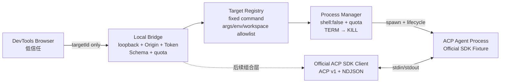
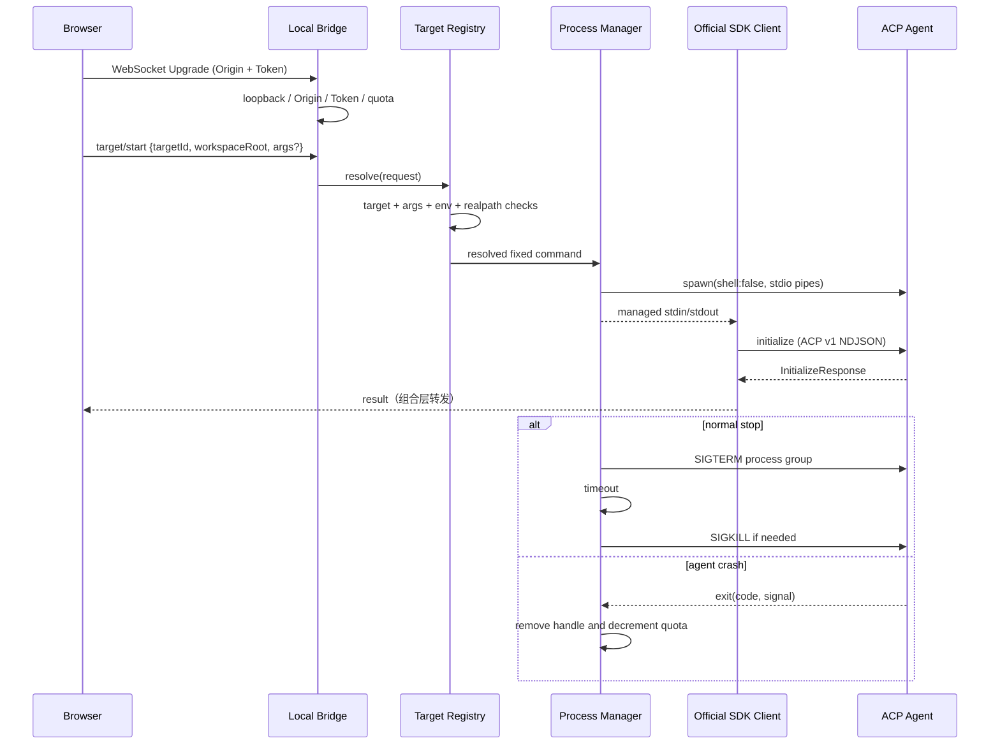

# Gate 02：Harness、子进程与安全 Review Pack

> Review 状态：**实现完成，等待最终统一 Review**
>
> 生成日期：2026-08-20
>
> Review 范围：Target Registry、Process Manager、官方 ACP TypeScript SDK、stdio、Local Bridge、进程退出与回收
>
> Review 方式：按用户最新授权连续开发，最终统一 Review。本文件只在本机记录 Gate 与技术 Commit 的映射；Commit Message 不写 Gate 标签。

## 0. Gate 结论与 Commit 映射

Gate 02 已完成一个最小但真实的安全 ACP 启动闭环：浏览器侧只能通过回环地址 Bridge 提交严格消息，Node Harness 只从服务端 Target Registry 解析固定命令和受控参数，在允许的 Workspace 内以 stdio 启动 Agent，再通过官方 ACP SDK 完成 `initialize`。正常停止、Agent Crash 和 Harness Dispose 都会清理进程登记；POSIX 下按独立进程组执行 `SIGTERM → 超时后 SIGKILL`。

本 Gate 对应的技术 Commit：

```text
c019e66 feat: add safe ACP subprocess harness
d875eec test: verify harness security boundaries
ff98873 fix: align harness types across root checks
```

可独立检查的实现范围：

```bash
git log --oneline c019e66^..ff98873
git diff c019e66^..ff98873
```

Review Pack 自身的文档 Commit 不纳入上述技术范围，最终索引会单独登记。自动化证据表示“可以统一 Review”，不表示用户已人工通过。

## 1. 本 Gate 实现了什么，以及明确没实现什么

### 已实现

- Target Registry 只接受预先登记的 Target ID；命令必须是服务端配置的绝对路径。
- 动态参数采用逐项 Allowlist，固定参数由 Registry 合并；网页消息不能传 `command` 或任意字段。
- 环境变量采用逐项 Allowlist，不默认继承完整 `process.env`。
- Workspace Root 先经 `realpath` 消除符号链接，再验证位于允许根目录内。
- Process Manager 使用 `spawn(..., { shell: false })`，避免 Shell 插值与命令拼接。
- 同时限制全局进程数和单 Target 进程数；stderr 只保留有上限的最近行。
- POSIX 子进程位于独立进程组；停止时先 `SIGTERM`，超时再 `SIGKILL`，以回收 Agent 及其子进程树。
- Agent 自然退出或 Crash 后，从活动 Handle 和单 Target 计数中移除。
- 使用官方 `@agentclientprotocol/sdk@1.3.0` 的稳定 v1 入口、`ndJsonStream`、`client()`、`methods` 和 `PROTOCOL_VERSION`。
- Fixture Agent 同样使用官方 SDK 的 `agent()`，真实完成 ACP `initialize`，而不是伪造 JSON 响应。
- Local Bridge 只允许 `localhost`、`127.0.0.1` 或 `::1` 绑定，并再次校验连接来源是回环地址。
- Bridge 使用至少 32 字符的高熵 Token、常量时间比较和显式 Origin Allowlist。
- WebSocket 限制连接数、消息大小和时间窗内消息数，拒绝二进制消息。
- Bridge 消息采用严格 Schema，只允许 `target/start` 与 `target/stop` 的既定字段；未知字段和未知 Target 均拒绝。
- Contract 测试覆盖真实 stdio initialize 和 Agent Crash；Security 测试覆盖未知 Target、参数/环境越权、目录逃逸、配额、进程树清理和 Bridge 鉴权。

### 明确未实现

- 未实现 `session/new`、`prompt`、流式 `session/update`、完整 Permission 或 Cancel；默认 Permission 处理仅返回 `cancelled`，防止意外授权。
- 未实现 Transport Tap、Raw JSON-RPC Trace、`AxisAcpEvent` 或 Adapter；这些属于 Gate 03。
- 未实现 Reducer、Turn 终态、Cancel 与 Pending Permission 协同；这些属于 Gate 04。
- 未实现 Scenario、Assertion、Diagnostic、Transcript、Replay、Report 或真实 DevTools UI。
- Local Bridge 是安全传输边界，不直接拥有 Harness 生命周期；“浏览器断开即清理其启动进程”需要后续组合层按连接建立所有权关系。
- Workspace 校验只证明启动时的 `cwd` 真实路径位于允许根内；没有实现 Agent 运行期间的文件写入沙箱或系统级权限隔离。
- POSIX 进程组回收有自动化证据；Windows 当前退化为 `child.kill()`，尚未实现 Job Object 或 `taskkill /T` 等等价进程树机制。
- stderr 当前只作为独立的有界诊断缓冲，不属于 ACP stdout，也尚未进入事件模型。
- 未对 Trace、URL 或文件正文执行凭据脱敏，因为本 Gate 尚不导出 Trace。

## 2. 对应简历内容

Gate 02 最终人工通过后，可以使用以下完成式描述：

> 基于官方 ACP TypeScript SDK 实现 Headless Harness，通过安全 Target Registry、`shell: false` 的 stdio 子进程、Workspace/参数/环境 Allowlist、全局与单 Target 配额以及进程组回收驱动本地 Agent；为浏览器调试面建立仅回环监听、Token + Origin 双校验、严格消息 Schema 和限流的 WebSocket Bridge，并以 Contract/Security 测试覆盖 initialize、越权拒绝和 Crash 清理。

表述边界：这句话只证明“安全启动与最小 initialize 链路”，不能写成已支持完整 ACP Session、场景测试、确定性回放、兼容性报告或生产级系统沙箱。

## 3. 关键文件、测试、命令和运行证据

### 关键文件

| 文件                                                | 作用                                                        |
| --------------------------------------------------- | ----------------------------------------------------------- |
| `packages/acp-harness/src/target-registry.ts`       | 固定 Target、参数/环境 Allowlist、Workspace `realpath` 边界 |
| `packages/acp-harness/src/process-manager.ts`       | 安全 Spawn、配额、stderr 上限、退出记账、进程组回收         |
| `packages/acp-harness/src/sdk-client.ts`            | 将子进程 stdio 接入官方 SDK 并发送 v1 initialize            |
| `packages/acp-harness/src/harness.ts`               | 编排 Registry、Process Manager 与 SDK Client 生命周期       |
| `packages/acp-harness/src/bridge/messages.ts`       | Bridge 严格消息 Schema，不允许浏览器传 Command              |
| `packages/acp-harness/src/bridge/local-bridge.ts`   | 回环监听、Token、Origin、连接/载荷/速率限制                 |
| `fixtures/acp-agents/bin/fixture-agent.mjs`         | 使用官方 SDK 的确定性 Fixture Agent 与 Crash 开关           |
| `test/contract/harness-initialize.contract.spec.ts` | 真实 stdio initialize 与 Crash Contract                     |
| `test/security/target-registry.security.spec.ts`    | Target、参数、环境和目录逃逸拒绝                            |
| `test/security/process-manager.security.spec.ts`    | 固定命令、配额和进程组清理                                  |
| `test/security/local-bridge.security.spec.ts`       | 回环、Token、Origin、Schema、Target 和限流边界              |

### SDK 与协议选择

本 Gate 固定使用 `@agentclientprotocol/sdk@1.3.0` 的稳定包入口和 ACP v1。没有使用 SDK 的实验性 v2 入口。API 与版本选择参考：

- [官方 TypeScript SDK 文档](https://agentclientprotocol.com/libraries/typescript)
- [官方 TypeScript SDK 仓库](https://github.com/agentclientprotocol/typescript-sdk)
- [npm 包页面](https://www.npmjs.com/package/@agentclientprotocol/sdk)

### 命令与结果

```bash
pnpm type-check
pnpm build:all
pnpm lint
```

结果：全部 PASS。Node Harness、Fixture 和原 Vue 工程均通过类型检查与构建。

```bash
pnpm test:contract
```

结果：PASS；2 条新增 Contract 用例完成真实 SDK initialize，并观察 Fixture Agent 以退出码 17 Crash 后活动 Handle 归零。

```bash
pnpm test:security
```

结果：PASS；11 条 Security 用例通过。Bridge 测试需要在允许本机回环监听的环境中执行；受限沙箱内的 `listen EPERM 127.0.0.1` 是运行环境权限，不是断言失败。

```bash
pnpm test:ci
```

结果：PASS：

```text
Test Files: 20 passed
Tests: 143 passed
Statements: 83.29%
Branches: 66.82%
Functions: 82.95%
Lines: 84.82%
Browser evidence: real Headless Chromium passed
```

```bash
pnpm check:publish
pnpm test:smoke
pnpm docs:build
```

结果：全部 PASS。公开包发布 Allowlist、tarball 安装消费与 VitePress 构建未被 Harness 改动破坏。`check:publish` 在受限沙箱内曾因无法写入 `~/.npm/_cacache` 报 `EPERM`；允许 npm 使用其用户缓存后，同一代码和命令通过。ATTW 保留原项目已忽略的 Node10/CJS 提示，ESM 与 Bundler Profile 通过。

## 4. 30 秒项目讲解

> 这一阶段把浏览器、本地 Node 进程和 ACP Agent 分成三个信任边界。浏览器不能提交任意命令，只能携带高熵 Token，从允许的 Origin 连接本机回环 Bridge，并选择服务端预登记的 Target。Harness 再校验参数、环境和 Workspace，用 `shell: false` 的 stdio 子进程启动 Agent，通过官方 ACP SDK 完成 initialize。进程有全局和单 Target 配额，退出或 Crash 会清理登记，停止时按进程组 TERM 后 KILL，避免残留孤儿进程。

## 5. 2 分钟技术讲解

> 这个闭环的核心不是“能 Spawn 一个程序”，而是限制谁能启动什么、在什么目录启动、能带入哪些输入，以及失败后由谁回收。浏览器页面处于低信任侧。如果允许它传 `command`、任意 `args` 或完整环境变量，本地 WebSocket 就可能退化成远程命令执行接口。因此 Bridge 消息只包含 Target ID、Workspace 和受控参数；Target Registry 在 Node 侧保存绝对命令、固定参数、动态参数 Allowlist、环境 Allowlist 和单 Target 配额。Workspace 会先 `realpath`，从而让指向允许目录外的符号链接不能绕过前缀检查。
>
> Process Manager 用参数数组和 `shell: false` 调用 Spawn，不做字符串命令拼接。每个 Agent 的 stdin/stdout 是 ACP 的 NDJSON Transport，stderr 单独收集且有行数上限，不能把日志混进协议流。POSIX 下子进程建立独立进程组，Harness 停止时对整个组先发 SIGTERM，超时再发 SIGKILL；自然退出和 Crash 也会触发统一记账清理。这样既限制资源消耗，也避免只杀父进程留下孙进程。
>
> 协议层没有自行实现 JSON-RPC 状态机，而是把 Node stdio 转成 Web Streams，交给官方 SDK 的 `ndJsonStream` 和 `client()`，使用官方 Method 定义发送 v1 initialize。Harness 自己负责 SDK 不应该负责的进程、资源、安全策略和产品生命周期。浏览器若需要观察或控制 Harness，只能连接回环 WebSocket，并同时通过 Origin Allowlist 和高熵 Token；Bridge 还限制连接、载荷、消息速率和 Schema。最后用真实官方 SDK Fixture 证明链路可互操作，并用越权、Crash 和进程树测试证明安全不只停留在设计文档。

## 6. 架构与时序图





## 7. 高概率面试问题与参考回答

### Q1：为什么浏览器不能直接连接本地 ACP Agent？

**参考回答**

浏览器既不适合直接管理本地子进程，也不能被当作可信命令来源。ACP Agent 通常通过 stdio 运行，浏览器没有安全、可移植的 Spawn 和进程树回收能力；页面还可能受到 XSS、恶意依赖或错误 Origin 影响。应由本地 Node Harness 持有命令、文件系统和进程权限，浏览器只通过受限 Bridge 调用高层动作。

**第一层追问：既然只监听 127.0.0.1，为什么还需要 Token？**

回环地址只限制网络路径，不证明请求来自被授权页面。恶意网站仍可能从用户浏览器请求本机端口；Token 提供不可猜测的会话凭据。

**第二层追问：有 Token 为什么还需要 Origin？**

两者抵御不同失效模式。Origin 限制页面来源，Token 证明本地会话授权；如果 Token 因日志、URL 历史或扩展泄露，Origin 仍提供一道边界，反之亦然。它们不能替代 CSP、XSS 防护和 Token 生命周期管理。

**常见错误回答**

- “浏览器完全不能用 WebSocket。”——浏览器可以连接 WebSocket，问题是不能直接拥有本地命令与进程权限。
- “127.0.0.1 天然安全。”——忽略恶意网站访问本机服务和 DNS/代理环境。
- “CORS 会自动保护 WebSocket。”——WebSocket 服务端仍必须显式校验 Origin。

### Q2：为什么使用 stdio，而不是自己设计 HTTP？

**参考回答**

stdio 是 ACP 本地 Agent 的既定 Transport 之一，天然贴合父子进程生命周期，不需要开放额外端口，也避免自造一层与协议无关的 HTTP 语义。Harness 把 stdin/stdout 交给官方 SDK 的 NDJSON Transport；浏览器 Bridge 是本地产品控制面，不是替换 ACP Transport。

**第一层追问：stdio 有什么工程风险？**

stdout 必须保持纯协议流，日志只能走 stderr；还要处理背压、半包/多包、进程异常退出和关闭顺序。后续 Transport Tap 必须透明转发字节，不能改变 SDK 看到的内容。

**第二层追问：什么时候会考虑网络 Transport？**

当 Agent 明确部署为远程服务、协议规范和鉴权模型支持对应 Transport，或需要跨主机复用时再考虑。不能只为方便浏览器而把本地 stdio Agent 暴露成无边界 HTTP 服务。

**常见错误回答**

- “stdio 比 HTTP 一定更快。”——性能不是主要设计依据。
- “用了 stdio 就不需要安全控制。”——命令、目录、环境和资源风险仍然存在。
- “Bridge 就是 ACP over WebSocket。”——当前 Bridge 是 Harness 控制协议，不是 ACP Transport 替代品。

### Q3：为什么网页不能传任意 command/args？Target Registry 解决了什么风险？

**参考回答**

任意 Command 会把 Bridge 变成本机远程代码执行接口；即使 `shell: false`，页面仍可直接启动危险可执行文件。任意参数也可能让一个合法命令进入危险模式。Registry 把可执行文件绝对路径、固定参数、动态参数集合、环境键和并发上限放在可信 Node 配置中，页面只能选择已审核 Target ID。

**第一层追问：`shell: false` 是否已经阻止命令注入？**

它阻止 Shell 元字符被解释，但不阻止调用 `/bin/rm`、给合法程序传危险 Flag，或用环境变量改变行为。因此它只是纵深防御的一层。

**第二层追问：参数逐项 Allowlist 有什么局限？**

它适合有限模式开关，不适合自由文本、路径和值参数。若以后需要键值参数，应按结构化字段分别验证类型、长度、枚举和路径归属，而不是把整串字符串放行。

**常见错误回答**

- “过滤分号就安全。”——没有 Shell 也可能直接启动危险程序，且黑名单容易漏。
- “只校验 Command 名称即可。”——PATH 劫持和参数行为仍不受控。
- “前端隐藏输入框就不会被调用。”——安全边界必须在 Node 服务端。

### Q4：Workspace 为什么要 `realpath` 后再检查？

**参考回答**

仅做字符串前缀判断会被 `..`、路径分隔符边界或符号链接绕过。先将候选目录和允许根解析为真实绝对路径，再用 `relative` 判断候选是否等于根或位于根下，可以拒绝指向外部的符号链接目录。

**第一层追问：`startsWith(root)` 为什么不够？**

`/safe-other` 也以 `/safe` 开头，而且不同平台的大小写和分隔符语义不同。应使用路径库计算相对路径并检查它不以 `..` 开始且不是绝对路径。

**第二层追问：这是否等于文件系统沙箱？**

不等于。它只限制启动 `cwd`，Agent 获得的 OS 权限仍可能读取或写入其他路径。生产级隔离还需要容器、沙箱、权限降级或 Agent 自身策略。

**常见错误回答**

- “绝对路径一定在允许目录。”——绝对只说明解析起点，不说明归属。
- “`realpath` 能阻止 Agent 访问所有外部文件。”——夸大了启动目录校验。
- “前端传来的路径已选过，所以可信。”——客户端输入始终需要服务端验证。

### Q5：Agent Crash 后怎样避免孤儿进程和资源计数泄漏？

**参考回答**

每次 Spawn 都立即建立 `exited` Promise，并在唯一的 Exit Handler 中移除 Handle、递减单 Target 计数，同时关闭 SDK Connection。主动停止时 POSIX 对独立进程组发信号，而不只杀父 PID；先 TERM 给清理机会，超时再 KILL。Harness Dispose 会 Stop All，测试同时断言退出码和活动 Handle 归零。

**第一层追问：为什么监听 `exit` 而不只监听 `close`？**

`exit` 表示进程结束，适合更新进程生命周期；`close` 表示 stdio 流已关闭，可能稍后发生。协议连接和流清理也要考虑 Close，但资源计数必须围绕明确的进程终态保持幂等。

**第二层追问：为什么只杀父 PID 不够？**

Agent 可能再启动语言服务器或工具子进程。父进程退出后它们可能被重新托管而继续运行；独立进程组允许 Harness 向整个树发送信号。Windows 需要另做等价实现，当前不能宣称跨平台完全解决。

**常见错误回答**

- “Node 退出会自动杀死所有子进程。”——不是可靠保证。
- “SIGKILL 最干净，所以直接用。”——不给 Agent 刷盘和正常关闭机会。
- “从 Map 删除就代表进程已停止。”——状态清理不能替代 OS 进程回收。

### Q6：官方 SDK 和自研 Harness 的职责如何划分？

**参考回答**

官方 SDK 负责 ACP v1 的方法定义、类型、JSON-RPC 连接和 NDJSON 编解码；Harness 负责产品层的 Target 选择、Spawn、Workspace/环境策略、资源配额、生命周期、Bridge 和可测试编排。协议语义不应重复造轮子，安全与进程策略也不应推给 SDK。

**第一层追问：为什么 Fixture Agent 也用官方 SDK？**

这样 Contract 测试验证的是 Client SDK 与 Agent SDK 的真实互操作，而不是 Harness 与自制 Mock 恰好使用相同错误格式。Fixture 仍应保持确定性，便于触发边界条件。

**第二层追问：SDK 升级时如何控制风险？**

锁定具体版本，限定稳定 v1 入口，通过 Contract 测试验证关键方法和 Fixture 互操作；把协议模型经 Adapter 转成内部语义事件，减少 UI/Scenario 对 SDK 类型的直接耦合。Adapter 属于下一 Gate。

**常见错误回答**

- “用了 SDK 就不需要 Contract Test。”——SDK 不能验证本项目的接线和生命周期。
- “Harness 应自己解析所有 JSON-RPC 才可控。”——重复实现协议状态机增加偏差风险。
- “官方 SDK 会自动处理进程安全。”——SDK 不拥有本项目的 Spawn 和 Bridge 策略。

### Q7：Token、Origin、限流和 Schema 各自防什么？

**参考回答**

Token 防止未获本地会话授权的调用；Origin 限制能够发起浏览器连接的页面；回环绑定减少网络暴露；Schema 阻止把控制面扩展为任意命令接口；消息大小、连接数和速率上限抑制内存、CPU 和进程资源滥用。它们是互补的纵深防御，没有一项能单独覆盖全部风险。

**第一层追问：为什么 Token 比较使用常量时间？**

避免比较操作因匹配前缀长度产生明显时序差异。对本机高熵 Token 来说实际攻击收益有限，但实现成本低，并避免形成不必要的侧信道。

**第二层追问：Token 放 Query 有什么风险？**

Query 可能进入访问日志、历史记录或错误报告。当前本地临时 Token 便于 WebSocket 握手，但后续应控制日志、缩短生命周期、避免导出，并在可能时采用更安全的握手或子协议传递方式。

**常见错误回答**

- “有 Token 就可以绑定 0.0.0.0。”——扩大网络面会改变威胁模型。
- “限流能阻止命令注入。”——限流只控制资源频率。
- “严格 TypeScript 类型能验证网络消息。”——运行时输入仍需 Schema 校验。

## 8. Demo 路径

### Demo A：真实 ACP initialize

```bash
pnpm test:contract -- --run test/contract/harness-initialize.contract.spec.ts
```

讲解顺序：

1. 打开 `test/helpers/acp-fixture.ts`，指出 Target 只登记绝对 Node Command 和固定 Fixture 路径。
2. 打开 `fixtures/acp-agents/bin/fixture-agent.mjs`，证明 Agent 使用官方 SDK。
3. 运行 Contract Test，展示协议版本和 Agent Name 断言。
4. 展示 `--crash-after-initialize` 返回退出码 17，随后活动 Handle 为 0。

### Demo B：拒绝未知 Target 与越权输入

```bash
pnpm test:security -- --run test/security/target-registry.security.spec.ts
pnpm test:security -- --run test/security/local-bridge.security.spec.ts
```

现场重点展示：

- `targetId: shell` 返回 `UNKNOWN_TARGET`。
- Bridge 消息夹带 `command: /bin/sh` 返回 `BAD_MESSAGE`。
- 非 Allowlist 参数、环境变量和符号链接逃逸均被拒绝。
- 错误 Token 或 Origin 的 Upgrade 返回 401。

### 回滚/检出

```bash
git switch --detach ff98873
pnpm install --frozen-lockfile
pnpm type-check
pnpm test:contract
pnpm test:security
```

Bridge Security Test 需要允许测试进程监听 `127.0.0.1` 的临时端口。

## 9. 当前仍不能写进简历的能力

- 不能写“实现完整 ACP Client”——当前只完成 initialize，Session/Prompt/Update/Permission/Cancel 尚未实现。
- 不能写“实现协议 Inspector/Raw Trace”——Transport Tap 和双事件模型尚未实现。
- 不能写“支持确定性 Replay”——Transcript、Virtual Agent 和 Sequence Replay 尚未实现。
- 不能写“支持 Scenario 回归和兼容性报告”——Runner、Assertion、Diagnostic 与 Reporter 尚未实现。
- 不能写“完成跨平台进程树隔离”——Windows 等价回收未实现。
- 不能写“实现生产级 Agent 沙箱”——这里只限制启动面和资源，不隔离 Agent 的 OS 文件/网络权限。
- 不能写“浏览器断开必然回收其全部进程”——Bridge 与 Harness 的所有权组合尚未完成。
- 不能写“已适配真实第三方 Agent”——当前 Contract 证据来自确定性 Fixture Agent。
- 不能写“安全审计通过”或“绝对安全”——当前只有明确威胁边界和自动化 Security Test。

## 10. 用户人工 Review 结论

```text
状态：等待最终统一 Review
自动化结论：实现、类型、Contract、Security、全量回归、发布检查、安装 Smoke、文档构建均通过
人工结论：尚未给出；不得表述为 Gate 02 已人工通过
后续方式：最终统一 Review 时按本文问题与参考答案自学，并可检出任一技术 Commit 独立验证
```
