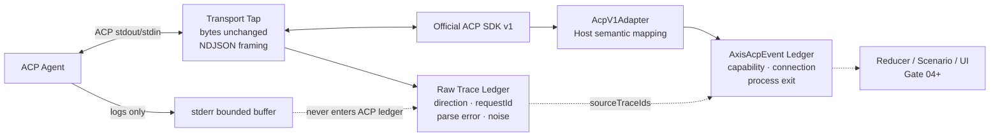
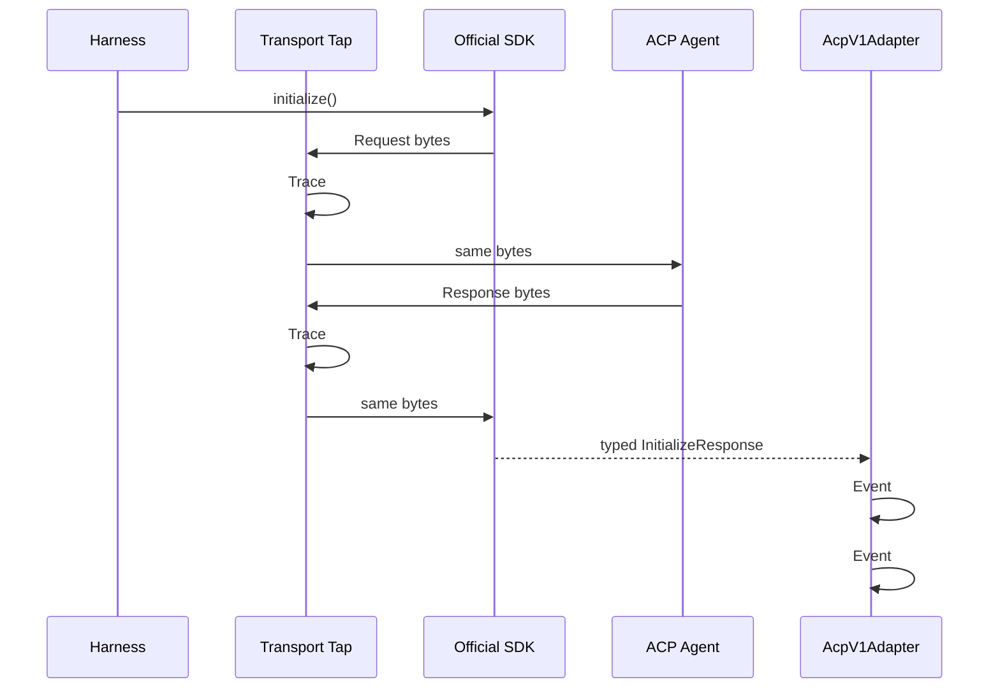

# Gate 03：Raw Trace 与 AxisAcpEvent Review Pack

> Review 状态：**实现完成，等待最终统一 Review**
>
> 生成日期：2026-08-20
>
> Review 范围：Transport Tap、Raw JSON-RPC Trace、全局 Sequence、AcpV1Adapter、AxisAcpEvent、stdout/stderr 隔离
>
> Review 方式：连续开发、最终统一 Review。Gate 与 Commit 的对应关系只记录在本机 Review 文档中，Commit Message 不写 Gate 标签。

## 0. Gate 结论与 Commit 映射

Gate 03 已建立 ACP DevKit 的“双层数据模型”：Transport Tap 在官方 SDK 编解码之前透明观察 stdin/stdout 字节，按 NDJSON 行记录双向 Raw Trace；Host 侧 `AcpV1Adapter` 再把 SDK 的 initialize、Capability 与进程生命周期投影为稳定的 `AxisAcpEvent`。两类记录共享一个 Run 级单调 Sequence，语义事件通过 `sourceTraceIds` 回链原始请求/响应，Timestamp 只用于观测。

本 Gate 对应的技术 Commit：

```text
24ba073 feat: add lossless ACP transport tracing
fce8812 feat: normalize harness protocol telemetry
```

独立 Review 范围：

```bash
git log --oneline 24ba073^..fce8812
git diff 24ba073^..fce8812
```

Review Pack 自身的文档 Commit 将由最终索引单独登记。自动化测试通过不代表用户已人工通过。

## 1. 本 Gate 实现了什么，以及明确没实现什么

### 已实现

- `@axis-ui/acp-core` 定义协议无关的 `ProtocolTraceFrame`、最小 `AxisAcpEvent` Union 和 `SequenceAllocator`。
- Raw Frame 包含 Run/Connection、Sequence、Timestamp、协议版本、方向、原文、字节数、分类、Request ID、Method、解析结果或解析错误。
- Frame 分类为 Request、Response、Notification、Invalid JSON 或 Stdout Noise。
- Transport Tap 使用流式 `TextDecoder`，正确处理 UTF-8 和跨 Chunk 的半行；只在完整 NDJSON 行到达时记账。
- Tap 将原始 `Uint8Array` 原样转发给官方 SDK，观察层不重新序列化、不改变换行或 Payload。
- Client → Agent 与 Agent → Client 两个方向都经过 Tap，可关联 initialize 的 Request/Response ID。
- `AcpV1Adapter` 位于 Node Host，而不是 Vue UI；把官方 v1 SDK 响应归一化为 Capability Snapshot 与 Connection State。
- 当前最小 `AxisAcpEvent` 包含 Connection State、Capability Snapshot 和 Process Exited，且所有事件具有统一元数据。
- Capability 与 Initialized 事件的 `sourceTraceIds` 同时关联 initialize Request 和 Response。
- Harness 暴露内存 Trace/Event Ledger 与 `subscribeTrace`、`subscribeEvents` Headless 接口。
- Raw Trace 与语义事件共享同一个 Sequence 分配器，因此跨两条流也有唯一确定顺序。
- Agent stderr 仍只进入 Process Manager 的有界缓冲，不经过 ACP Tap，也不会伪装成协议消息。
- Fixture 可确定性输出非法 stdout 或 stderr Marker，用 Contract Test 验证隔离行为。
- 真实观察到官方 SDK 对非法 JSON 行会输出解析错误并继续读取后续合法帧；Tap 会保留该非法行证据。

### 明确未实现

- 未实现 Session、Prompt、Update、Permission、Cancel 及其事件类型；当前 Union 是 Gate 03 所需的最小集合。
- 未实现 Session Reducer 或 Vue Store；UI 还没有消费 `AxisAcpEvent`。
- 未实现 Request/Response 通用 Pending Map；当前 Adapter 只关联 initialize。
- 未实现 Trace Schema 校验、协议违规 Diagnostic 或责任主体归类。
- 未实现 Trace 持久化、分页、索引、导出或 Redaction Manifest。
- 当前 Ledger 在内存中增长，尚未加入帧数/总字节上限；不能声称适合无限长会话或不可信大流量生产环境。
- 当前 Raw Payload 未脱敏，可能包含路径、代码、Token 或业务内容；不得通过 Bridge 或报告导出。
- Invalid JSON 被保留为证据，但当前遵循官方 SDK 的容错行为，不主动终止 Agent。
- 未实现 Transcript、Replay、State Hash、Scenario Assertion 或 Compatibility Report。
- stderr 与 stdout 已隔离，但 stderr 内容本身尚未脱敏，只通过既有行数上限控制内存。
- 未适配 ACP v2；事件的 `protocolVersion` 固定为内部归一化标识 `v1`。

## 2. 对应简历内容

Gate 03 最终人工通过后，可以使用：

> 在官方 ACP SDK 前置无损 Transport Tap，记录双向 NDJSON Raw Trace、Request/Response 关联、解析错误和 stdout 噪声；在 Host 侧通过 v1 Adapter 投影稳定的 `AxisAcpEvent`，以 Run 级 Sequence 决定跨 Trace/Event 的确定顺序，并用 `sourceTraceIds` 建立语义 Timeline 到原始协议帧的可追溯链路，同时保持 Agent stderr 与协议 stdout 隔离。

不能把这句话扩大为“已实现完整协议 Inspector、状态机、Replay 或安全 Trace 导出”。

## 3. 关键文件、测试、命令和运行证据

### 关键文件

| 文件                                                | 作用                                               |
| --------------------------------------------------- | -------------------------------------------------- |
| `packages/acp-core/src/protocol-trace.ts`           | Raw Frame、JSON 值、方向与分类模型                 |
| `packages/acp-core/src/axis-event.ts`               | 最小稳定语义事件 Union 与统一元数据                |
| `packages/acp-core/src/sequence.ts`                 | Run 级单调 Sequence 分配器                         |
| `packages/acp-harness/src/transport-tap.ts`         | 字节透明转发、流式分行、解析与 Frame 记录          |
| `packages/acp-harness/src/acp-v1-adapter.ts`        | 官方 v1 SDK 对象到内部语义事件的 Host 投影         |
| `packages/acp-harness/src/sdk-client.ts`            | Tap → SDK → Adapter 接线与 initialize 关联         |
| `packages/acp-harness/src/harness.ts`               | Trace/Event Ledger 与订阅接口                      |
| `fixtures/acp-agents/bin/fixture-agent.mjs`         | stdout Noise、stderr Marker 和 Crash 故障注入      |
| `packages/acp-harness/src/transport-tap.spec.ts`    | 跨 Chunk NDJSON、字节不变、Noise 分类单测          |
| `test/contract/harness-trace.contract.spec.ts`      | 真实 SDK Trace/Event 关联和 stdout/stderr 隔离     |
| `test/contract/harness-initialize.contract.spec.ts` | Crash → Process Exited/Connection Crashed 语义事件 |

### 关键自动化证据

```bash
pnpm type-check
pnpm build:all
pnpm lint
pnpm test:unit
pnpm test:contract
```

结果：全部 PASS。Unit 共 128 项；Contract 3 个文件、6 项测试。

```bash
pnpm test:ci
```

结果：PASS：

```text
Test Files: 22 passed
Tests: 148 passed
Statements: 84.07%
Branches: 69.34%
Functions: 84.29%
Lines: 85.61%
acp-harness statements: 85.35%
Transport Tap statements: 90.38%
AcpV1Adapter: 100%
Browser evidence: real Headless Chromium passed
```

非法 stdout 用例会在测试 stderr 显示官方 SDK 的 `Failed to parse JSON message`，这是故障注入的预期可观察证据；测试随后仍通过 initialize，并断言 Raw Ledger 中保留 `invalid-json` Frame。

```bash
pnpm check:publish
pnpm test:smoke
pnpm docs:build
```

结果：全部 PASS。三个原公开包的发布审计、tarball 安装消费和文档构建未受影响。ATTW 仍只有原项目明确忽略的 Node10/CJS 提示。

## 4. 30 秒项目讲解

> 官方 SDK 负责把 ACP JSON-RPC 解码成类型化调用，但解码后会损失原始字节、非法 stdout 和排错上下文。因此我在 SDK 前放了透明 Transport Tap：它不改写数据，只记录双向 NDJSON、方向、Request ID、解析错误和全局 Sequence。SDK 返回 initialize 后，Host 侧 v1 Adapter 再生成稳定的 Capability 和 Connection 事件，并用 `sourceTraceIds` 回链原始请求/响应。业务状态以后只消费语义事件，Inspector 才读取经过脱敏的 Raw Trace；stderr 始终与协议 stdout 分开。

## 5. 2 分钟技术讲解

> Raw Trace 和业务事件解决的是两个不同问题。官方 SDK 会正确处理 JSON-RPC 和方法类型，但 Inspector 仍需要回答：线上的原文是什么、方向是什么、Request 与 Response 是否匹配、Agent 是否把日志写到了 stdout，以及解析失败发生在哪一行。Transport Tap 因此位于子进程流和 SDK 之间。它用流式 Decoder 处理 UTF-8 和半包，按换行形成 Frame，但转发给 SDK 的仍是原始 `Uint8Array`，不会解析后再序列化。实测 Fixture 输出非法行时，官方 SDK 报错后会继续；Tap 能保留这条 SDK 不能投影成协议对象的证据。
>
> Raw JSON-RPC 不适合作为 UI 状态。协议对象围绕 Request、Notification 和 Chunk，可能版本变化、重复或乱序，而且一条业务状态可能来自多条帧。Host 侧 `AcpV1Adapter` 把 v1 Initialize Response 归一化为 Capability Snapshot 与 Connection State，未来 UI、Scenario 和 Reducer 只依赖 `AxisAcpEvent`，不直接依赖 SDK 类型。Adapter 必须在 Host，因为这里同时掌握 SDK 响应、Trace ID、进程生命周期和安全策略；放到 Vue 会导致每个消费者重复协议解释。
>
> 两条 Ledger 共用一个 Run 级 `SequenceAllocator`。Sequence 是本进程观察到动作的确定顺序，Timestamp 只是墙钟，可能重复、回拨或精度不足，所以未来 Reducer 与 Replay 只能按 Sequence。语义事件的 `sourceTraceIds` 会关联 initialize 的 Request 与 Response，使 Timeline 的 Capability 变化可以跳回原始 Payload。stderr 不经过 Tap，只进入有界诊断缓冲，避免普通日志破坏 ACP stdout。当前 Trace 尚未脱敏、限容或导出，这些限制必须在后续功能前补上。

## 6. 双数据流架构图





编号仅示意；Connection Connected 事件通常先占用 Sequence #1。

## 7. 高概率面试问题与参考回答

### Q1：为什么已经使用官方 SDK，还要记录 Raw Trace？

**参考回答**

SDK 提供正确的协议编解码和类型化 Method，但解码对象不一定保留原始文本、非法行、字段顺序和传输方向。Inspector、协议诊断和互操作排错需要 Wire 级证据。Tap 与 SDK 是互补关系：Tap 观察事实，SDK 解释合法协议。

**第一层追问：为什么不在 SDK Handler 里把对象再 JSON.stringify？**

重新序列化会丢失非法 JSON、空白/字段顺序等原始信息，也看不到 SDK 拒绝或忽略的帧，因此不能作为原始证据。

**第二层追问：Tap 是否应该自行实现 JSON-RPC 状态机？**

不应该。Tap 只做轻量分类与关联字段提取，正式协议校验仍交给 SDK/Diagnostic 层；否则会出现两套协议实现和不一致结论。

**常见错误回答**

- “官方 SDK 不可靠，所以全部重写。”——没有尊重职责边界。
- “Trace 只是 console.log。”——缺少方向、Sequence、关联和错误模型。
- “只记录合法响应即可。”——非法 stdout 往往正是最有价值的证据。

### Q2：为什么 Raw JSON-RPC 不能直接作为 Vue 状态？

**参考回答**

Raw Frame 是传输事实，不是稳定业务状态。一个 Message 可能由多条 Chunk 组成，重复 Update 需要 Upsert，Request/Response 还涉及 Pending 和终态；协议版本也会改变字段。若 Vue 直接解释 Raw Frame，UI、CLI 和 Scenario 会各自复制一套状态机。统一语义事件可以让 Headless Reducer 成为唯一解释器。

**第一层追问：语义事件是否会丢信息？**

会有意丢掉与业务状态无关的 Wire 细节，所以 Raw Ledger 必须并存，并通过 `sourceTraceIds` 可追溯，而不是用语义事件替代 Trace。

**第二层追问：为什么不直接让 Reducer 消费 SDK 对象？**

SDK 对象仍是版本化协议模型，还缺少进程、连接和 Harness Diagnostic 等产品事件。Adapter 提供版本和来源的防腐层。

**常见错误回答**

- “Vue 不能处理 JSON。”——技术上当然可以，问题是职责和确定性。
- “只要 Pinia 里多放几个 loading。”——不能表达重复、并发和终态竞态。
- “语义事件有了就可以删 Raw Trace。”——失去协议诊断证据。

### Q3：Raw Trace 和 AxisAcpEvent 分别解决什么问题？

**参考回答**

Raw Trace 回答“线上实际收发了什么”，用于 Inspector、Schema、Request/Response、非法 stdout 和排错；`AxisAcpEvent` 回答“这些协议与进程事实在产品语义上意味着什么”，用于 Reducer、Scenario、Timeline 和 Replay。前者追求证据完整，后者追求稳定、可归约和跨版本统一。

**第一层追问：一条语义事件只能关联一条 Frame 吗？**

不能。Capability Snapshot 由 initialize Request/Response 共同形成，Chunk 聚合或诊断可能关联多条 Frame，所以字段是 `sourceTraceIds[]`。

**第二层追问：进程 Crash 没有协议 Frame，怎样关联？**

`ProcessExitedEvent` 可以有空的 `sourceTraceIds`，因为来源是 OS 进程生命周期；它仍共享 Run/Connection 和 Sequence。

**常见错误回答**

- “二者内容相同，只是命名不同。”——忽略证据层与语义层。
- “所有事件都必须有 Request ID。”——进程事件和部分通知没有。
- “Normalized 就代表更真实。”——Raw 与 Semantic 是不同视角，不能互相冒充。

### Q4：事件顺序为什么使用 Sequence，而不是 Timestamp？

**参考回答**

墙钟可能回拨、跨线程精度不足、多个事件时间相同，并且不同机器时钟不可直接比较。Sequence 由单一 Run 观察点单调分配，明确表示 Reducer 应采用的顺序；Timestamp 只用于耗时、报告和人类阅读。

**第一层追问：Sequence 是否等于 Agent 内部真实发生顺序？**

不是，它代表 Harness 观察并登记的顺序。分布式因果关系需要额外 ID 或 Logical Clock，当前本地 stdio 单连接不应夸大。

**第二层追问：为什么 Trace 与 Event 共用分配器？**

这样能够表达“先观察响应，再产生 Capability 事件”的跨 Ledger 顺序，避免两个各自从 1 开始的序列无法合并。

**常见错误回答**

- “Date.now 足够精确。”——精度不是单调性和因果性的保证。
- “按数组下标即可。”——多 Ledger 合并后下标没有统一意义。
- “Sequence 可以替代所有时间。”——性能分析仍需要 Timestamp/Duration。

### Q5：协议版本适配为什么必须发生在 Host？

**参考回答**

Host 同时持有 SDK 类型、Raw Trace、Target 连接、进程退出和安全策略，是唯一能完整构造语义元数据的位置。若适配放在 Vue，CLI/CI 会依赖浏览器或重复实现，Raw Payload 也可能未经脱敏跨越 Bridge。Host Adapter 还能把未来 v1/v2 差异封装在统一事件之后。

**第一层追问：Adapter 能否直接写 Vue Store？**

不能。Adapter 应输出纯数据事件，Headless Harness、CLI、Scenario 和 UI 都可消费；Store 是下游表现层。

**第二层追问：增加 v2 时是否修改所有消费者？**

理想情况下新增独立 v2 Adapter 映射到兼容的内部事件；只有 v2 新增且确实需要暴露的语义才扩展 Union，并通过 Feature Flag 与 Contract Test 控制。

**常见错误回答**

- “Host 比浏览器性能更高。”——核心原因是信任、数据所有权和 Headless 复用。
- “Adapter 就是复制字段。”——还负责版本归一、来源关联和产品语义。
- “内部事件永远不变。”——可以演进，但应比协议对象更稳定、显式版本化。

### Q6：如何证明 Tap 没改写协议，以及 stdout/stderr 确实隔离？

**参考回答**

Unit Test 将一个 JSON-RPC 行拆成两个 Chunk，断言 Destination 收到的字节拼接与输入完全一致，同时 Ledger 只形成一条完整 Request。Contract Test 让官方 SDK Fixture 输出 stderr Marker，initialize 仍成功，Marker 只在 Target stderr Buffer 中，所有 Raw Frame 都不含它；另一个 Fixture 把日志写到 stdout，Ledger 明确记录 Invalid JSON。

**第一层追问：为什么日志写 stdout 很危险？**

stdio 模式下 stdout 是协议专用通道，普通日志可能让解析失败或产生误诊。日志必须走 stderr，Harness 应把噪声作为 Agent/Runtime 诊断证据。

**第二层追问：当前测试是否证明任意大 Payload 都安全？**

没有。它证明半包和隔离语义，不证明无限大小、背压、磁盘持久化或内存上限；当前 Ledger 未限容是明确后续项。

**常见错误回答**

- “能 Initialize 就证明无损。”——可能仍有字段重写，必须比较字节。
- “stderr 不解析，所以可以无限保存。”——仍需上限和脱敏。
- “SDK 打了错误日志就不需要 Trace。”——日志无法稳定关联 Run、Connection 和 Frame。

## 8. Demo 路径

### Demo A：Raw Trace 与 Capability Event 联动

```bash
pnpm test:contract -- --run test/contract/harness-trace.contract.spec.ts
```

讲解：

1. 在测试中找到 Client → Agent 的 initialize Request。
2. 用相同 Request ID 找到 Agent → Client Response。
3. 找到 `capability/snapshot`，确认 `sourceTraceIds` 同时引用两条 Frame。
4. 合并 Trace 与 Event Sequence，证明从 1 开始唯一且连续。

### Demo B：非法 stdout 与 stderr 隔离

同一命令会运行两个故障注入：

- `--stdout-noise`：终端出现 SDK Parse Error，Raw Ledger 保留 `invalid-json`，后续 initialize 仍成功。
- `--stderr-marker`：Marker 只存在于 `target.stderr`，Raw Ledger 中不存在。

### Demo C：跨 Chunk 字节无损

```bash
pnpm test:unit -- --run packages/acp-harness/src/transport-tap.spec.ts
```

查看断言：一个 JSON-RPC 行被拆成两个 Chunk，Destination 字节完全相同，Trace 仍只生成一个 Request Frame。

### 回滚/检出

```bash
git switch --detach fce8812
pnpm install --frozen-lockfile
pnpm type-check
pnpm test:unit
pnpm test:contract
```

## 9. 当前仍不能写进简历的能力

- 不能写“完整 ACP Event Model”——当前只有 Initialize/Connection/Process 所需最小事件。
- 不能写“完整协议 Inspector”——没有 UI、Schema Diagnostic、过滤、分页和安全展示。
- 不能写“确定性 Replay”——Sequence 是 Replay 前提，但 Transcript/Virtual Agent 尚未实现。
- 不能写“状态确定性”——纯 Reducer、State Hash 和竞态收敛尚未实现。
- 不能写“安全导出 Raw Trace”——尚未脱敏，也没有 Redaction Manifest。
- 不能写“支持无限长会话”——内存 Ledger 尚无限容与落盘策略。
- 不能写“非法 stdout 会自动断连”——官方 SDK 当前会报错并继续处理后续合法行。
- 不能写“支持 ACP v2”——当前固定稳定 v1。
- 不能写“已完成 Scenario/Diagnostics/Compatibility Report”——均属于后续 Gate。

## 10. 用户人工 Review 结论

```text
状态：等待最终统一 Review
自动化结论：类型、构建、Lint、Unit、Contract、全量覆盖率、发布检查、安装 Smoke、文档构建均通过
人工结论：尚未给出；不得表述为 Gate 03 已人工通过
学习方式：最终统一 Review 时按本文 6 组问题与参考答案学习，可检出两个技术 Commit 分层观察
```
