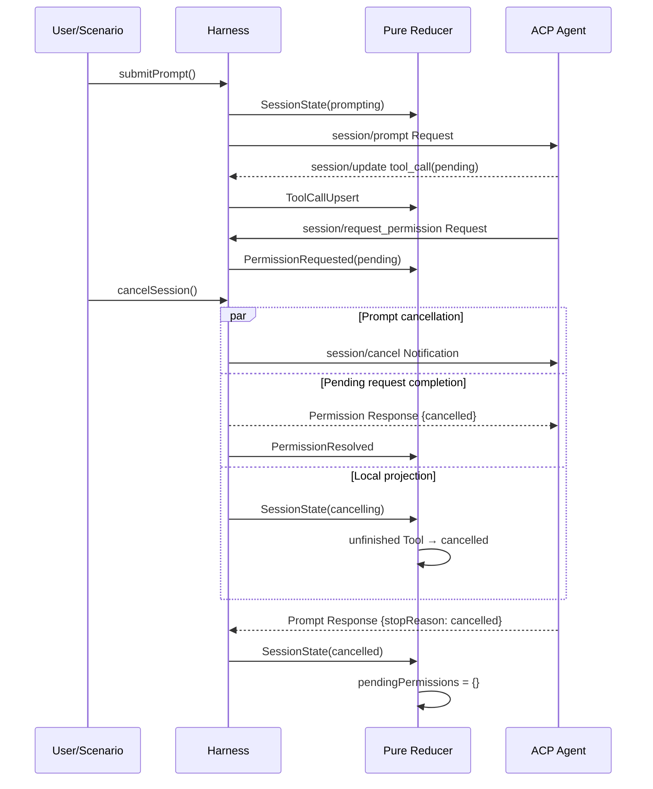
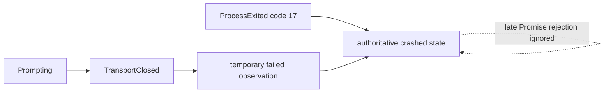

# Gate 04：Session Reducer 与 Cancel 竞态 Review Pack

> Review 状态：**实现完成，等待最终统一 Review**
>
> 生成日期：2026-08-20
>
> Review 范围：Session/New、Prompt/Update、纯 Reducer、Permission Pending、Cancel、多轮 Turn、Agent Crash 收敛
>
> Review 方式：连续开发、最终统一 Review。Gate 与 Commit 映射只记录在本机文档中，Commit Message 不写 Gate 标签。

## 0. Gate 结论与 Commit 映射

Gate 04 已完成最小 ACP v1 Session 状态闭环：Harness 创建 Session 后异步提交 Prompt，`session/update` 经 Adapter 形成 Message/Tool 事件，纯 Reducer 以 Sequence 聚合状态；Permission Request 会进入显式 Pending Map。Cancel 同时发送 `session/cancel`、将全部 Pending Permission 回复 `cancelled`、本地取消未完成 Tool Call，并等待 Agent 用 `stopReason: cancelled` 结束原 Prompt。stdio 失败与 Process Exit 竞态最终由权威 OS Exit 收敛为 `crashed`。

本 Gate 技术 Commit：

```text
469a12a feat: add deterministic ACP session reducer
7aac9ea feat: orchestrate ACP session cancellation
471a597 fix: preserve multi-turn session semantics
b58da72 fix: converge tool state during cancellation
```

独立 Review 范围：

```bash
git log --oneline 469a12a^..b58da72
git diff 469a12a^..b58da72
```

四个 Commit 分别对应纯状态模型、协议副作用编排、多轮语义修正和 Cancel Tool 收敛。Review Pack 的文档 Commit 由最终索引另行登记。

## 1. 本 Gate 实现了什么，以及明确没实现什么

### 已实现

- 官方 SDK `session/new`，Session 的 cwd 固定取安全 Target 的已校验真实 Workspace。
- `submitPrompt` 在本地校验后立即返回 `turnId`，不要求调用方等待整个 Turn 的 Request Promise。
- Agent 的 `session/update` 通过 v1 Adapter 归一化为 Message Chunk 或 Tool Call Upsert 事件。
- Prompt Response 的 `stopReason` 归一化为 Completed 或 Cancelled Session State。
- `AcpSessionState` 包含状态、Stop Reason、消息、Tool Call、Pending Permission、已应用事件 ID 与最后 Sequence。
- `reduceSessionEvent` 是纯函数；不修改旧 State、Event、Map 或 Array。
- `reduceSessionEvents` 先按 Sequence 排序，Timestamp 不参与状态顺序。
- 重复 Event ID 幂等忽略；其他 Session/Connection 的事件不会串入当前状态。
- 相同 `messageId` 的 Chunk 按 Sequence 聚合；Tool Call Update 按 ID Merge。
- Permission Request 生成稳定 `permissionId`，进入 Pending Map 并保留 Tool/Option。
- 手工 Permission Decision 只允许 Agent 提供过的 Option ID，拒绝伪造选项。
- 同一 Session 禁止并发 Prompt；前一 Turn 完成后，新 Prompt 可以显式重新打开下一 Turn。
- Cancel 先进入 Cancelling，发送 `session/cancel` Notification，并把该 Session 所有 Pending Permission Response 解析为 `cancelled`。
- Cancel 时未完成 Tool Call 在本地立即收敛为 `status: cancelled`；已 Completed/Failed 的 Tool 不回退。
- Agent 返回 `stopReason: cancelled` 后，Session 进入 Cancelled，Pending Permission 清零。
- Agent Crash 时连接关闭导致的 Prompt Failure 可能先出现；随后 `ProcessExited(code: 17)` 会把 Failed/Prompting 权威收敛为 Crashed，并清空 Pending。
- Deterministic Fixture 覆盖正常多轮 Prompt、Permission Cancel 和 Prompt 中 Crash。

以上 Cancel 行为对应 ACP v1 官方规范：Client 可发 `session/cancel`；必须对 Pending Permission 回复 `cancelled`；Agent 必须以 Cancelled Stop Reason 响应原 Prompt，并且 Client 仍应接受 Cancel 后、Prompt Response 前到达的 Update。参考 [ACP v1 Prompt Turn](https://agentclientprotocol.com/protocol/v1/prompt-turn) 与 [ACP v1 Tool Calls](https://agentclientprotocol.com/protocol/v1/tool-calls)。

### 明确未实现

- 未实现 Scenario DSL、Timeout Step、Assertion、Lifecycle Invariant 或 Diagnostic；这些属于 Gate 05。
- 未对规范违规归责。例如 Agent 在 Cancel 后返回 `end_turn` 时，当前会如实进入 Completed，尚不会生成 Protocol Violation。
- 当前只投影 Message Chunk、Tool Call、Permission 和 Session State；Plan、Usage、Mode、Config、Elicitation、FS、Terminal 等 Update 尚未实现。
- 未实现 Client Capability Profile；initialize 当前仍发送空 Capability。
- 未实现多 Pending Prompt；同一 Session 明确拒绝并发 Turn。
- 未实现 `session/close`、load、resume、delete 或通用 `$/cancel_request`。
- 未实现 Permission UI、持久化 Permission Policy 或 `allow_always/reject_always` 记忆。
- 未将 Permission Resolved Event 关联到“写回后的 Response Frame”；当前来源回链 Permission Request Frame，Raw Ledger 仍可独立看到 Response。
- 未实现 State Hash、Transcript 或 Replay。
- Crash State 只根据本地进程退出收敛；没有远程 Transport 断线恢复。
- 未验证真实第三方 Agent 的 Session/Cancel；当前证据来自官方 SDK Deterministic Fixture。

## 2. 对应简历内容

Gate 04 最终人工通过后，可以写：

> 实现 ACP v1 Session/Prompt 状态机与纯事件 Reducer，将流式 Message、Tool Call 和 Permission 归一化为可幂等归约的 Session State；针对 Cancel-during-Permission 同时发送 `session/cancel`、取消 Pending Permission 和未完成 Tool，并以 Agent Cancelled Stop Reason 或 OS Process Exit 处理完成/取消/崩溃竞态，通过多轮、并发拒绝与故障注入 Contract Test 验证确定性收敛。

不能扩展为“已实现完整 ACP Client、Scenario Engine、协议合规诊断或 Replay”。

## 3. 关键文件、测试、命令和运行证据

### 关键文件

| 文件                                             | 作用                                                          |
| ------------------------------------------------ | ------------------------------------------------------------- |
| `packages/acp-core/src/axis-event.ts`            | Session/Message/Tool/Permission 语义事件                      |
| `packages/acp-core/src/session-reducer.ts`       | 纯 Session Reducer、终态/重开/Crash/Cancel 规则               |
| `packages/acp-harness/src/acp-v1-adapter.ts`     | SDK Session Update 与 Permission 到内部事件的映射             |
| `packages/acp-harness/src/sdk-client.ts`         | New/Prompt/Cancel、Pending Permission Resolver 与 Trace 关联  |
| `packages/acp-harness/src/harness.ts`            | Session State Map、并发 Prompt 防护和 Headless API            |
| `packages/acp-harness/src/types.ts`              | Session Identity、Prompt Submission、Permission Decision 类型 |
| `fixtures/acp-agents/bin/fixture-agent.mjs`      | 多轮回复、Permission、Cancel 和 Prompt Crash Fixture          |
| `packages/acp-core/src/session-reducer.spec.ts`  | Chunk、幂等、Sequence、隔离、Crash 和多轮纯函数单测           |
| `test/contract/harness-session.contract.spec.ts` | 正常多轮、Cancel-during-Permission、Crash Contract            |

### 官方协议证据

- [ACP v1 Prompt Turn](https://agentclientprotocol.com/protocol/v1/prompt-turn)：Prompt → Update → Prompt Response 生命周期、Stop Reason、Cancel 责任与继续下一 Turn。
- [ACP v1 Tool Calls](https://agentclientprotocol.com/protocol/v1/tool-calls)：Permission Request/Response、Option、Cancelled Outcome 与 Tool 状态。
- [官方 TypeScript SDK](https://agentclientprotocol.com/libraries/typescript)：本项目实际使用的 Method/Type/Connection 实现。

### 命令与结果

```bash
pnpm lint
pnpm type-check
pnpm build:all
pnpm test:unit
pnpm test:contract
```

结果：全部 PASS。Unit 13 个文件、133 项；Contract 4 个文件、9 项。

```bash
pnpm test:ci
```

结果：PASS：

```text
Test Files: 24 passed
Tests: 156 passed
Statements: 84.03%
Branches: 69.80%
Functions: 86.14%
Lines: 85.51%
acp-harness statements: 87.95%
real Headless Chromium: passed
```

```bash
pnpm check:publish
pnpm test:smoke
pnpm docs:build
```

结果：全部 PASS。三个原公开包的发布审计、tarball 安装消费与文档构建未被 Session Runtime 破坏。

## 4. 30 秒项目讲解

> 这一阶段把 ACP Prompt 从一个长 Promise 变成事件驱动状态机。Harness 创建 Session 后，`submitPrompt` 只表示请求已提交；流式 Update、Permission 和最终 Stop Reason 都变成带 Sequence 的事件，由纯 Reducer 聚合。最关键的是 Cancel-during-Permission：Client 同时发 `session/cancel`、把所有 Pending Permission 回复 cancelled、在本地取消未完成 Tool，然后等待 Agent 以 cancelled Stop Reason 结束原 Prompt。若 stdio 先报错、OS 后确认 Agent Crash，Process Exit 会把状态最终收敛为 crashed。

## 5. 2 分钟技术讲解

> Prompt Turn 不是一个简单 loading Boolean。一次 Turn 中会交错 Message Chunk、Tool Call、Permission Request、Cancel 和 Prompt Response；同时 stdio 关闭与 Process Exit 的观察顺序也可能不同。如果把这些状态分散在多个回调和 Vue Ref 中，重复 Update、跨 Session 串线和竞态都会产生不可复现的 UI。因此 Host 只产生不可变 `AxisAcpEvent`，`reduceSessionEvent` 作为纯函数按 Sequence 构造新 State。相同 Message ID 聚合 Chunk，相同 Tool ID Merge Patch，Event ID 重复时幂等忽略，其他 Session 事件直接隔离。
>
> `submitPrompt` 不把 Request Promise 当作 UI 终态。它同步生成 Prompting Event 后返回 Turn ID；SDK Promise 只在内部转成 Completed/Cancelled/Failed Event。这样 CLI、Scenario 和 UI 都观察同一状态流。一个 Turn Terminal 后，规范允许继续下一 Prompt，所以更高 Sequence 的 Prompting 可以重新打开 Completed/Cancelled/Failed；但 Prompting/Cancelling 期间第二个 Prompt 会被 `SESSION_BUSY` 拒绝，Crashed Session 不能重开。
>
> Cancel-during-Permission 有双向责任。Client 发 `session/cancel` 时，必须回复所有 Pending Permission 为 cancelled，本地未完成 Tool 应立即显示 cancelled；Agent 应停止 LLM/Tool，允许把已在途 Update 在最终响应前发完，最后必须以 `stopReason: cancelled` 回原 Prompt。实现用 Pending Resolver Map 保存尚未回复的 SDK Request，Cancel 一次性 Resolve 并发出 Permission Resolved Event。Reducer在 Cancelling 时取消 Tool，但继续接受后续 Update，直到 Prompt Response 决定终态。
>
> Crash 是另一类终态。流关闭可能先让 Prompt Promise Reject，产生 Failed；OS Exit 码随后更权威地说明 Agent Crash，因此 Process Exited 可以把 Failed/Prompting 覆盖为 Crashed，但不会把已经成功 Completed 或 Cancelled 的历史 Turn 改写。这个优先级由单测和 Fixture Exit 17 Contract 固化，后续 Diagnostic 再负责区分 Agent、Harness 与 Runtime 责任。

## 6. Cancel-during-Permission 时序图



Crash 竞态：



## 7. 高概率面试问题与参考回答

### Q1：为什么不用几个 loading 变量，而要使用状态机？

**参考回答**

Prompt 期间至少有 Session、Message、Tool、Permission 和进程五类并发状态。多个 Boolean 无法表达非法组合，例如 `loading=false` 但 Permission 仍 Pending，或 Crash 后 Tool 仍 Running。事件 + Reducer 把合法转移、终态优先级、清理动作和多 Session 隔离集中到一个可测试模型。

**第一层追问：状态机是否一定要用第三方库？**

不需要。关键是显式状态、事件和转移规则；当前纯函数 Reducer 足够，复杂度上升后再评估 XState 等工具。

**第二层追问：为什么 Tool 和 Permission 不各自放独立 Store？**

可以分 Slice，但必须由同一 Sequence/Reducer 事务或明确组合规则驱动，否则 Cancel 无法原子地清 Permission、取消 Tool 并推进 Session。

**常见错误回答**

- “状态机性能更快。”——主要收益是正确性和可解释性。
- “Boolean 永远不能用。”——局部派生状态可以用，不能代替生命周期模型。
- “用了 Union Type 就自动合法。”——类型只限制形状，Reducer 才限制转移。

### Q2：Reducer 为什么必须是纯函数？

**参考回答**

纯函数保证相同初始 State 与同一 Sequence Event 得到相同结果，使单测、Replay、State Hash 和故障复现成立；不修改旧对象也便于 Vue/CLI 做变更检测。网络、计时器、Permission Resolver 和进程信号必须留在 Harness 副作用层。

**第一层追问：纯函数如何处理当前时间？**

Reducer 不读取当前时间；Timestamp 已在事件创建时固定。Timeout 应由 Runner 产生显式事件或 Diagnostic，而不是在 Reducer 内调用 Date.now。

**第二层追问：如何处理重复事件？**

State 保存已应用 Event ID，重复 ID 直接返回旧语义；批量 Reducer先按 Sequence 排序，保证输入数组顺序不同仍得到一致结果。

**常见错误回答**

- “纯函数不能创建新对象。”——恰恰通过新对象表达不可变更新。
- “只要不访问 DOM 就是纯函数。”——网络、随机数、时间和外部可变变量也会破坏纯度。
- “Replay 时再修状态即可。”——Live 与 Replay 必须复用同一解释器。

### Q3：Permission Pending 时 Cancel 会产生哪些并发动作？

**参考回答**

Client 一边发送 `session/cancel` 给 Agent，一边对该 Session 所有 Pending `session/request_permission` 请求返回 `outcome: cancelled`，同时本地把未完成 Tool 标为 cancelled、Session 标为 cancelling。之后仍接受在途 Update，最终等 Agent 对原 Prompt 返回 cancelled Stop Reason。

**第一层追问：为什么只发 session/cancel 不够？**

Permission 是 Agent 发起、等待 Client Response 的独立 JSON-RPC Request。若 Client 不响应，Agent Handler 可能永远挂起，Prompt 也无法正常返回 cancelled。

**第二层追问：先回 Permission 还是先发 Cancel？**

两者属于同一取消事务，不应依赖严格网络先后；实现同步触发两者。最终正确性取决于两项都完成，并按 Sequence 留下证据。

**常见错误回答**

- “关闭 Permission Modal 就完成取消。”——UI 消失不等于协议 Request 已响应。
- “直接杀 Agent 最简单。”——丢失语义 Stop Reason 和正常清理机会。
- “Permission 拒绝等于 Turn Cancel。”——Reject Tool 与 Cancel 整个 Turn 不是同一语义。

### Q4：ACP 对 Pending Permission 和 Cancelled StopReason 有什么要求？

**参考回答**

官方 v1 规定 Client 取消 Turn 时必须把所有 Pending Permission 回复 cancelled；Agent 停止操作后必须对原 `session/prompt` 返回 `stopReason: cancelled`，不能把常见的 Abort Exception 裸露为普通错误。Agent 可在最终 Prompt Response 前发送剩余 Update，Client 应继续接收。

**第一层追问：规范里的 MUST、SHOULD 有什么区别？**

MUST 是互操作必需条件，违反可判 Protocol Violation；SHOULD 有正当例外但需要解释。后续 Diagnostic 必须保留 Normative Reference 与主体，不能把所有 SHOULD 偏差都等价为致命违规。

**第二层追问：本 Gate 是否已经自动判违规？**

没有。本 Gate 实现正确 Client/Fixture 行为与状态证据；规范规则、责任主体和 Diagnostic 分类属于下一 Gate。

**常见错误回答**

- “Cancel 后所有 Update 都非法。”——规范允许最终 Response 前的在途 Update。
- “Abort Error 就是 cancelled StopReason。”——Agent 必须转成协议语义响应。
- “测试通过就证明所有 Agent 合规。”——只证明 Fixture 与 Harness 路径。

### Q5：Cancel 与 Completed 同时到达时怎样处理？

**参考回答**

Reducer 不看 Timestamp，而按 Harness Sequence。若正常 Prompt Response 已先形成 Completed，之后用户的 Cancel 对已结束 Turn 应无效；若 Cancelled Stop Reason 先形成终态，迟到的 Completed 不应覆盖。新一 Turn 只有显式的、更高 Sequence Prompting 才能重新打开状态。

**第一层追问：为什么不是“Cancel 永远优先”？**

如果 Agent 已完成并响应，后到 Cancel 不能改写历史事实。请求取消规范也遵循“已完成则返回正常响应并忽略后续取消”的一般原则。

**第二层追问：如何区分迟到的上一 Turn Response 与下一 Turn？**

当前禁止同 Session 并发 Prompt，必须先观察上一 Turn 终态才能提交下一 Turn，因此 Sequence + 单 Pending Turn 足以区分；支持队列或并发时需要显式 Turn ID 贯穿事件。

**常见错误回答**

- “谁的 Timestamp 小谁赢。”——墙钟不是确定因果顺序。
- “最后写入永远覆盖。”——迟到回调会破坏终态。
- “Completed 与 Cancelled 可以同时为 true。”——状态必须给消费者一个确定投影。

### Q6：Agent Crash 为什么能覆盖 Prompt Failed？

**参考回答**

stdio 关闭会先让 SDK 的 Pending Prompt Reject，这只是传输层观察；OS 随后给出进程退出码，能更准确说明本地 Agent 已崩溃。因此 Process Exit 对尚未成功 Completed/Cancelled 的 Session 更权威，可以把 Prompting/Failed 收敛为 Crashed。迟到的 Promise Rejection 不能再覆盖 Crashed。

**第一层追问：正常 Stop 后 Process Exit 是否也标 Crash？**

Process Event 自身包含 Code/Signal，Connection Adapter 区分 Closed 与 Crashed；Session 只有在未成功终结时才因异常退出收敛 Crash。后续 Diagnostic 会进一步区分用户 Stop、超时 Kill 与 Agent Crash。

**第二层追问：为什么不只依赖 Exit Code？**

远程 Transport 未必有本地 PID，退出码 0 也可能发生在协议仍有 Pending Work 时。需要组合 Connection、Pending RPC、Session State 和操作意图。

**常见错误回答**

- “任何 Promise Reject 都是 Agent Crash。”——也可能是 Harness、Transport 或参数错误。
- “Exit Code 0 永远成功。”——协议生命周期可能仍不完整。
- “先到的 Failed 不能更改。”——权威度比简单到达顺序更重要，但规则必须显式。

### Q7：如何判断问题来自 Agent 还是 Harness？

**参考回答**

先看证据主体：Agent 发出的非法 Stop Reason、未回复 Prompt 或 stdout 噪声可能归 Agent；Client 未回复 Pending Permission、发错 Session ID 归 Harness；Tap/Fixture/测试超时本身可能是 Harness Failure；OS、权限和端口问题可能归 Runtime。当前事件与 Trace 提供证据，但正式 Diagnostic Subject 和 Normative Reference 要到下一 Gate 才实现。

**第一层追问：Agent 未返回 cancelled 一定违规吗？**

先确认 Harness 确实发送了 Cancel、回复了 Permission、连接未先断、等待窗口合理；证据链完整后才可归 Agent。

**第二层追问：自动测试 Timeout 能直接归 Agent 吗？**

不能。Timeout 是观察结果，可能由 Agent、Harness Deadlock、Fixture、机器负载或错误阈值引起；Diagnostic 必须标 Subject，无法确定时用 Unknown。

**常见错误回答**

- “被测对象失败都算 Agent Bug。”——忽略测试基础设施责任。
- “堆栈在 Harness 就一定是 Harness Bug。”——协议错误也可能在 Client Handler 暴露。
- “无法确定时默认归 Agent。”——会产生不可信兼容性报告。

## 8. Demo 路径

### Demo A：正常多轮 Prompt

```bash
pnpm test:contract -- --run test/contract/harness-session.contract.spec.ts
```

第一个用例展示：Session/New → Prompting → Message Chunk → Completed；并发第二 Prompt 返回 `SESSION_BUSY`；终态后第二 Turn 可重新 Prompt，同一 Message ID 的两个 Chunk 确定聚合。

### Demo B：Cancel-during-Permission

同文件第二个用例：

1. Fixture 发 Tool Call 和 Permission Request。
2. Harness State 出现一个 Pending Permission。
3. 伪造 Option ID 被拒绝。
4. Cancel 后 Raw Trace 同时存在 `session/cancel` Notification 和包含 cancelled 的 Permission Response。
5. Tool 本地状态为 cancelled，Pending Map 为空，Prompt 最终 Stop Reason 为 cancelled。

### Demo C：Crash 竞态

第三个用例让 Fixture 在 Prompt 中退出 17，断言 Process Handle 移除、Session 最终为 Crashed、Pending Permission 清空，而不是停在临时 Failed。

### Demo D：纯 Reducer

```bash
pnpm test:unit -- --run packages/acp-core/src/session-reducer.spec.ts
```

展示乱序输入按 Sequence 归约、重复 Event 幂等、Session 隔离、Failed → Crash 权威覆盖与多轮重开。

### 回滚/检出

```bash
git switch --detach b58da72
pnpm install --frozen-lockfile
pnpm type-check
pnpm test:unit
pnpm test:contract
```

## 9. 当前仍不能写进简历的能力

- 不能写“完整 ACP v1 Client”——Plan、Usage、Elicitation、FS、Terminal、Close/Load 等尚未实现。
- 不能写“Scenario Testing Framework”——当前是直接 Contract 测试，没有 DSL/Runner/Timeout/Assertion。
- 不能写“自动协议合规诊断”——Normative Rule、Subject 和 Diagnostic 尚未生成。
- 不能写“兼容性报告”——没有 Agent × Scenario Matrix 与 Reporter。
- 不能写“确定性 Replay”——没有 Transcript、State Hash 或 Virtual Agent。
- 不能写“支持并发/排队 Prompt”——同一 Session 只允许一个 In-flight Turn。
- 不能写“Permission Policy 系统”——只有 Pending、显式 Decision、Option 校验和 Cancel 清理。
- 不能写“已验证真实第三方 Agent Cancel”——当前只验证 Deterministic Fixture。
- 不能写“任何失败都能准确归责”——正式分类在 Gate 05。

## 10. 用户人工 Review 结论

```text
状态：等待最终统一 Review
自动化结论：Lint、类型、构建、Unit、Contract、全量覆盖率、发布检查、安装 Smoke、文档构建均通过
人工结论：尚未给出；不得表述为 Gate 04 已人工通过
学习方式：最终统一 Review 时先检出纯 Reducer Commit，再逐步加入协议编排和两个规范修正 Commit
```
