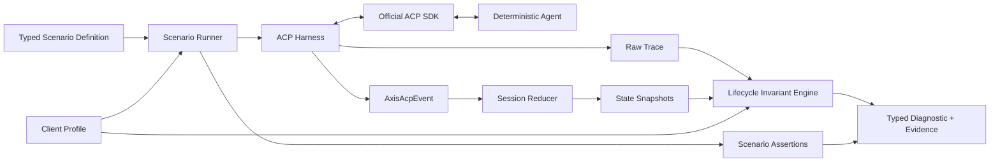
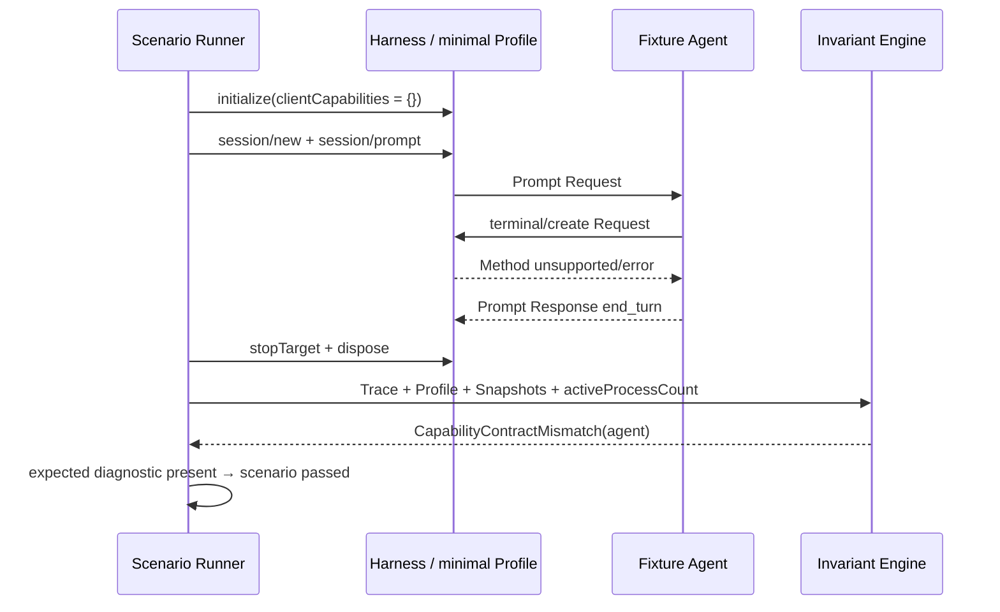

# Gate 05：Scenario 与 Diagnostics Review Pack

> Review 状态：**实现完成，等待最终统一 Review**
>
> 生成日期：2026-08-20
>
> Review 范围：三个固定 Scenario、两个 Client Profile、七条 Lifecycle Invariant、Diagnostic 分类、规范引用、责任主体与证据链
>
> Review 方式：连续开发、最终统一 Review。Gate 与 Commit 映射只记录在本机文档中，Commit Message 不写 Gate 标签。

## 0. Gate 结论与 Commit 映射

Gate 05 已形成最小可重复的 ACP 兼容性测试闭环：Scenario Runner 用两个明确的 Client Profile 驱动 Deterministic Fixture Agent，执行三个固定场景；Invariant Engine 对 Raw Trace、语义 Event、Session State Snapshot、进程资源和 Fault Injection 证据做七条检查，并把失败区分为协议违规、Capability 契约不匹配、场景断言失败、资源泄漏或 Harness 自身故障。

本 Gate 技术 Commit：

```text
2853142 feat: classify ACP lifecycle diagnostics
49b9720 feat: run deterministic ACP conformance scenarios
```

独立 Review 范围：

```bash
git log --oneline 2853142^..49b9720
git diff 2853142^..49b9720
```

前一个 Commit 是诊断模型、Client Profile、七条规则和状态快照证据；后一个 Commit 是三个固定场景、Runner 与定向 Fixture 行为。Review Pack 的文档 Commit 由最终索引另行登记。

## 1. 实现与非实现范围

### 已实现

- 两个冻结的 Client Profile：`minimal` 与 `permission-only`。两者都不声明 Terminal/FS Capability；后者允许 Harness 暂存 Permission Request，供 Cancel 场景控制。
- 三个固定场景：`normal-prompt-turn`、`cancel-during-permission`、`capability-method-mismatch`。
- TypeScript `scenario()` 定义和 `ScenarioRunner`；当前 API 只表达三个场景所需的 Profile、参数、Prompt、流程、预期诊断与 Fault Injection。
- Runner 按 Start → Initialize → New Session → Prompt → 可选 Cancel → 等待终态 → Stop/Dispose 的顺序执行。
- 七条固定 Lifecycle Invariant：

```text
jsonrpc-response-correlation
notification-must-not-have-response
stdio-stdout-valid-acp-only
omitted-capability-is-unsupported
cancel-pending-permission-response
cancelled-stop-reason
no-orphan-process-after-run
```

- `Diagnostic` 统一携带 Kind、Severity、Subject、Run/Scenario/Invariant、Sequence、Trace ID、State Snapshot ID、Fault Injection ID 与 Normative Reference。
- 规范规则链接 ACP v1 或 JSON-RPC 2.0；工程资源规则不伪造规范出处。
- 每次 Session Event 归约后记录 State Snapshot；诊断按失败 Sequence 选取相邻前后状态作为证据。
- `capability-method-mismatch` 使用 `minimal` Profile，Fixture 故意调用未声明的 `terminal/create`，Runner 预期得到 Capability Contract Mismatch，场景因此仍可判定为成功复现。
- Minimal Profile 遇到未允许的 Permission Method 会立即返回 cancelled，避免测试基础设施留下 Pending Request；Permission 场景显式选择 `permission-only`。
- 已测试 Permission 在 Cancel 前已解决时不会误报“Pending Permission 未取消”。

### 明确未实现

- 未实现通用链式 Scenario DSL、任意 Step 组合、YAML Schema、插件系统或 Scenario Marketplace。
- 未实现 Transcript Schema、Redaction、State Hash 或 Deterministic Replay；这些属于 Gate 06。
- 未实现 CLI `run/inspect/replay`、JSON/HTML Report 或跨运行聚合。
- 未实现 Agent Crash、Permission Timeout、Update Delay 三类完整 Fault Scenario Pack；本 Gate 只提供三个核心场景所需注入。
- 未实现 Terminal 生命周期管理，因此资源规则当前只检查 Process，不宣称覆盖 Running Terminal、文件句柄或 Pending RPC。
- 未实现 Performance Baseline；类型模型预留 `performance-regression`，但没有规则输出它。
- 未实现真实 Registry Agent 验证；所有 Scenario 证据来自官方 SDK 与 Deterministic Fixture。
- `notification-must-not-have-response` 只能依据 Wire Trace 中“无 Request 关联且紧随对向 Notification 的 Response”保守推断；Notification 本身没有 ID，不能声称具有完美因果关联。
- 本项目不是 ACP 官方 Conformance Suite，场景 PASS 只表示 Axis 固定场景与当前规则集通过。

## 2. 对应简历内容

最终人工 Review 通过后，可写成：

> 设计最小 TypeScript Scenario API 与 Lifecycle Invariant Engine，以两个 Client Capability Profile 驱动三个可确定复现的 ACP 场景；将失败区分为协议违规、Capability 契约不匹配、场景断言、资源泄漏与 Harness 故障，并关联规范引用、Raw Frame、Session 前后状态、责任主体和 Fault Injection 证据。

当前不能写成“实现完整 ACP 合规套件”“覆盖全部 ACP v1”“支持通用 DSL”或“已验证多个真实 Agent”。

## 3. 文件、测试和运行证据

### 关键文件

| 文件                                                  | 作用                                                                    |
| ----------------------------------------------------- | ----------------------------------------------------------------------- |
| `packages/acp-core/src/diagnostic.ts`                 | Diagnostic、Normative Reference、Invariant Context、State Snapshot 契约 |
| `packages/acp-harness/src/client-profiles.ts`         | 两个 Client Profile 与允许的 Client Method                              |
| `packages/acp-harness/src/invariants.ts`              | 七条固定规则、分类、主体和证据选择                                      |
| `packages/acp-harness/src/scenario.ts`                | 三个场景定义、Runner、断言与 HarnessFailure 收敛                        |
| `packages/acp-harness/src/harness.ts`                 | Profile 初始化与逐 Event State Snapshot Ledger                          |
| `packages/acp-harness/src/sdk-client.ts`              | Capability 发送、Profile 驱动的 Permission 行为                         |
| `fixtures/acp-agents/bin/fixture-agent.mjs`           | 不受支持 Terminal Method 的可确定故障注入                               |
| `test/scenario/lifecycle-invariants.scenario.spec.ts` | 七条规则集合、分类/引用/资源证据与 Permission 边界                      |
| `test/scenario/core-scenarios.scenario.spec.ts`       | 三个固定场景端到端执行与预期诊断                                        |

### 规范依据

- [JSON-RPC 2.0 Specification](https://www.jsonrpc.org/specification)：Request ID、Response 关联以及 Notification 不得返回 Response。
- [ACP v1 Transports](https://agentclientprotocol.com/protocol/v1/transports)：stdio 下 stdout 只能承载协议消息。
- [ACP v1 Initialization](https://agentclientprotocol.com/protocol/v1/initialization)：省略的 Client Capability 必须视为不支持。
- [ACP v1 Prompt Turn](https://agentclientprotocol.com/protocol/v1/prompt-turn)：Cancel、Pending Permission 与 `cancelled` Stop Reason。

### 自动化证据

```bash
pnpm lint
pnpm type-check
pnpm vitest run --project contract --project scenario
```

结果：全部 PASS；Contract 与 Scenario 合计 7 个文件、16 项，Scenario 单独 3 个文件、7 项。

```bash
pnpm test:ci
```

结果：

```text
Test Files: 26 passed
Tests: 162 passed
Statements: 85.00%
Branches: 72.41%
Functions: 87.50%
Lines: 86.36%
acp-harness statements: 89.09%
Lifecycle Invariants statements: 95.65%
real Headless Chromium: passed
```

沙箱内第一次运行因禁止绑定 `127.0.0.1` 导致 3 项 LocalBridge 用例 `EPERM`；以允许回环端口的同一命令重跑后 162 项全部通过。Invalid stdout Fixture 的 SDK stderr 是故意注入的预期观察，不是测试失败。

```bash
pnpm build:all
pnpm check:publish
pnpm test:smoke
pnpm docs:build
```

结果：全部 PASS。公开 Axis-UI 包仍通过发布审计和真实 tarball 消费，ACP private 包未进入发布集合。

## 4. 30 秒项目讲解

> 这一阶段把 Harness 从“能跑 ACP”提升到“能解释为什么失败”。我用两个明确的 Client Profile 驱动三个固定场景，再用七条 Lifecycle Invariant 检查 Raw Trace、Session 状态和进程资源。诊断不会把所有失败都归给 Agent：规范违规、Capability 契约不匹配、Axis 场景未满足、资源泄漏和 Harness 故障分别建模；每条结果都带责任主体、失败 Sequence、原始帧、前后状态、故障注入和规范来源，所以报告可复核而不是只有一个 PASS/FAIL。

## 5. 2 分钟技术讲解

> Scenario 层选择 TypeScript，是因为当前目标不是配置平台，而是把三个最重要的互操作路径做成有类型、可调试、可重构的可执行规范。每个定义固定 Profile、Fixture 参数、Prompt、控制流、预期诊断和 Fault Injection。Runner 自己管理 Target 生命周期，通过 Harness 观察事件状态而不是等待 UI；`cancel-during-permission` 会等 Permission 真正进入 Pending 后才发 Cancel，避免依赖固定 Sleep。
>
> Client Profile 不只是测试标签。Initialize 真正发送 Profile 的 Capability Snapshot，SDK Client 也据此决定哪些 Client Method 可进入控制流。`minimal` 没有 Terminal/FS Capability；Fixture 故意调用 `terminal/create` 时，Raw Trace 仍记录该 Request，SDK 拒绝它，而 Invariant 依据 Initialization 的规范要求生成 `capability-contract-mismatch`，主体是 Agent。因为这个错误是场景预期注入，Runner 的场景结果仍是 Passed——Passed 表示成功复现并正确分类，不表示 Trace 中没有诊断。
>
> Invariant Engine 接收同一 Run 的 Profile、Raw Trace、Axis Event、State Snapshot、活动进程数和 Fault ID。规范规则必须携带 ACP v1 或 JSON-RPC 的 Section、URL 与 Requirement；无规范依据的 `no-orphan-process-after-run` 只能归 Resource Leak，引用列表为空。协议失败也不自动归 Agent，例如 Cancel 时未回复 Pending Permission 的主体是 Harness；Agent 未返回 cancelled Stop Reason 才归 Agent。
>
> 证据链以 Sequence 为中心。诊断保存触发帧，并从 Reducer Snapshot Ledger 选择失败点附近的前后 Session State。这样下一阶段可以把同一证据序列写入 Transcript，再离线 Replay。当前刻意只实现三个场景和七条规则：范围小，才能明确每条规则的来源、责任与误判边界；没有规范依据的产品偏好不能包装成协议违规。

## 6. 架构与场景时序图



`capability-method-mismatch` 时序：



## 7. 面试问题、参考回答与两层追问

### Q1：为什么选择 TypeScript Scenario API？

**参考回答**

三个核心场景需要异步等待、类型化 Profile、断言和故障标记。TypeScript 可直接复用 Harness 类型，获得编译期检查、IDE 重构与正常调试；当前场景数量很少，先引入 YAML 还要维护 Schema、解析器、版本迁移和表达能力，收益不足。

**第一层追问：TypeScript 是否让非开发用户难以使用？**

是，所以它适合当前 Developer Toolkit 的目标用户。以后需求稳定后可在同一内部模型上增加 YAML/JSON 编译层，而不是先让配置格式决定运行语义。

**第二层追问：怎样防止 Scenario 任意执行代码？**

浏览器不能上传任意脚本；可运行 Scenario 来自受信仓库，Target 仍受 Registry、参数和 Workspace 白名单约束。若未来接收第三方 Scenario，需要隔离执行与签名策略。

**常见错误回答**

- “TypeScript 一定比 YAML 快。”——选择重点是类型、调试与维护成本。
- “以后永远不需要配置格式。”——当前只是推迟，不是否定。
- “有类型就没有运行时错误。”——进程、协议和超时仍是运行时问题。

### Q2：为什么 M2-Core 只做三个 Scenario？

**参考回答**

三个场景分别覆盖正常 Prompt、最关键的 Cancel/Permission 竞态，以及 Capability 声明与实际 Method 的契约冲突，能验证驱动、时序与诊断三类核心价值。小范围有利于把 Fixture、规则来源、证据链和可重复性做扎实，避免堆大量不可信用例。

**第一层追问：三个场景能证明 ACP 兼容吗？**

不能，只能证明 Axis 场景集下的行为；报告不能称为官方认证或完整 v1 合规。

**第二层追问：下一批场景如何排序？**

按真实 Agent 的失败频率、规范重要性、可确定复现程度与资源风险排序，例如 Crash、Permission Timeout、Update Delay，再扩展稳定 v1 Capability。

**常见错误回答**

- “三个场景覆盖了 ACP 大多数功能。”——没有证据。
- “测试越多项目越强。”——低确定性、无来源的测试会降低可信度。
- “真实模型输出可以直接做严格断言。”——非确定性会造成脆弱测试。

### Q3：协议违规和场景失败有什么区别？

**参考回答**

协议违规必须有 ACP 或 JSON-RPC 的规范性依据，例如 stdout 混入日志。场景失败只是没有满足 Axis 当前测试预期，例如场景期望出现 Permission，但 Agent 走了无需权限的合法路径；它不必然违反协议，因此类型、主体和引用必须分开。

**第一层追问：SHOULD 未满足能否报 Error？**

默认应是带依据的 Warning，并允许实现说明例外；只有明确 MUST/MUST NOT 才适合直接形成错误级规范诊断。

**第二层追问：测试预期与规范冲突怎么办？**

以规范为准；修正 Scenario 或把它降为产品契约，不能用内部期望定义行业协议。

**常见错误回答**

- “只要 Scenario FAIL 就是 Agent 不合规。”
- “所有异常都是 ProtocolViolation。”
- “规范链接可有可无。”

### Q4：资源泄漏为什么不一定是 ACP 违规？

**参考回答**

孤儿进程是 Harness 的工程可靠性问题，但 ACP 文本未必规定本地 OS Process Manager 如何管理 PID/Process Group。因此它应是 `resource-leak`，主体通常是 Harness，Normative Reference 为空，不能借用无关协议条款制造合规结论。

**第一层追问：如果 Agent 自己启动子进程呢？**

需要区分所有权和可观测证据。Harness 管理的 Target 组由 Harness 负责清理；Agent 内部资源只有在协议承诺或明确探针证明后才能归责。

**第二层追问：没有规范来源，规则还有价值吗？**

有。兼容性工具同时需要协议正确性和工程可靠性，只要分类清楚、不冒充规范即可。

**常见错误回答**

- “所有泄漏都违反 ACP。”
- “没有规范引用就不该检测。”
- “进程退出码为 0 就不存在泄漏。”

### Q5：如何证明一条规则确实来自规范？

**参考回答**

诊断保存 Standard、Protocol Version、Section、URL 和 Requirement，并把具体 Wire/State 证据映射到规范主语与动作。Review 时既要打开原文核对 MUST/SHOULD，也要确认主体和版本一致；JSON-RPC 的规则明确引用 JSON-RPC，不能包装成 ACP 自有要求。

**第一层追问：网页链接变化怎么办？**

Transcript/Report 应同时保存协议版本、章节与工具版本；长期可固定规范快照或校验链接，不能只存一段随时变化的文案。

**第二层追问：规则解释存在歧义怎么办？**

降低 Severity、标 Runtime Warning/Unknown Subject，并记录解释与反例；证据不足时不要输出确定的 Protocol Violation。

**常见错误回答**

- “我记得规范这么说。”
- “SDK 报错就证明规范禁止。”
- “只保存 URL，不保存版本和章节。”

### Q6：Capability 省略为什么必须视为不支持？

**参考回答**

ACP 初始化使用 Capability Snapshot 协商可用 Client Method。省略不能被 Agent 当成默认支持，否则旧 Client 或最小 Client 会收到无法处理的 Terminal/FS 请求，破坏向后兼容。当前 mismatch 场景用空 Capability 收到 `terminal/create`，因此归为 Agent 的 Capability Contract Mismatch。

**第一层追问：Permission 为什么不在 Capability 对象里？**

当前 ACP v1 的 Permission 是核心 Client Method，不是 Terminal/FS 那类可选 Capability；本项目的 `permission-only` 是测试控制 Profile，表示是否让请求保持 Pending，不伪称它是官方 Capability 字段。

**第二层追问：Client 收到不支持的方法应该怎样做？**

Wire 层应给出标准方法不支持/错误响应并保留 Trace；诊断层再结合初始化 Snapshot 判断责任，不能静默执行能力。

**常见错误回答**

- “没写就是默认全支持。”
- “Capability 只影响 UI 是否显示按钮。”
- “收到调用后临时假装支持即可。”

### Q7：为什么需要 HarnessFailureDiagnostic？

**参考回答**

测试工具也可能失败，例如 Fixture 无法启动、Transport Tap 异常或 Runner Timeout。如果把它们归为 Agent Protocol Violation，报告会系统性误责被测对象。Harness Failure 使用独立 Kind、`subject: harness` 和无规范引用，场景状态为 Failed，提醒先修测试基础设施。

**第一层追问：Timeout 一定是 Harness Failure 吗？**

不一定。Timeout 只是症状；当前 Runner 无法可靠归因时先保守归 Harness Failure。更成熟实现应结合最后 Trace、进程状态与阈值，把可证明的 Agent 不响应和环境慢区分开。

**第二层追问：怎样避免 Harness 自己掩盖 Agent Bug？**

保留异常前的 Raw Trace、State Snapshot 与进程证据；Harness Failure 不删除同时成立的协议诊断，并用 Deterministic Fixture 对 Harness 路径做自测。

**常见错误回答**

- “测试失败当然是 Agent 失败。”
- “Catch 后返回空诊断即可。”
- “只看堆栈在哪个包就能归责。”

## 8. Demo 路径

### Demo A：三个固定场景

```bash
pnpm vitest run --project scenario test/scenario/core-scenarios.scenario.spec.ts --reporter=verbose
```

观察点：三个场景都 Passed；前两个无 Diagnostic，Capability Mismatch 场景包含预期的 `omitted-capability-is-unsupported`，Subject 为 Agent，并带 Fault 与 State Snapshot ID。

### Demo B：七条规则与误报边界

```bash
pnpm vitest run --project scenario test/scenario/lifecycle-invariants.scenario.spec.ts --reporter=verbose
```

观察点：规则 ID 固定为七条；Protocol、Capability 与 Resource 分类不同；资源规则没有伪造规范引用；Permission 已在 Cancel 前回复时不会误报 Pending。

### Demo C：独立检出 Review

```bash
git show --stat 2853142
git show --stat 49b9720
git diff 2853142^..49b9720
```

第一条查看规则与证据基础，第二条查看可执行场景。Commit 信息只描述技术变更，Gate 映射只在本文中维护。

## 9. 当前不能写入简历的能力

- 完整 ACP v1/v2 Conformance Suite 或官方认证。
- 通用 Scenario DSL、YAML 场景、第三方插件或 Marketplace。
- Transcript 导出、Redaction、State Hash、离线 Replay。
- CLI `inspect/run/replay` 与 JSON/HTML Compatibility Report。
- 多真实 Agent 兼容性矩阵或真实模型的稳定 Cancel 测试。
- 完整 Terminal/FS/Usage/Config/Mode/Elicitation 生命周期规则。
- 性能回归基线和 P95/P99 分析。
- 对 Notification Response 的完美因果识别。
- “所有失败都能自动准确归责”。Unknown 和 Harness/Environment 歧义仍需保守处理。

## 10. 人工 Review 结论

当前结论：**尚未人工通过**。

本轮按用户授权不进行逐 Gate 口头讲解与追问，也不在这里自动标记通过。Gate 05 已完成实现、独立测试、Review Pack 与 Commit 映射，等待 Gate 01～07 全部完成后的统一 Review。
