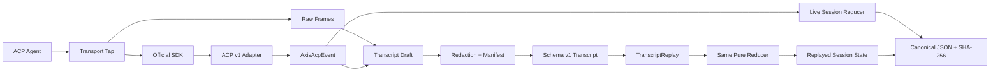
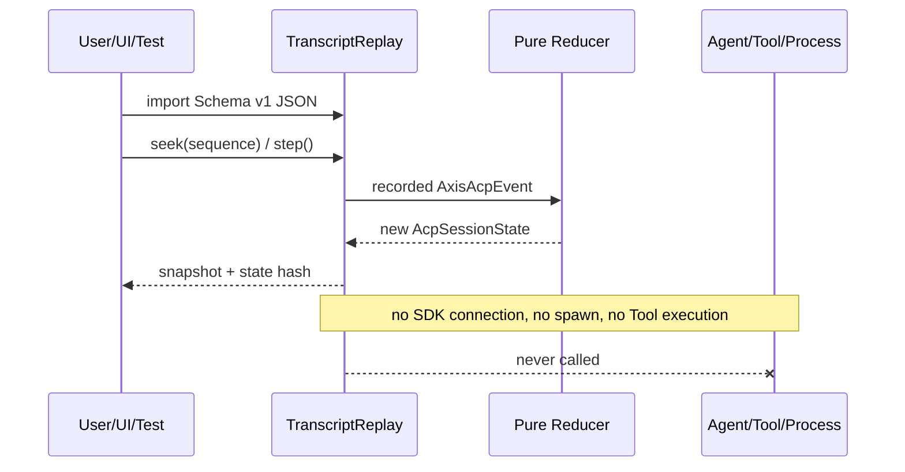

# Gate 06：Transcript 与 Deterministic Replay Review Pack

> Review 状态：**实现完成，等待最终统一 Review**
>
> 生成日期：2026-08-20
>
> Review 范围：Transcript Schema、Redaction、Canonical State Hash、纯事件 Replay、Schema Version、Scenario Artifact 接入
>
> Review 方式：连续开发、最终统一 Review。Gate 与 Commit 映射只记录在本机文档中，Commit Message 不写 Gate 标签。

## 0. Gate 结论与 Commit 映射

Gate 06 已完成“记录事实、脱敏导出、离线解释”的最小闭环。Scenario 运行结束后生成 Schema Version 1 Transcript，包含运行与 Target 快照、Client Profile、Raw Frame、AxisAcpEvent、Assertion、Diagnostic、Redaction Manifest 和每个 Session 的 SHA-256 State Hash。`TranscriptReplay` 只把已记录的语义事件重新送入同一纯 Reducer，不连接 SDK、不启动 Agent、不执行 Tool，因此可单步、暂停、跳转 Sequence 或归约到末尾，并验证导入结果的 State Hash。

本 Gate 技术 Commit：

```text
087a5d9 feat: add deterministic transcript replay
9c54779 feat: export replayable scenario artifacts
```

独立 Review 范围：

```bash
git log --oneline 087a5d9^..9c54779
git diff 087a5d9^..9c54779
```

第一个 Commit 是无进程依赖的 Transcript/Redaction/Replay/Hash 内核；第二个 Commit 把 Scenario 的 Live Evidence 导出为可回放 Artifact，并验证 Live State 与 Replay State 一致。Review Pack 的文档 Commit 由最终索引另行登记。

## 1. 实现与非实现范围

### 已实现

- `AxisAcpTranscript` Schema Version 1，包含 Run、Target、Client Profile、Raw Frame、AxisAcpEvent、Assertion、Diagnostic、Redaction Manifest 与 Integrity Metadata。
- Run Metadata 记录 Run/Scenario、起止时间、Toolkit Version 与 ACP Protocol Version。
- Target Snapshot 记录安全 Target ID、stdio、协议版本、允许参数和 Agent Info，不持久化可执行 Command、PID 或 Environment。
- 默认按敏感键脱敏 Authorization、Cookie、Environment、API Key、Password、Secret 与 Token。
- 支持调用方提供 Secret Literal 与显式路径；Scenario 默认移除 Workspace 绝对路径和 Prompt Payload。
- 同时处理 Parsed JSON 与 Raw NDJSON 字符串，保证同一 Secret 不会从另一份证据副本泄露。
- Redaction Manifest 记录脱敏 Path 与原因：敏感键、Secret Literal 或显式路径。
- Canonical JSON 对对象 Key 排序、保留数组顺序并拒绝 Cycle、非有限数字与不可 JSON 化值。
- 使用 Web Crypto `SHA-256` 计算每个最终 Session State Hash，Node 与 Browser 共享实现。
- `TranscriptReplay` 支持 `step()`、`pause()`、`reset()`、`seek(sequence)` 与 `playToEnd()`。
- Replay 按 Sequence 排序事件，并复用 Live Harness 的 `reduceSessionEvent`；Raw Frame 只作为证据，不驱动状态。
- `verifyIntegrity()` 重新计算最终 Session State Hash，与 Transcript 中记录值比较。
- `parseTranscript()` 在回放前检查 Root、Schema Version、核心数组、Event 基本字段与 State Hash 元数据；未知 Schema Version 明确拒绝。
- Scenario Report 自动携带脱敏 Transcript。
- 端到端证明：Live Scenario 最终 State 与序列化、导入、离线 Replay 后 State 深度相等，SHA-256 相同。
- Source Trace ID 仍能从语义 Event 回链到 Transcript 内的 Raw Frame。

### 明确未实现

- 未实现 CLI 文件读写、`inspect`、`run` 或 `replay` 命令；CLI 和 UI 入口属于 Gate 07。
- 未实现自动定时播放、原速/倍速 Scheduler；内核提供纯步进和暂停状态，计时控制留给 UI 层。
- 未实现 Transcript Diff、修复前后比较或 State Transition 可视化。
- 未实现旧 Schema Migration；Version 1 可解析，未知版本拒绝，后续需用显式 Migration Chain 升级。
- 未实现数字签名或完整 Artifact Content Hash。当前 Hash 证明“最终 Session State 一致”，不证明 Raw Frame、Assertion 或 Metadata 从未被篡改。
- 未实现通用 DLP。默认策略覆盖常见凭据，调用方仍必须识别源码、Prompt、Tool 参数、路径、Agent 输出中的业务敏感信息。
- Redaction 后的 Raw Frame 是安全副本，不再承诺与 Wire Byte-for-Byte 相同；`byteLength` 保留采集时原始长度。
- 未执行 Transcript 中记录的 Terminal、FS、网络或模型副作用，也不提供“重新跑一遍 Agent”的模式。
- 未验证跨 Reducer 版本 Hash 恒定；Transcript 保存 Schema/Toolkit/Protocol Version，未来语义变更需要版本化解释器或迁移测试。

## 2. 对应简历内容

最终人工 Review 通过后，可写成：

> 设计版本化 ACP Transcript 与确定性 Replay 内核，统一持久化 Raw JSON-RPC、归一化事件、断言和诊断；通过 Key/Literal/Path 三类脱敏策略生成 Manifest，使用 Canonical JSON + SHA-256 校验 Session State，并复用纯 Reducer 在不启动 Agent、不执行 Tool 副作用的条件下支持单步、Sequence 跳转和离线状态还原。

当前不能写成“实现安全审计级防篡改日志”“Replay 可重新执行真实 Tool”“兼容所有历史 Schema”或“支持完整交互式回放 UI”。

## 3. 文件、测试和运行证据

### 关键文件

| 文件                                             | 作用                                                                      |
| ------------------------------------------------ | ------------------------------------------------------------------------- |
| `packages/acp-core/src/transcript.ts`            | Schema Version 1、Run/Target/Assertion/Redaction/Integrity 类型与导入校验 |
| `packages/acp-core/src/redaction.ts`             | 敏感 Key、Literal、Path 的深度脱敏与 Manifest                             |
| `packages/acp-core/src/canonical-json.ts`        | Canonical JSON 与 SHA-256 State Hash                                      |
| `packages/acp-core/src/replay.ts`                | 纯事件 Replay、Step/Pause/Seek/Reset/Hash Verification                    |
| `packages/acp-core/src/transcript-artifact.ts`   | 脱敏、Replay 计算 Hash、Canonical Serialize 的导出流水线                  |
| `packages/acp-harness/src/scenario.ts`           | Live Scenario Evidence 到 Transcript Artifact 的接入                      |
| `test/replay/transcript.replay.spec.ts`          | 步进、跳转、Hash、篡改、脱敏与版本拒绝                                    |
| `test/replay/scenario-transcript.replay.spec.ts` | Live/Replay State + Hash 一致、路径脱敏、Raw/Event 关联                   |

### 自动化证据

```bash
pnpm lint
pnpm type-check
pnpm test:replay
pnpm test:scenario
```

结果：全部 PASS；Replay 3 个文件、7 项，Scenario 3 个文件、7 项。

```bash
pnpm test:ci
```

结果：

```text
Test Files: 28 passed
Tests: 168 passed
Statements: 85.04%
Branches: 72.41%
Functions: 87.53%
Lines: 86.41%
real Headless Chromium: passed
```

```bash
pnpm build:all
pnpm check:publish
pnpm test:smoke
pnpm docs:build
```

最终结果：全部 PASS。第一次把 `build:all` 与 `test:smoke` 并行执行时，Smoke 读取到正在重建的 `dist`，瞬时报告缺少 `style.css`；构建结束后按正确依赖顺序重跑，tarball 安装、入口导入和样式完整性全部通过。该现象属于验证编排竞态，未修改实现来掩盖结果。

## 4. 30 秒项目讲解

> 这一阶段实现的 Replay 不是重新运行 Agent，而是重放已记录事实。一次 Scenario 会导出版本化 Transcript，把 Raw Frame、归一化事件、断言和诊断放在一起，先脱敏，再由同一个纯 Reducer离线恢复 Session State。对象经过 Canonical JSON 后计算 SHA-256；Live State、序列化导入后的 Replay State Hash 必须一致。Replay 完全不知道 SDK、Agent 和 Process Manager，所以不会再次执行 Terminal、文件或网络副作用。

## 5. 2 分钟技术讲解

> Transcript 有两类互补数据。Raw Frame 保存“Wire 上发生了什么”，用于检查 JSON-RPC ID、Method、Direction 和原始错误；AxisAcpEvent 保存“产品如何解释这些事实”，是跨协议版本的稳定语义层。Replay 只消费 Event，因为 Raw Frame 重新送入 SDK 会重新触发 Handler，既可能产生副作用，也会把协议解析与状态归约耦合。UI 需要看原始证据时，通过 Event 的 `sourceTraceIds` 回链 Raw Frame。
>
> 确定性有明确边界：在相同 Transcript Event、相同 Schema/Reducer 语义下，无论事件数组原始排列如何，按 Sequence 归约都得到相同 Session State 和 Hash。它不保证墙钟耗时相同，也不保证重新调用模型或 Tool 会得到相同结果。`TranscriptReplay` 因此只有状态解释能力：Step、Seek、Reset、Pause、Play-to-End，不接收 Registry、SDK、Process Manager 或 Tool Executor。
>
> State Hash 先把最终 State 转成 Canonical JSON。对象 Key 递归排序，数组顺序保留，Undefined 的处理与 JSON 语义一致；Cycle、BigInt 等不可序列化输入直接失败。之后用 Web Crypto SHA-256 计算每个 Session 的 Hash。Scenario 集成测试把 Live Harness 最后一份 State Snapshot 与离线 Replay State 做深度比较，再比较 Hash；修改会影响状态的 Event 后，`verifyIntegrity` 会失败。这个 Hash 只覆盖最终 State，不是整个 Artifact 的数字签名。
>
> 导出前必须脱敏，因为 Raw JSON 可能包含 Prompt、源码、Workspace Path、Tool 参数、Authorization 和 API Key。Redactor 同时扫描 Parsed Object 和 Raw JSON 字符串；默认识别常见凭据 Key，调用方可补充 Secret Literal 与精确 Path，所有替换写进 Manifest。Scenario 默认移除 Prompt Payload 和本机 Workspace 路径。策略的局限也被保留：Agent 输出里的未知秘密不可能靠通用 Key 完全识别，导出前仍需审阅。
>
> Schema Version 与 ACP Protocol Version 分开。前者管理 Artifact 结构，后者描述被记录协议；Event 是版本归一化层。当前只接受 Version 1，未知版本 Fail Closed。未来兼容旧 Transcript 时，应由显式 Migration 把旧 Schema 转为当前内部模型，并用固定 Fixture 验证迁移前后 State Hash，而不是让解析器猜测字段。

## 6. 架构与时序图



Replay 副作用边界：



## 7. 面试问题、参考回答与两层追问

### Q1：确定性 Replay 的“确定性”具体指什么？

**参考回答**

相同 Schema/Reducer 版本、相同归一化 Event 集和 Sequence 会得到相同最终 Session State 与 SHA-256。它不表示重新调用模型或 Tool 能重现相同世界状态，也不承诺播放耗时和原运行相同。

**第一层追问：为什么 Timestamp 不参与顺序？**

墙钟可能漂移、精度不足或相同；Harness 的单调 Sequence 表示实际观察顺序，更适合确定归约。Timestamp 只用于展示和可选播放节奏。

**第二层追问：同一 Sequence 出现两个 Event 怎么办？**

正常 SequenceAllocator 应保证唯一；Replay 用 Event ID 作稳定次序兜底，但导入校验未来应把重复 Sequence 诊断为 Artifact 异常，而不是依赖兜底定义业务语义。

**常见错误回答**

- “Replay 会重新跑模型，所以答案完全相同。”
- “只要随机种子固定就确定。”
- “Hash 相同证明所有 Raw Frame 都没变。”

### Q2：Replay 为什么不能重新执行 Tool 副作用？

**参考回答**

Tool 可能写文件、运行命令、访问网络或产生费用。重执行会改变环境，结果也依赖当前时间和外部服务，既不安全也不确定。Replay 的输入是已记录 Event，目标是复现状态解释与诊断；需要重新验证 Tool 时应启动新的受控 Scenario Run，并生成新的 Transcript。

**第一层追问：只读 Tool 可以重放吗？**

“只读”也可能读取已变化的文件或远程数据。若要支持，必须作为新的运行模式显式授权、隔离并记录新证据，不能混入 Deterministic Replay。

**第二层追问：如何证明代码没有副作用？**

Replay 包只依赖 Transcript 类型和纯 Reducer，API 不接收 Registry、SDK、Process Manager 或 Tool Executor；测试从序列化 Artifact 构造 Replay 即可完成状态还原。

**常见错误回答**

- “Tool 结果已经缓存，所以重跑没风险。”
- “在测试目录执行就一定安全。”
- “Replay 和 Retry 是同一个概念。”

### Q3：Raw Frame 和 AxisAcpEvent 回放有什么区别？

**参考回答**

Raw Frame 是版本相关的 Wire 事实，适合协议取证；AxisAcpEvent 是 Adapter 归一化后的产品语义，适合 Reducer 与跨版本 UI。当前 Replay 只归约 Event，Raw Frame 通过 `sourceTraceIds` 联动展示，避免重新触发 SDK Request Handler。

**第一层追问：只存 Event 是否足够？**

不足。Adapter Bug、非法 JSON、错误 ID 或 stdout 污染可能在归一化前发生，必须保留 Raw Frame 才能复核。

**第二层追问：只存 Raw Frame 呢？**

也不足。每次 Replay 都要重跑版本相关解析和 Handler，难以稳定 UI State，也容易重新触发 Client Method；语义层是副作用隔离与版本适配边界。

**常见错误回答**

- “二者内容完全重复。”
- “官方 SDK 已解析，所以 Raw 无价值。”
- “Replay Raw JSON 就会天然安全。”

### Q4：State Hash 如何证明状态还原一致？

**参考回答**

Live 和 Replay 使用同一 State 结构，先用 Canonical JSON 固定对象 Key 顺序，再计算 SHA-256。测试同时做深度相等和 Hash 相等；修改会改变 State 的 Event 后验证失败。Hash 证明最终 State 相同，不证明每个中间状态、Raw Frame 或 Metadata 相同。

**第一层追问：为什么不能直接 `JSON.stringify`？**

逻辑相同对象可能因插入顺序不同产生不同字符串；Canonical JSON 递归排序对象 Key，消除无意义差异，但保留数组顺序。

**第二层追问：两个不同状态会不会碰撞？**

理论上任何固定长度 Hash 都可能碰撞，但 SHA-256 对工程一致性校验足够。它不是签名，没有密钥，不能证明 Artifact 来源可信。

**常见错误回答**

- “Hash 相同数学上绝对证明对象相同。”
- “SHA-256 自动防止别人篡改文件。”
- “对象 Key 排序也应该改变数组顺序。”

### Q5：Transcript 中可能泄露哪些敏感数据？

**参考回答**

Prompt 与源码、Workspace 绝对路径、Tool 参数和输出、Environment、Authorization/Cookie/API Key、错误堆栈、Agent 输出中的业务数据都可能泄露。必须同时检查 Parsed 和 Raw 副本，并记录 Redaction Manifest；默认规则不能替代特定项目的导出审阅。

**第一层追问：为什么保留 Manifest？**

它让接收方知道证据在哪些位置被修改、为何修改，避免把脱敏后的空缺误认为 Agent 原始行为，也方便审计策略覆盖率。

**第二层追问：直接删除所有 Raw Frame 是否更安全？**

更安全但会丢失协议取证价值。合理做法是最小采集、策略化脱敏、访问控制和保留期限；高敏场景可以选择不导出 Raw。

**常见错误回答**

- “只删 token 字段就安全。”
- “Fixture 没密钥，所以生产 Transcript 也没风险。”
- “Base64 或 Hash 一下就是匿名化。”

### Q6：协议升级后旧 Transcript 如何兼容？

**参考回答**

Artifact Schema Version 与 ACP Protocol Version 分离；Raw Frame 保留原协议版本，Adapter 输出归一化 Event。当前解析器对未知 Schema Fail Closed。未来增加显式 Migration Chain，把旧 Artifact 转到当前内部模型，并用固定 Transcript 验证 State Hash 与诊断语义，不能静默猜测字段。

**第一层追问：Reducer 规则升级会不会让旧 Hash 失败？**

会，所以 Toolkit/Schema Version 必须进入 Metadata。可保留版本化 Reducer，或迁移后生成新期望 Hash并保留迁移记录；不能把变化隐藏为同一版本。

**第二层追问：ACP v2 能直接复用 v1 Raw Frame 吗？**

不能直接解释，但可由 v2 Adapter 生成同一 AxisAcpEvent 语义，复用上层 Scenario/Reducer；协议特有信息仍保存在各自 Raw Frame 中。

**常见错误回答**

- “TypeScript 类型能自动迁移历史 JSON。”
- “忽略未知字段就永远向前兼容。”
- “ACP Version 就等于 Transcript Schema Version。”

## 8. Demo 路径

### Demo A：纯 Replay、脱敏与 Hash

```bash
pnpm vitest run --project replay test/replay/transcript.replay.spec.ts --reporter=verbose
```

观察点：乱序 Event 被 Sequence 归约；Step/Seek/Play 得到同一状态；Secret 不出现在 Canonical JSON；修改终态 Event 后 Integrity 验证失败；Schema Version 2 被拒绝。

### Demo B：Live Scenario → Transcript → Offline Replay

```bash
pnpm vitest run --project replay test/replay/scenario-transcript.replay.spec.ts --reporter=verbose
```

观察点：Fixture 只在 Scenario 阶段启动；随后 Replay 从 JSON 字符串独立构造，不接触 Registry。Live 最终 State 与 Replay State 深度相等，Hash 相同，Workspace Root 不出现在 Artifact，Event 的 Source Trace ID 全部能找到 Raw Frame。

### Demo C：独立检出 Review

```bash
git show --stat 087a5d9
git show --stat 9c54779
git diff 087a5d9^..9c54779
```

## 9. 当前不能写入简历的能力

- 重新执行 Agent/Tool 的“确定性”仿真。
- 完整 Artifact 防篡改、数字签名、可信时间戳或审计合规认证。
- 自动发现所有源码、业务数据与模型输出中的秘密。
- CLI 文件导入导出和完整回放命令。
- 原速/倍速计时器、交互式 Timeline、State Diff 与 Transcript Diff。
- 任意历史 Schema 的自动迁移。
- 跨 Reducer/Toolkit 版本 State Hash 永久不变。
- Replay 性能 Benchmark Dashboard 或 10,000 Event P95 结论。

## 10. 人工 Review 结论

当前结论：**尚未人工通过**。

本轮按用户授权不进行逐 Gate 口头讲解与追问，也不在这里自动标记通过。Gate 06 已完成实现、独立测试、Review Pack 与 Commit 映射，等待 Gate 01～07 全部完成后的统一 Review。
