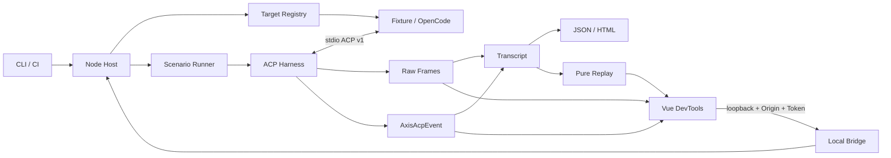
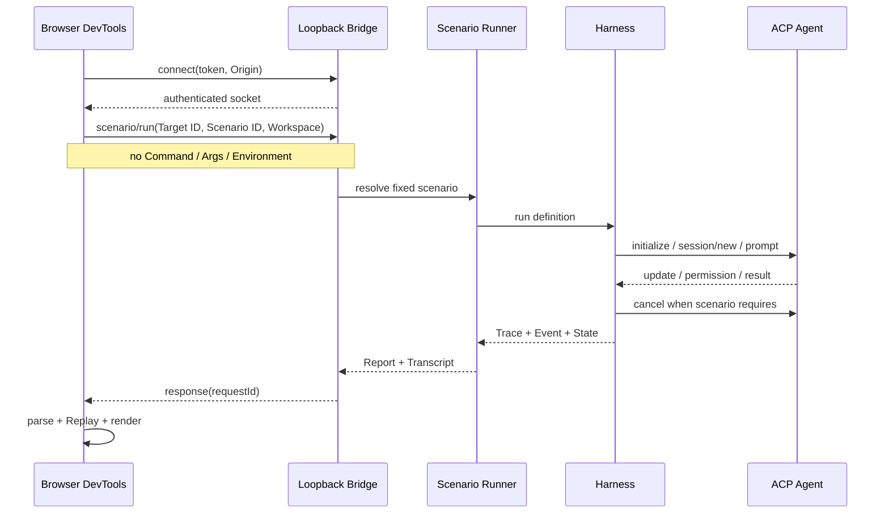
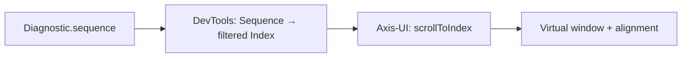

# Gate 07：DevTools、Axis-UI 与真实 Agent Review Pack

> Review 状态：**实现完成，等待最终统一 Review**
>
> 生成日期：2026-08-20
>
> Review 范围：Headless CLI、单次 JSON/HTML Report、OpenCode 真实 Agent、Authenticated Local Bridge、Timeline/Inspector、Axis-UI 反哺
>
> Review 方式：连续开发、最终统一 Review。Gate 与 Commit 映射只记录在本机文档中，Commit Message 不写 Gate 标签。

## 0. Gate 结论与 Commit 映射

Gate 07 已把前六个阶段的 Headless Runtime 组成可演示闭环：CLI 可运行固定 Scenario、检查真实 Agent、输出 JSON/HTML 并离线 Replay；浏览器 Workbench 可导入或消费同一 Transcript，在一个序列账本中联动 Raw Frame、AxisAcpEvent、State、Capability 与 Diagnostic。浏览器不持有可执行 Command，Live Run 必须经过只绑定 loopback、校验 Origin 与临时 Token 的 Node Bridge。

本 Gate 技术 Commit：

```text
d70adcd feat: expose virtual list index navigation
851da23 feat: register OpenCode as an ACP target
1db9454 feat: add headless scenario reports
81b6fb4 feat: run scenarios through the local bridge
89d8c89 feat: build the ACP protocol workbench
```

独立 Review 范围：

```bash
git log --oneline d70adcd^..89d8c89
git diff d70adcd^..89d8c89
```

这些是五个合理的开发单元，不表示一个 Gate 必须只有一个 Commit：Axis-UI 通用能力、真实 Target、Headless Report、Host Bridge 和浏览器 Workbench 可以分别检出与测试。Review Pack 与 README 的文档 Commit 由最终索引登记。

## 1. 实现与非实现范围

### 已实现

- `axis-acp run`：运行三个固定 Scenario 之一，输出状态、Trace/Event 数量、Transcript 路径和静态 HTML 路径。
- `axis-acp inspect`：只执行 Target 注册、进程启动与 initialize，打印协议版本、Agent Info、Capability Snapshot、Trace/Event 数量和最终活动进程数。
- `axis-acp replay`：导入 Transcript，离线恢复最终状态并验证 SHA-256 State Hash。
- `axis-acp serve`：启动鉴权 loopback WebSocket Bridge；端口可随机分配，Token 至少 32 字符，只接受允许的 Origin。
- Bridge 新增严格的 `scenario/run` 消息。未知字段、任意 `args`、任意 Command、未知 Target/Scenario 都被拒绝。
- Bridge Handler 只把固定 Scenario ID 解析为 Host 内定义；OpenCode 只允许 `normal-prompt-turn`。
- 单次静态 HTML Report 对内容做 HTML Escape，展示断言、诊断、规范引用和“非官方认证”边界。
- DevTools 提供三个确定性样例，即使未启动 Host 也能学习 Timeline、Inspector 与 Replay。
- Timeline 按全局 Sequence 合并 Raw Wire Frame 与 AxisAcpEvent，可按 Method/Event/Direction/Sequence 过滤。
- Inspector 展示选中证据的 Raw JSON 和该 Sequence 的 Replay State；Diagnostic 可跳到关联 Sequence。
- Capability 用 Axis-UI Tree 展示；场景表单使用 Form、Input、Button；长 Trace 使用 VirtualList。
- 支持导入 Transcript，先校验 Schema，再 Replay 并验证 State Hash；支持导出当前 Transcript JSON。
- Workbench 具备 loading/running/error/empty 状态、`aria-live`、Skip Link、可见 Focus、44px 触控目标、reduced-motion 与 375px 单列布局。
- Workbench 只允许 `ws://localhost`、`ws://127.0.0.1` 或 `ws://[::1]`，拒绝远程 Bridge URL。
- Axis-UI 反哺 `VirtualListExpose.scrollToIndex(index, alignment)`，支持 `start | center | end | auto`；ACP 的 Sequence→过滤后 Index 映射留在 DevTools。
- 接入本机 OpenCode `1.14.48` 的 `opencode acp --pure`，真实合同测试完成 initialize、Capability Snapshot、基础 Raw Trace 与无孤儿进程验证；未安装时测试明确 Skip。
- OpenCode 是 ACP Registry 中列出的 Agent；Registry 入口见 [agentclientprotocol/registry](https://github.com/agentclientprotocol/registry)。
- 使用真实 Chromium 做组件边界测试，并用黑盒浏览器完成桌面、375×812、诊断跳转、过滤、真实 Bridge Run 和控制台检查。

### 明确未实现

- 未实现完整 ACP v1 方法矩阵；当前产品范围仍是三个固定 Scenario。
- 未对 OpenCode 自动执行真实模型 Prompt。硬门槛只覆盖 initialize、Capability Snapshot 和基础 Trace，避免网络、账户、模型与输出非确定性阻塞 CI。
- 未声称 OpenCode 的全部 ACP 行为通过，只能说它通过当前 initialize 合同。
- 未实现多 Run 聚合 Dashboard、趋势图、团队共享、远程 Transport 或云端执行。
- 未实现通用 Scenario DSL、任意命令输入、插件系统或 Registry 自动下载。
- 未实现官方 ACP Conformance Suite，也不签发认证；HTML 是 Axis 场景证据。
- 未实现万级 Trace 性能基准数字。VirtualList 的复杂度与窗口化行为有组件测试，但没有编造吞吐或内存指标。
- 未把 `scrollToSequence` 放入 Axis-UI。Sequence 是 ACP 领域概念，组件库只接受通用 Index。
- 未把 ACP Core、Harness、CLI 或 DevTools 加入公开发布列表；它们仍是 private workspace。
- 未实现可重新执行 Agent/Tool 的 Replay；UI 展示的是已记录事件的纯归约结果。
- 未实现正式发行安装器或托管 Web App；当前 Demo 面向源码工作区。

## 2. 对应简历内容

最终人工 Review 通过后，可写成：

> 构建 ACP v1 Headless 测试与调试闭环：以安全 Target Registry 和鉴权 loopback Bridge 驱动固定场景，统一关联 Raw JSON-RPC、语义事件、诊断与确定性 Replay，输出 JSON/HTML 证据；开发 Vue DevTools Timeline/Inspector，并将通用 `scrollToIndex` 能力反哺 Axis-UI VirtualList；同时以确定性 Fixture 做回归、以真实 OpenCode Agent 的 initialize/Capability Trace 证明互操作边界。

更短版本：

> 实现 ACP Agent 测试 DevKit 的 CLI、报告与 Vue Inspector，支持三类确定性场景、Raw/Event 双层取证、离线状态回放及真实 OpenCode initialize 验证，并把领域需求抽象为 Axis-UI VirtualList 通用导航 API。

不要写成“通过 ACP 官方认证”“兼容任意 ACP Agent”“真实模型输出完全确定”“实现完整 ACP v1”或“万级 Trace 零卡顿”。

## 3. 文件、测试和运行证据

### 关键文件

| 文件                                                         | 作用                                                                        |
| ------------------------------------------------------------ | --------------------------------------------------------------------------- |
| `packages/acp-cli/src/cli.ts`                                | `run / inspect / replay / serve`、固定 Target/Scenario 解析、Bridge Handler |
| `packages/acp-cli/src/report.ts`                             | 单次静态 HTML Report 与 Escape                                              |
| `packages/acp-harness/src/registry-targets.ts`               | 本机 OpenCode 查找与固定 `acp --pure` Target 定义                           |
| `packages/acp-harness/src/bridge/local-bridge.ts`            | loopback、Origin、Token、连接/消息配额                                      |
| `packages/acp-harness/src/bridge/messages.ts`                | Browser→Host 严格消息 Schema                                                |
| `apps/acp-devtools/src/App.vue`                              | Workbench 信息架构与 Trace/State/Diagnostic 联动                            |
| `apps/acp-devtools/src/bridge-client.ts`                     | 仅 loopback 的 WebSocket Scenario Client                                    |
| `apps/acp-devtools/src/demo-data.ts`                         | 三个离线确定性学习样例                                                      |
| `packages/components/virtual-list/src/virtual.tsx`           | 通用 `scrollToIndex` 实现                                                   |
| `test/contract/real-agent.contract.spec.ts`                  | OpenCode initialize/Capability/Trace/Process 合同                           |
| `test/contract/cli-report.contract.spec.ts`                  | CLI→Artifact→HTML→Replay 合同                                               |
| `test/contract/devtools-bridge.contract.spec.ts`             | 鉴权 WebSocket→Scenario→Transcript 合同                                     |
| `test/security/local-bridge.security.spec.ts`                | Origin/Token/Schema/Rate/任意参数拒绝                                       |
| `apps/acp-devtools/test/unit/environment.spec.ts`            | 样例、Axis-UI 消费、诊断导航、Launcher 与远程 URL 拒绝                      |
| `apps/acp-devtools/test/browser/environment.browser.spec.ts` | Chromium 中 Timeline 与 Replay Inspector 边界                               |

### 最终自动化证据

```bash
pnpm lint
pnpm type-check
pnpm test:ci
```

结果：

```text
Test Files: 31 passed
Tests: 176 passed
Statements: 80.00%
Branches: 68.19%
Functions: 84.90%
Lines: 81.00%
Chromium: passed
OpenCode real-agent contract: passed (1.14.48)
```

```bash
pnpm build:all
pnpm check:publish
pnpm test:smoke
pnpm docs:build
```

结果：全部 PASS。`check:publish` 与 `test:smoke` 第一次在受限环境中因 npm 用户缓存不可写而失败；允许其使用现有用户缓存后原命令通过。代码和包内容没有为此修改。`theme-chalk` 的缺少 `type` 字段是 publint Suggestion，不是 Error；`attw` 在项目既定 `esm-only` Profile 下通过。

### CLI 实跑证据

```bash
node packages/acp-cli/dist/main.js run \
  --target fixture-agent \
  --scenario cancel-during-permission \
  --workspace . \
  --output /tmp/axis-acp-final-demo
```

```text
status: passed
diagnostics: 0
traceCount: 11
eventCount: 13
JSON Transcript + HTML Report: written
```

```bash
node packages/acp-cli/dist/main.js replay \
  --input /tmp/axis-acp-final-demo/fixture-agent-cancel-during-permission.axis-acp.json
```

```text
status: completed
sequence: 24
integrityValid: true
state hash: e57027394e48cb21d2859d230d8b3875514496d096784c450cba9d6ad507aeb7
```

```bash
node packages/acp-cli/dist/main.js inspect --target opencode --workspace .
```

```text
agent: OpenCode 1.14.48
protocolVersion: 1
traceCount: 2
eventCount: 5
activeProcesses: 0
```

### 浏览器探索证据

- 桌面与 375×812 Full Page：信息架构完整，无横向溢出。
- 样例切换：Capability Mismatch 显示 1 条 Diagnostic。
- Diagnostic→Sequence：跳至 `SEQ 9`，Raw JSON 显示 `terminal/create`。
- Filter：`terminal` 只留下对应 Row。
- Target 约束：切换 OpenCode 后 Scenario 自动收敛为 `normal-prompt-turn`。
- Live Bridge：运行 `cancel-during-permission` 后新增 `fixture-agent · bridge`，状态 passed。
- Console：无应用异常；只观察到 Vite 开发连接日志。
- 探索中发现并修复一项 Launcher 状态问题，随后增加组件回归测试并完成浏览器复测。
- 最终演示录像：`docs/public/demos/axis-acp-devtools.webm`（约 590 KiB），展示 Live Bridge Run、样例切换和 Diagnostic→Sequence 跳转；录屏画面不含地址栏或 Token。

## 4. 30 秒项目讲解

> Axis ACP DevKit 的核心不是这张 Vue 页面，而是可在 CI 独立运行的 Harness、Scenario、Diagnostic 和 Replay。CLI 用确定性 Fixture 执行固定场景，保存 Raw JSON-RPC 与语义事件，输出 JSON/HTML；DevTools 只是消费同一 Transcript，用 VirtualList 展示时序，用 Tree 看 Capability，并把诊断跳回原始证据。Fixture 保证回归稳定，真实 OpenCode 的 initialize 测试证明不是只适配自家假 Agent。报告只代表 Axis 场景集，不是官方认证。

## 5. 2 分钟技术讲解

> 整条链路有两个入口，但只有一个证据模型。Headless 入口由 CLI 把 Target ID 和 Scenario ID 交给 Host；浏览器入口先连接鉴权 loopback Bridge，再发送同样的 ID。浏览器永远不能发送 Command、任意 Args 或 Environment。Host 从代码内 Target Registry 解析固定命令，从三个 Scenario 定义解析步骤，然后 Harness 通过 stdio 驱动 Agent。Transport Tap 先记录 Raw JSON-RPC，官方 SDK 负责协议交互，Adapter 再产生 AxisAcpEvent；Scenario Runner 用状态与七条 Invariant 生成 Assertion、Diagnostic 和 Transcript。
>
> UI 的中心是 Sequence，而不是聊天消息。Raw Frame 和 Event 合并成 Timeline；点一条 Event 时通过 `sourceTraceIds` 找 Raw Frame，再让 `TranscriptReplay.seek(sequence)` 用纯 Reducer恢复当时状态。Diagnostic 保存 Sequence 和 Trace ID，所以能直接定位证据。Capability 是层级数据，使用 Tree；Trace 数量可能很大，使用 VirtualList，只渲染可视窗口。
>
> 反哺组件库时要守住领域边界。DevTools 需要跳到某个协议 Sequence，但过滤后 Sequence 不等于数组下标。Axis-UI 只新增 `scrollToIndex(index, alignment)`，它不知道 ACP；DevTools 负责把 Sequence 映射到当前过滤结果中的 Index。这样 API 可用于日志、搜索结果和列表定位，而不污染公开组件。
>
> Fixture 和真实 Agent 的证据强度不同。Fixture 能确定触发 Permission Pending、Cancel 和 Capability Mismatch，适合 CI 与 Replay Hash；真实 OpenCode 会受版本、账户、网络与模型影响，所以硬性合同只做无需模型的 initialize、Capability Snapshot、Raw Trace 和进程清理。它证明互操作入口真实存在，但不扩大成“完整兼容”。JSON/HTML Report 同样只汇总本次场景事实，并明确写出不是官方 ACP Certification。

## 6. 架构与时序图



Live DevTools 时序：



Axis-UI 反哺边界：



## 7. 面试问题、参考回答与两层追问

### Q1：为什么 DevTools 不是项目核心，而 Headless Harness 才是？

**参考回答**

测试必须可重复、可脚本化并在 CI 无界面运行。Harness 和 Scenario 负责驱动、采证、断言、诊断与资源清理；UI 只提高人类探索同一证据的效率。关闭浏览器后 `run / inspect / replay` 仍完整工作，证明依赖方向正确。

**第一层追问：如果 UI 直接调用 SDK 有什么问题？**

浏览器无法安全管理本地进程和命令白名单，也会把协议状态、Vue 状态和副作用耦合，难以在 CI 复用。

**第二层追问：怎样防止 Headless 与 UI 逻辑分叉？**

二者共享 Transcript、AxisAcpEvent、Reducer 与 Scenario Report；UI 不重新解释协议，只消费 Host 生成的模型。

**常见错误回答**

- “UI 不重要。”——它对复杂证据定位很重要，只是不是运行时核心。
- “CLI 比 UI 更专业。”——关键是可自动化与依赖方向，不是形式偏好。

### Q2：VirtualList 在万级 Trace 中解决什么问题？

**参考回答**

它限制实际 DOM 数量为可视窗口与缓冲区，避免 Trace 条目线性增加时 DOM、布局和绘制成本同步膨胀。当前证明了窗口化行为和 Index 导航，但没有做万级端到端性能基准，所以不能给出虚构 FPS。

**第一层追问：为什么 Inspector 不需要虚拟化？**

Inspector 只展示当前选择的一份 Raw/State；高基数集合在 Timeline，优化应落在真正增长的列表上。

**第二层追问：固定高度与动态高度如何取舍？**

协议摘要采用固定行高，计算和定位更稳定；展开详情放 Inspector。动态高度适合内容必须内联展开的列表，但测量缓存更复杂。

**常见错误回答**

- “VirtualList 让所有计算变成 O(1)。”——过滤和数据归约仍可能是 O(n)。
- “已经证明十万条 60 FPS。”——当前没有该基准。

### Q3：哪些需求进入 Axis-UI，哪些留在 ACP DevKit？

**参考回答**

可跨业务复用、输入输出不含 ACP 语义的能力进入组件库，例如按 Index 和 Alignment 定位；Sequence、Trace ID、Diagnostic 关联、Lane 颜色和 Transcript Replay 属于 ACP 领域，留在 DevTools。

**第一层追问：为什么不直接加 `scrollToSequence`？**

组件不知道 Sequence 是否连续、是否唯一，也不知道过滤与排序；把它加入公开 API 会耦合领域模型。

**第二层追问：如何验证反哺不是一次性 Hack？**

API 以通用 Index 定义，有独立组件测试与文档，不依赖任何 ACP 包；DevTools 只是其中一个消费者。

**常见错误回答**

- “DevTools 用到的都放组件库。”
- “为了复用，把完整 Transcript 类型放到 Axis-UI。”

### Q4：`scrollToIndex` 与 `scrollToSequence` 的边界是什么？

**参考回答**

Sequence 是证据的稳定观察顺序；Index 是当前视图排序和过滤后的物理位置。DevTools 先清除或应用过滤，再查 Sequence 对应 Row 的 Index，最后调用组件 API。组件只负责将 Index 对齐到 start/center/end/auto。

**第一层追问：过滤后目标不存在怎么办？**

领域层决定清空过滤、提示用户或不跳转；组件不应猜测。当前 Diagnostic Reveal 会清空过滤后再映射。

**第二层追问：为什么不能用 Sequence 直接算 scrollTop？**

Sequence 可能有 Raw/Event 交错、缺口和过滤，动态高度下也无法简单相乘；必须经过当前 Item 集映射。

**常见错误回答**

- “Sequence 永远等于数组下标。”
- “组件库应该理解 Raw Frame 和 Event。”

### Q5：为什么 Fixture Agent 和真实 Agent 都需要？

**参考回答**

Fixture 提供确定故障、稳定时序和无网络回归，能可靠测试 Cancel、Permission 与 Capability Mismatch；真实 Agent 证明 Registry、stdio、SDK 和 Adapter 没有只为 Fixture 私有行为定制。二者回答不同问题，不能互相替代。

**第一层追问：只测真实 Agent 更真实吗？**

更接近生态，但模型、账户、版本和网络使失败原因不稳定，也很难精确触发竞态，不能承担核心 CI 回归。

**第二层追问：只测 Fixture 有什么盲区？**

Fixture 与 Harness 可能共享错误假设，导致“自说自话”；真实实现能暴露初始化字段、Capability 形状和进程行为差异。

**常见错误回答**

- “Fixture 通过就代表协议兼容。”
- “真实 Agent 偶尔成功就足够做回归。”

### Q6：真实 Agent 的非确定性如何避免阻塞测试？

**参考回答**

把硬性合同缩到不调用模型的 initialize、Capability Snapshot、基础 Trace 和进程清理；可执行文件不存在时明确 Skip；版本和 Agent Info 作为证据输出。真实 Prompt Turn 可做手工或非阻断实验，不能偷换成稳定 CI 结论。

**第一层追问：为什么 OpenCode 只允许 `normal-prompt-turn`？**

另外两个场景要求确定触发 Permission 或主动违反 Capability；真实 Agent 未提供稳定配置保证，因此 Host 和 UI 都禁用。

**第二层追问：如果未来要纳入真实 Prompt CI？**

需要固定版本、隔离账户与 Workspace、可控模型、预算与超时、重试分类、输出非语义断言，并把不稳定性指标单独报告。

**常见错误回答**

- “把 timeout 调长就确定了。”
- “失败重试到成功即可。”——这会掩盖真实失败率。

### Q7：Compatibility Report 为什么不等于官方认证？

**参考回答**

它只陈述特定 Toolkit 版本、Target、Client Profile 与 Scenario 下观察到的 Trace、Assertion 和 Diagnostic。规则集与覆盖范围有限，项目不是标准组织，也没有官方授权或完整 Conformance Matrix。因此报告必须保留场景、版本、证据和非认证声明。

**第一层追问：报告仍有什么价值？**

它能复现一次工程行为、关联规范来源、区分责任主体，并作为回归基线；“有限但可审计”比笼统兼容声明更可信。

**第二层追问：怎样逐步提高证据强度？**

扩展稳定规范规则与 Target 矩阵，固定版本和环境，公开 Fixture 与 Transcript，记录通过率与已知限制，并与官方套件交叉验证，但仍不擅自使用认证措辞。

**常见错误回答**

- “所有测试通过，所以是官方兼容。”
- “HTML 有规范链接，所以具有认证效力。”

## 8. 3～5 分钟 Demo 路径

### A. Headless 主链路（约 2 分钟）

```bash
pnpm build:all

node packages/acp-cli/dist/main.js run \
  --target fixture-agent \
  --scenario cancel-during-permission \
  --workspace . \
  --output /tmp/axis-acp-demo

node packages/acp-cli/dist/main.js replay \
  --input /tmp/axis-acp-demo/fixture-agent-cancel-during-permission.axis-acp.json
```

讲解顺序：

1. `run` 返回 passed、Trace/Event 计数以及 JSON/HTML 路径。
2. 打开 HTML，指出 Assertion、Diagnostic 和“not official ACP certification”。
3. `replay` 返回 `integrityValid: true` 和 State Hash。
4. 强调 Replay 没有再次启动 Agent 或 Tool。

### B. DevTools（约 1～2 分钟）

```bash
node packages/acp-cli/dist/main.js serve --origin http://127.0.0.1:5173
pnpm --filter @axis-ui/acp-devtools dev
```

1. 用 Bridge 输出组装本机 URL，打开 Workbench。
2. 运行 `cancel-during-permission`，展示新增的 `bridge` Run。
3. 选择 Capability Mismatch 样例，点 Diagnostic 的 `Reveal sequence 9`。
4. 证明 Timeline 跳到 `terminal/create`，Raw JSON 与 Replay State 同步。
5. 过滤 `terminal`，说明 Sequence→Index 映射与 VirtualList 反哺边界。
6. 切到 375px 宽度，展示单列布局和可触控控件。

### C. 真实 Agent（约 30 秒）

```bash
node packages/acp-cli/dist/main.js inspect --target opencode --workspace .
```

指出 OpenCode 版本、Capability Snapshot、2 个 Raw Frame、5 个 Event 和 `activeProcesses: 0`。明确这里只证明 initialize 互操作，不证明真实 Prompt 与完整协议兼容。

## 9. 当前仍不能写入简历的能力

- “获得 ACP 官方认证”或“实现官方 Conformance Suite”。
- “支持任意命令/任意 ACP Agent 即插即用”。
- “覆盖完整 ACP v1/v2、远程 Transport、MCP 全矩阵”。
- “真实 OpenCode 三个场景全部稳定通过”。
- “真实模型输出可确定 Replay”。
- “Replay 会重新执行并复现 Tool 副作用”。
- “万级/十万级 Trace 达到某个 FPS、耗时或内存指标”。
- “多 Run Dashboard、趋势分析、云端协作、自动 Registry 安装”。
- “Transcript 是审计级防篡改日志或数字签名证据”。
- “ACP DevKit 已作为公开 npm 产品发布”。

## 10. 用户人工 Review 结论

当前结论：**尚未由用户最终人工确认**。

自动化测试、CLI 实跑、真实 Agent initialize 和浏览器探索全部通过，只表示 Gate 07 已具备统一 Review 条件。最终 Review 时，用户可按第 0 节 Commit 映射逐个检出，也可按第 8 节完成完整 Demo。只有用户明确回复“Gate 07 通过”，本 Gate 才算人工通过。
